# Differential expression analysis on Larval RNAseq data

## 1. Preprocessing and testing

This analysis is based on a lot of work to properly filter the data and compare mapping pipelines to handle the high rRNA contamination rate and multimapping issues.

### 1.1 rRNA filtering and other reads preprocessing

This was done by Bianca Sarcani, all data here: `PhD_chapter4/RNA_data_processing`. Basically:

* filter rRNA reads with sortmeRNA and custom rRNA library (see back to Axel's work about generating the reference library)
* collapse lanes
* deduplicate reads (removePCR duplicates and poly-G)

Bianca continued here and assembled a transcriptome but I will not use it here

### 1.2 Evaluation and comparison of mapping pipelines

This was done by Sebastian Ellwe, see repository here: https://github.com/sellwe/Master_thesis_sebastian. He compared:

* STAR
* Salmon
  * salmon-mapping (map RNA to proteinfasta with decoy dataset)
  * salmon-align (refine existing mapped bam file)

From his results I made the choice to use Salmon-mapping, see `PhD_chapter4/mapping_and_transcriptome`.

### 1.3 yTor annotation manual curation

This work is based on the selection lines evaluated by Kaufmann *et al.* ([link](https://doi.org/10.1093/molbev/msad167)), but I am using a different version of the *C. maculatus* annotation that does not have the gene structures of the Y TOR copy number variation. Therefore I lift these gene structures from the original annotation and transform the coordinates to match my superscaffolded version of the assembly/annotation, see `PhD_chapter4/mTOR_annotation`.

## 2. STAR mapping

See `PhD_chapter4/RNA_mapping`.

## 3. DE analysis

I will use edgeR. After reading the data and filtering for minimum expression thresholds, yTor-A and yTor-C are expressed, but not yTor-B.

### PCA plots

PCAs are based on log-transformed normalized counts.

Toggle down for PCA plots

Lines are SL1 and SL3 which are the large (1) and small (3) males respectively. The days are day 14, 16, or 18 of larval development.

#### All samples

  
  

When plotting all samples at once, the line is a clear separator, but the day not as clearly. Day 14 seems to be mostly to the left, but 16 and 18 are across the entire range.

#### Only males or only females

Since we are interested in the male variation and the females are mostly control, we have much fewer female than male samples.

  
  

Mostly the same as above, line is the lagest difference and day 14 kind of separate but otherwise the age does not make a massive difference.

I have also generated a MDS plot based on the edgeR data structure using `plotMDS()`

Toggle down for MDS plots

  
  

Males and females are kind of but not super clearly separated, but for only male samples, the SL1 and SL3 border is relatively clear.

### Male samples 

I started the differential expression analysis with only the male samples. The contrasts are within each day (14, 16, 18), and always `SL1 - SL3`. `SL1` are the small males (three Tor copies), and all genes identified as "upregulated" are higher expressed in `SL1`. I am trying both `glmLRT` and `glmQLFTest` to test for differential expression, both fit negative binomial GLMs with the first one being more simple but having a higher false-positive error, while the second takes more variation in dispersion into account. I show both here and for the lines comparison, but I will only plot the results from `glmQLFTest`.

#### Number of differentially expressed genes between SL1 and SL3

| `glmLRT`      | Day 14        | Day 16        | Day 18        | `glmQLFTest`  | Day 14        | Day 16        | Day 18        |
| ------------- | ------------- | ------------- | ------------- | ------------- | ------------- | ------------- | ------------- |
| Downregulated | 102           | 175           | 63            | Downregulated | 76            | 139           | 17            |
| no difference | 10318         | 10147         | 10515         | no difference | 10368         | 10253         | 10574         |
| Upregulated   | 216           | 314           | 58            | Upregulated   | 192           | 244           | 45            |

Day 14 and 16 have more significantly differentially expressed genes in common than day 18. The DE genes here are identified with `decideTestsDGE`, while the table above is `topTags`, which is why I think the numbers don't match but I'm unsure what the exact difference is.

Toggle down for venn diagramm

  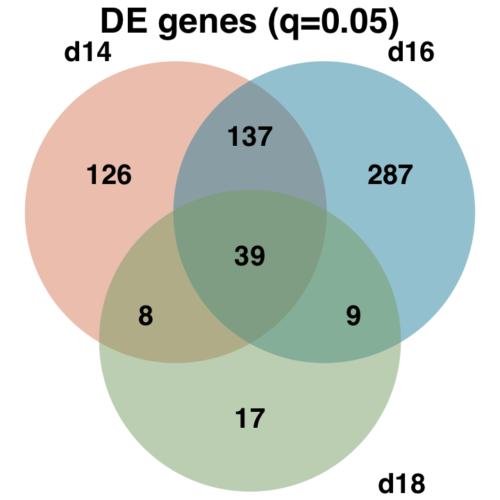

Additionally, in day 14 and day 16, there is a larger number of upregulated (higher in `SL1`) genes, while day 18 about the same number as up- and downregulated genes. This looks like there is a stronger line-difference in day 14 and 16, which becomes reduced in day 18.

Toggle down for smear plots

  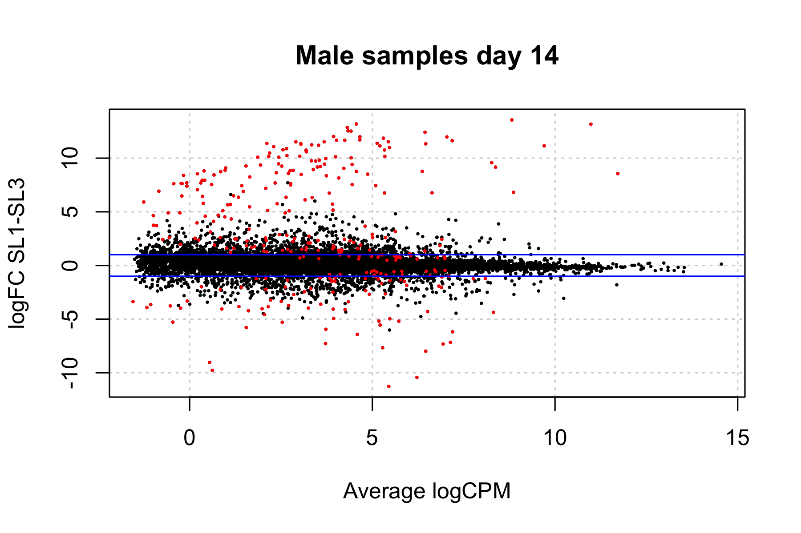
  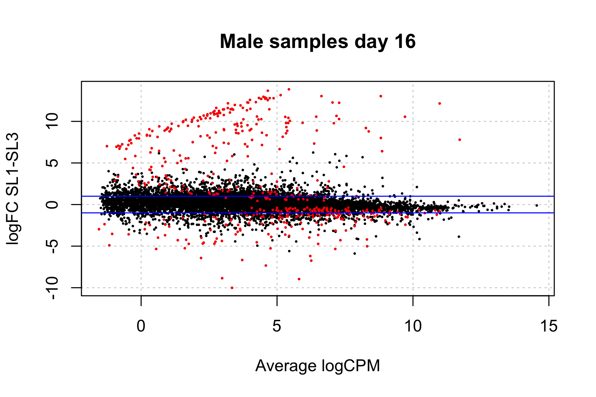
  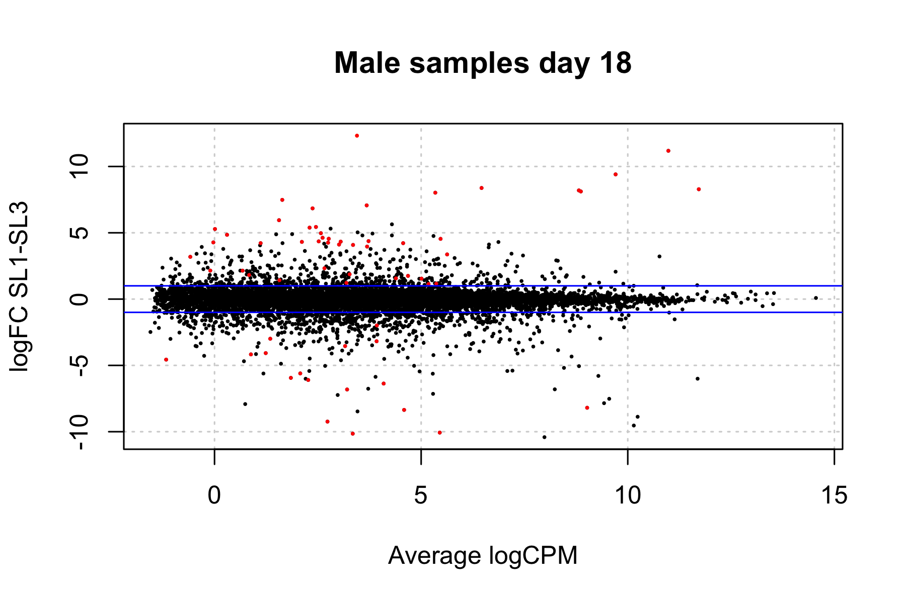

I also check which genes are DE in only one or both lines for the day contrast. A lot of them are shared but there is a decent amount of difference.

Toggle down for plot and numbers

  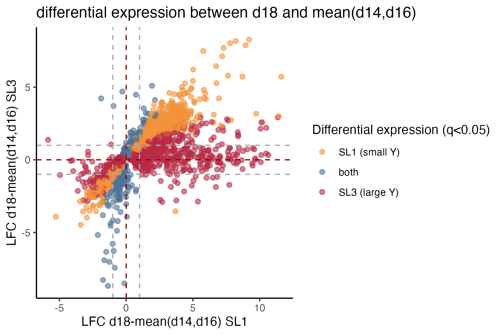

| category      | num DE genes  |
| ------------- | ------------- |
| both          | 1984          |
| SL1 exclusive | 502           |
| SL3 exclusive | 1999          |

#### Number of differentially expressed genes between day18 and mean(day14+day16)

| `glmLRT`      | Line 1        | Line 3        | `glmQLFTest`  | Line 1        | Line 3        |
| ------------- | ------------- | ------------- | ------------- | ------------- | ------------- |
| Downregulated | 388           | 488           | Downregulated | 311           | 438           |
| no difference | 9010          | 8174          | no difference | 9172          | 8309          |
| Upregulated   | 1238          | 1974          | Upregulated   | 1153          | 1889          |

Most of the DE genes are shared between line 1 (small males) and line 3 (large males), supporting the hypothesis that the difference between the lines is mostly in day 14 and 16, and that the larvae start a common preparation for pupation around day 18.

Toggle down for venn diagramm

  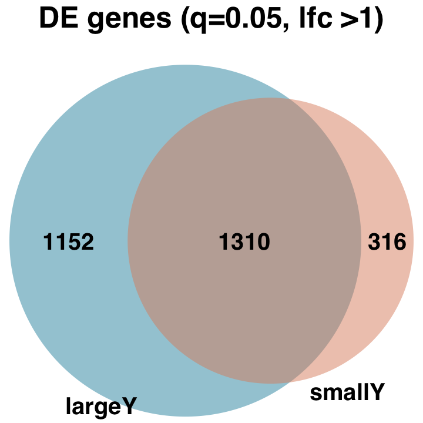

Lots of genes are upregulated in day 18 compared to 14 and 16 as well.

Toggle down for smear plots

  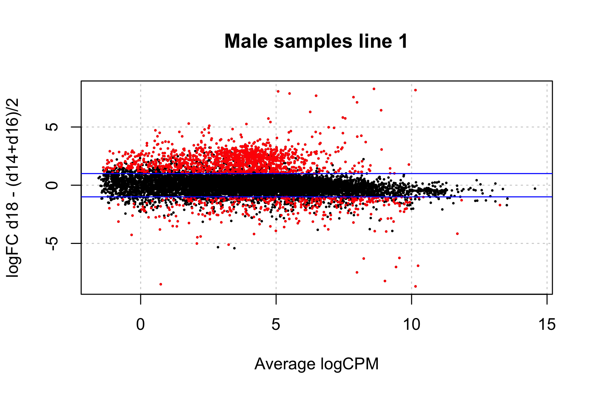
  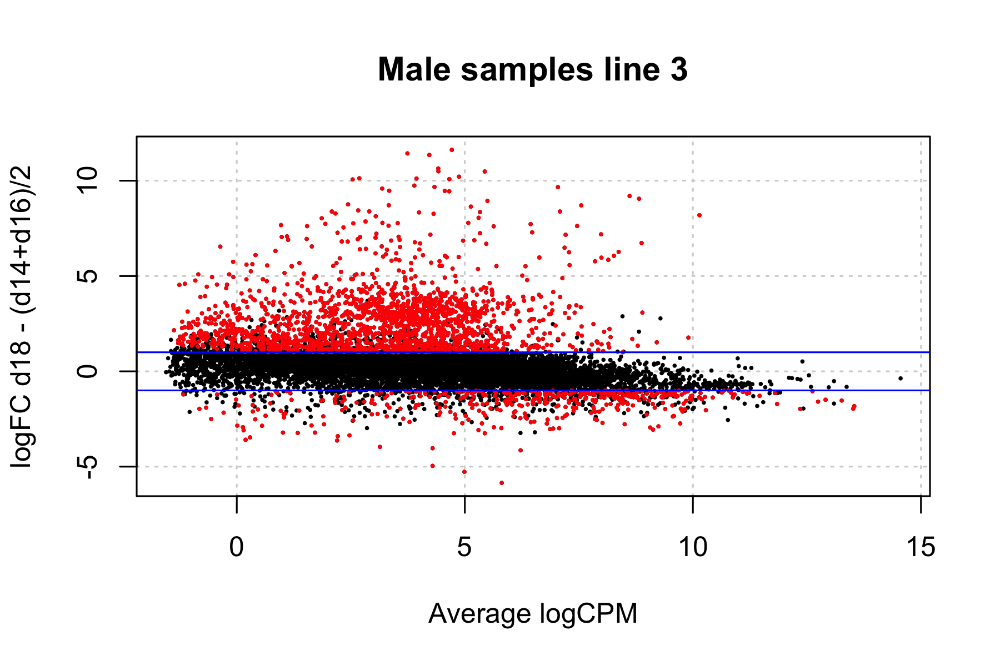

I will also look at DE genes in time points that are the same or different in the small and large males.

Toggle down for plot and numbers

  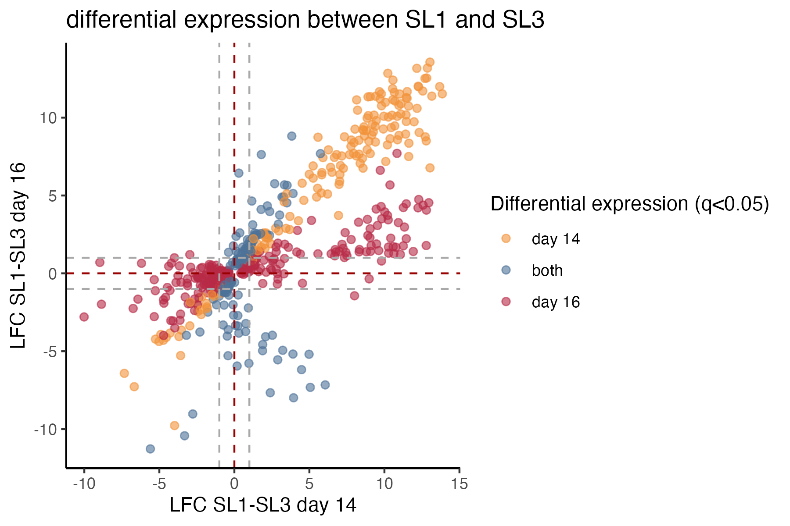

| category      | num DE genes  |
| ------------- | ------------- |
| both          | 176           |
| d14 exclusive | 134           |
| d16 exclusive | 296           |

  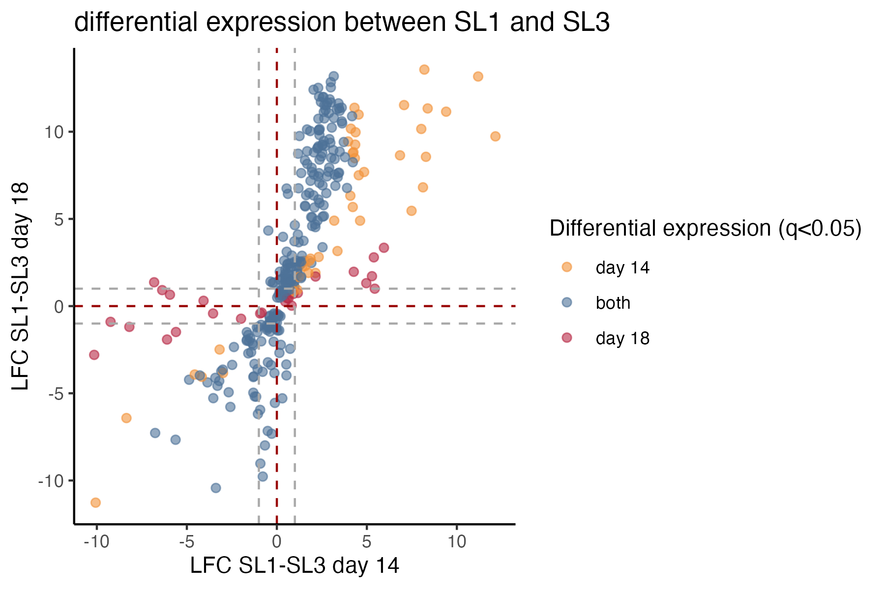

| category      | num DE genes  |
| ------------- | ------------- |
| both          | 47            |
| d14 exclusive | 263           |
| d18 exclusive | 26           |

  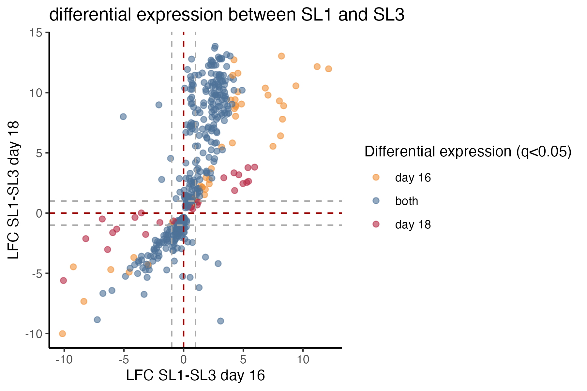

| category      | num DE genes  |
| ------------- | ------------- |
| both          | 48            |
| d14 exclusive | 424           |
| d16 exclusive | 25            |

