<!-- Tab links -->
<script>
function openTab(evt, cityName) {
  // Declare all variables
  var i, tabcontent, tablinks, tab, parenttab;
  // only change tabs on the same level to allow nested tabs etc.
  tab = document.getElementById(cityName)
  parenttab = tab.parentNode  

  // Get all elements with class="tabcontent" and hide them
  tabcontent = document.getElementsByClassName("tabcontent");
  for (i = 0; i < tabcontent.length; i++) {
    if (tabcontent[i].parentNode == parenttab){
      tabcontent[i].style.display = "none";
    }
  }

  // Get all elements with class="tablinks" and remove the class "active"
  tablinks = document.getElementsByClassName("tablinks");
  for (i = 0; i < tablinks.length; i++) {
    if (tabcontent[i].parentNode == parenttab){
      tablinks[i].classList.remove("active");
    }
  }

  // Show the current tab, and add an "active" class to the button that opened the tab
  document.getElementById(cityName).style.display = "block";
  evt.currentTarget.classList.add("active");
}

</script>

<style>

/* Style the tab */
.tab {
  overflow: hidden;
  border: 1px solid #ccc;
  background-color: #f1f1f1;
}

/* Style the buttons that are used to open the tab content */
.tab button {
  background-color: inherit;
  float: left;
  border: none;
  outline: none;
  cursor: pointer;
  padding: 14px 16px;
  transition: 0.3s;
}

/* Change background color of buttons on hover */
.tab button:hover {
  background-color: #ddd;
}

/* Create an active/current tablink class */
.tab button.active {
  background-color: #ccc;
}

/* Style the tab content */
.tabcontent {
  display: none;
  padding: 6px 12px;
  border: 1px solid #ccc;
  border-top: none;
}

</style>


# Differential expression analysis on Larval RNAseq data

## 1. Preprocessing and testing

This analysis is based on a lot of work to properly filter the data and compare mapping pipelines to handle the high rRNA contamination rate and multimapping issues.

### 1.1 rRNA filtering and other reads preprocessing

This was done by Bianca Sarcani, all data here: `RNA_data_processing`. Basically:

* filter rRNA reads with sortmeRNA and custom rRNA library (see back to Axel's work about generating the reference library)
* collapse lanes
* deduplicate reads (removePCR duplicates and poly-G)

Bianca continued here and assembled a transcriptome but I will not use it since we suspect that there are some problems that require further curation, such as a very high number of transcripts

### 1.2 Evaluation and comparison of mapping pipelines

This was done by Sebastian Ellwe, see repository here: https://github.com/sellwe/Master_thesis_sebastian. He compared:

* STAR
* Salmon
  * salmon-mapping (map RNA to proteinfasta with decoy dataset)
  * salmon-align (refine existing mapped bam file)

From his results I made the choice to use STAR, see `mapping_and_transcriptome`. In short, with the new annotation the mapping rate is good enough with just STAR and not the complicated optimization algorithm that salmon uses.

### 1.3 yTor annotation manual curation

This work is based on the selection lines evaluated by Kaufmann *et al.* ([link](https://doi.org/10.1093/molbev/msad167)), but I am using a different version of the *C. maculatus* annotation that does not have the gene structures of the Y TOR copy number variation. Therefore I lift these gene structures from the original annotation and transform the coordinates to match my superscaffolded version of the assembly/annotation, see `mTOR_annotation`.

The genes are named `yTor-A`, `yTor-B`, and `yTor-C`, and the autosomal Tor is `transcript-30111`, or `gene-30110`.

The annotation is then functionally annotated using eggnog and the resulting functional annotation is used for GO-term enrichment analysis with topGO in R.

## 2. STAR mapping

See the `RNA_mapping` directory in this repository for by-sample mapping rate information. Mean uniquely mapped reads: 83.76% and mean multimapped reads: 9.74%. 

## 3. DE analysis

I will use edgeR to get the logFC of all comparisons of interest below, but the plotting is done in python. In EdgeR, I am trying both `glmLRT` and `glmQLFTest` to test for differential expression, both fit negative binomial GLMs with the first one being more simple but having a higher false-positive error, while the second takes more variation in dispersion into account. I show both here and for the lines comparison, but I will only plot the results from `glmQLFTest`.

### 3.1 yTor expression

After reading the data and filtering for minimum expression thresholds, yTor-A and yTor-C are expressed, but not yTor-B. Since we know that yTor-C (orange) in SL1 is the closest to the SL3 yTor, it makes sense that it shows expression in SL1 and SL3, while yTor-A, which is more diverged from the SL3 yTor, does not map reads from these samples. Furthermore, yTor-C is also the closes to aTor, which likely explains the female samples, which are mismapped reads that only map to yTor-C and not yTor-A.

The autosomal Tor `gene-30110` is expressed much higher than any y-linked copy, which makes sense since it is a highly conserved gene in the insulin signalling pathway. There seems to be no difference between SL1 and SL3.

Since we hypothesize that the phenotypic difference is related with differences in Tor expression dosage, I will manually merge the read counts of yTor-A, B and C into one yTor-all for the DE analysis.

The phylogenetic relationship is this: `(aTor,(yTor-SL3,(yTor-C,(yTor-A,yTor-B))))` (with yTor-C being the one also in SL3 and the closest to aTor) and the tick labels are according to this naming scheme: `SL`-`day`-`sample_ID`-`sex`.

<div class="tab">
  <button class="tablinks" onclick="openTab(event, 'yTor_split')">yTor split into A,B,C</button>
  <button class="tablinks" onclick="openTab(event, 'yTor_merged')">yTor merged</button>
</div>

<div id="yTor_split" class="tabcontent">

Only show samples that have nonzero expression!

<p float="left">
  
  
</p>

</div>

<div id="yTor_merged" class="tabcontent">

Only show samples that have nonzero expression! Female samples removed even if they show expression.

<p float="left">
  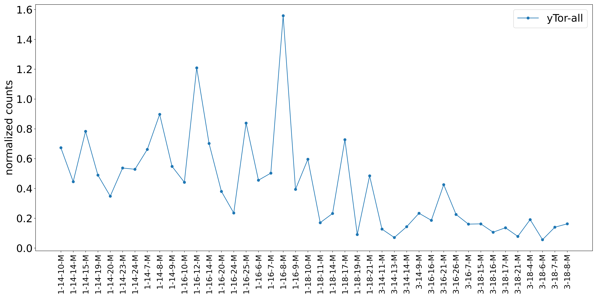
  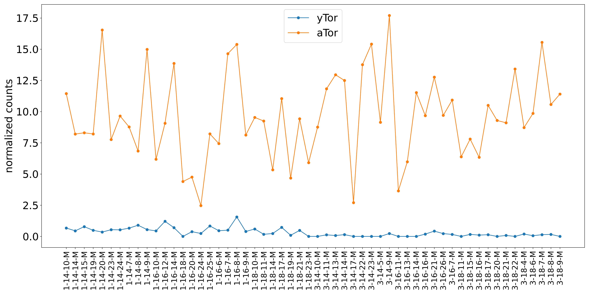
</p>

</div>

### 3.2 Separation summary: PCA plots

For the actual DE analysis, I am partitioning the data into three separate sub-analyses. This helps avoid three-way contrasts which are complicated to define and confusing to interpret.

* **Sex-separated**: Analyze one sex at a time to investigate line and day contrasts (how do the lines change across the development time?)
* **Line-separated**: Analyze one line at a time to investigate sex and day contrasts (how do the sexes change across development time?)
* **Day-separated**: Analyze one developmental time point to investigate sex and line contrasts (how do sexes change across lines?)

PCAs are based on log-transformed normalized counts. Lines are SL1 and SL3 which are the small (1) and large (3) males respectively. Intuitively, the tor copy number is reversed, with the small males in SL1 having three copies, and the large males in SL3 having only one. The days are day 14, 16, or 18 of larval development. 

<div class="tab">
  <button class="tablinks" onclick="openTab(event, 'All samples')">All samples</button>
  <button class="tablinks" onclick="openTab(event, 'Only one sex')">Sex-separated</button>
  <button class="tablinks" onclick="openTab(event, 'Only one line')">Line-separated</button>
  <button class="tablinks" onclick="openTab(event, 'Only one day')">Day-separated</button>
</div>

<div id="All samples" class="tabcontent">


<p float="left">
  
  
</p>

Line is a clear separator (left), but not day (right). Day 14 seems to be mostly to the left, but 16 and 18 are across the entire range. There is a trend of females being more to the left and males more to the right but it is not as nice of a separation as line.

</div>

<div id="Only one sex" class="tabcontent">

<p float="left">
  
  
</p>

Since we are interested in the male variation and the females are mostly control, we have much fewer female than male samples.

line is the lagest difference, which is the same as when all samples are plotted. The days show a trend where day 18 is more to the left, 16 is intermediate, and 14 is to the right, but it is more of a gradual transition and not a clear separation. This makes sense since age is continuous, and we can only sample with limited precision, so it is likely that there is some age variation present within all the day categories that is represented here. (Except that one outlier in females (right) for SL3 day18 all the way on the right.)

</div>

<div id="Only one line" class="tabcontent">

<p float="left">
  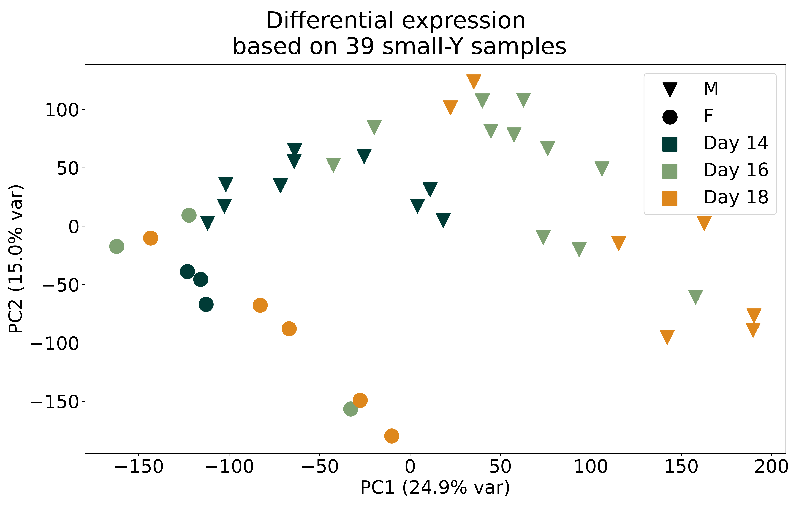
  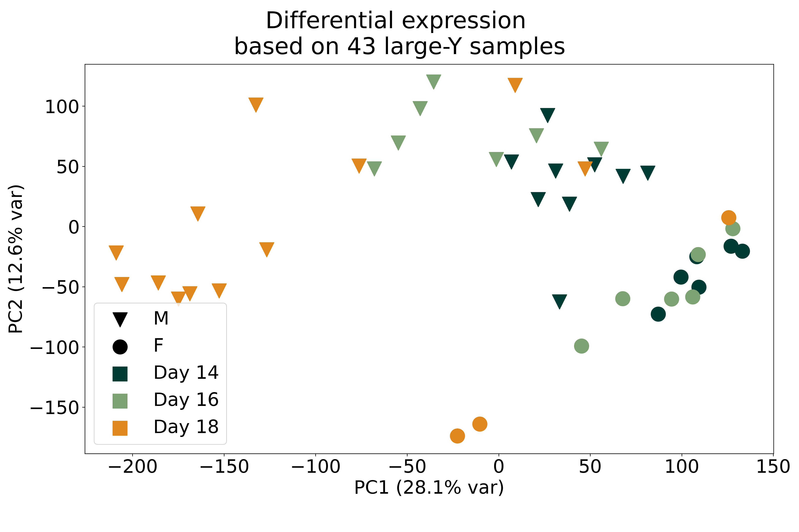
</p>

Sexes separate mostly cleanly, but the days are not as obvious, more gradual (similar as the other separations). in SL3 (larger males) the day 18 ones are the most separated while the others are more similar, and in SL1 day 14 are more together while the other time points are more overlapping.

</div>

<div id="Only one day" class="tabcontent">

<p float="left">
  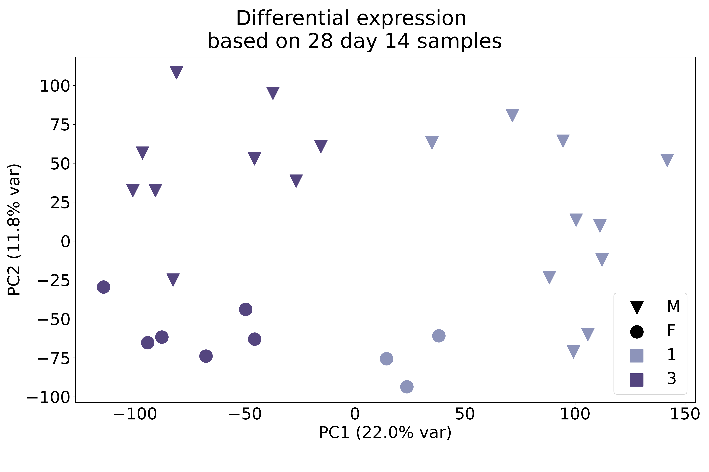
  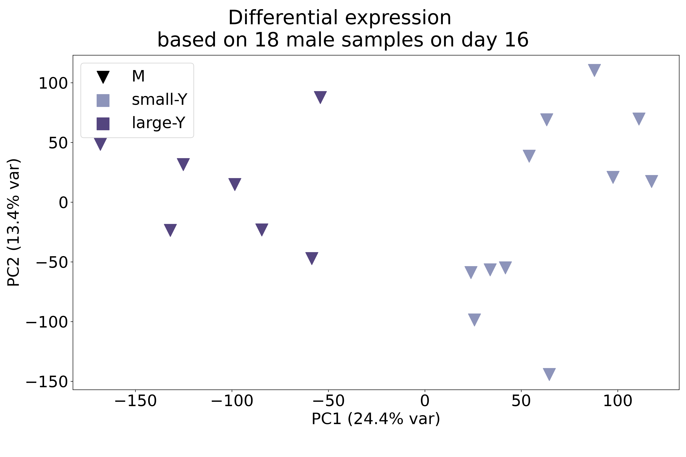
  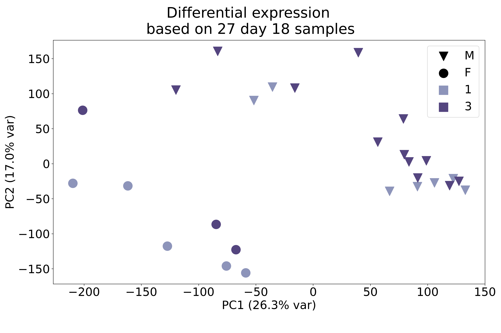
</p>

Lines are cleanly separated in day 14 and day 16, but kind of merged in day 18. general clean sex-separation in all days perpendicular to the line-separation.

</div>

<details>
<summary>I have also generated a MDS plot based on the edgeR data structure using plotMDS(), but they mostly show the same results as the PCA plots. Toggle down for MDS plots</summary>

<p float="left">
  
  
</p>

Males and females are kind of but not super clearly separated, but for only male samples, the SL1 and SL3 border is relatively clear.

</details>

### 3.3 Sex-separated samples 

The contrasts are within each day (14, 16, 18), and always `SL1 - SL3`. `SL1` are the small males (three Tor copies), and all genes identified as "upregulated" are higher expressed in `SL1`.

In all contrasts, genes that are differentially expressed in both females and males between the lines are excluded from the smear plots (see venn-diagram overlaps). 

#### Differential expression between SL1 and SL3

Additionally, in day 14 and day 16, there is a larger number of upregulated (higher in `SL1`) genes, while day 18 about the same number as up- and downregulated genes. This looks like there is a stronger line-difference in day 14 and 16, which becomes reduced in day 18.

<div class="tab">
  <button class="tablinks" onclick="openTab(event, 'males_lines_DE')">males (Smear plots)</button>
  <button class="tablinks" onclick="openTab(event, 'females_lines_DE')">females (Smear plots)</button>
  <button class="tablinks" onclick="openTab(event, 'males_lines_DE_volcano')">males (Volcano plots)</button>
  <button class="tablinks" onclick="openTab(event, 'females_lines_DE_volcano')">females (Volcano plots)</button>
</div>

<div id="males_lines_DE" class="tabcontent">

<table>

| `glmQLFTest`  | Day 14        | Day 16        | Day 18        |
| ------------- | ------------- | ------------- | ------------- |
| Downregulated | 93            | 200           | 16            |
| no difference | 10326         | 10164         | 10563         |
| Upregulated   | 149           | 186           | 36            |

</table>

<p float="left">
  
  
  
</p>

Upregulation here means that genes are expressed higher in SL1 than SL3. Day 14 and 16 have more significantly differentially expressed genes than day 18. In day 18, the larvae are close to pupation, which could mean that they are switching from gene expression related to grwoth and digestion to what they need for pupation instead, which is not related to the Y-haplotype difference any more, resulting in less DE between the lines on day 18.

<p float="left">
  
</p>

</div>

<div id="females_lines_DE" class="tabcontent">

<table>

| `glmQLFTest`  | Day 14        | Day 16        | Day 18        |
| ------------- | ------------- | ------------- | ------------- |
| Downregulated | 5             | 8             | 29            |
| no difference | 9581          | 9553          | 9559          |
| Upregulated   | 1             | 8             | 47            |

</table>


<p float="left">
  
  
  
</p>

Fewer DE genes than males in day 14 and 16, and similar number in day 18. Within females, similar amounts of DE genes on day 14, 16, and 18, which is different from the male samples where day 18 is a clear outlier. This supports the hypothesis that this is caused by the line difference in growth which impacts day 14 and 16 more than 18, and therefore the DE genes here are not related to the growth differences between the lines that impact the males.

<p float="left">
  
  
  
  
</p>

When comparing the genes that are DE between lines in the females to the ones in the males, we find that they are mostly a subset of the male ones in day 14 and day 16, and only start to diverge in day 18. These are probably not differences mediated by the Y-chromosome haplotype, and therefore should be excluded when comparing lines. Lists are below (toggle):

<details>
<summary>Day 14 (69 genes)</summary>

```
'gene-428738', 'gene-224697', 'gene-222350', 'gene-428765', 'gene-222600', 'gene-224875', 'gene-241001', 'gene-430032', 'gene-220028', 'gene-222486', 'gene-241055', 'gene-224357', 'gene-226245', 'gene-225738', 'gene-224968', 'gene-222531', 'gene-430263', 'gene-224201', 'gene-225107', 'gene-225236', 'gene-225140', 'gene-224227', 'gene-390616', 'gene-225709', 'gene-225325', 'gene-222332', 'gene-222519', 'gene-430314', 'gene-120952', 'gene-240871', 'gene-224860', 'gene-326873', 'gene-240929', 'gene-80359', 'gene-84970', 'gene-322912', 'gene-326849', 'gene-81427', 'gene-323148', 'gene-322927', 'gene-224782', 'gene-218529', 'gene-224743', 'gene-240623', 'gene-222383', 'gene-225173', 'gene-222365', 'gene-222344', 'gene-237881', 'gene-430068', 'gene-224956', 'gene-225720', 'gene-224682', 'gene-431701', 'gene-222555', 'gene-224896', 'gene-403809', 'gene-240910', 'gene-323803', 'gene-390956', 'gene-430080', 'gene-225635', 'gene-240833', 'gene-224593', 'gene-241126', 'gene-225030', 'gene-240691', 'gene-391222', 'gene-90157'
```

</details>

<details>
<summary>Day 16 (87 genes)</summary>

```
'gene-224697', 'gene-222600', 'gene-224875', 'gene-241001', 'gene-220028', 'gene-222486', 'gene-224357', 'gene-224968', 'gene-222159', 'gene-323148', 'gene-223773', 'gene-224782', 'gene-240623', 'gene-225173', 'gene-222344', 'gene-225720', 'gene-431701', 'gene-222555', 'gene-323803', 'gene-225635', 'gene-430080', 'gene-87700', 'gene-330102', 'gene-225030', 'gene-223419', 'gene-90157', 'gene-241262', 'gene-428738', 'gene-222350', 'gene-428765', 'gene-224079', 'gene-225325', 'gene-222332', 'gene-430314', 'gene-120952', 'gene-223491', 'gene-84970', 'gene-322927', 'gene-237881', 'gene-430068', 'gene-224956', 'gene-224682', 'gene-224896', 'g14784', 'gene-240833', 'gene-240691', 'gene-286545', 'gene-223318', 'gene-124877', 'gene-225738', 'gene-222531', 'gene-430263', 'gene-407280', 'gene-225140', 'gene-224227', 'gene-225709', 'gene-224890', 'gene-80359', 'gene-322912', 'gene-227370', 'gene-224743', 'gene-406796', 'gene-240910', 'gene-390956', 'gene-391222', 'gene-430032', 'gene-229506', 'gene-241055', 'gene-226245', 'gene-225107', 'gene-224201', 'gene-225236', 'gene-390616', 'gene-282853', 'gene-222519', 'gene-240871', 'gene-224860', 'gene-326873', 'gene-240929', 'gene-326849', 'gene-222383', 'gene-222365', 'gene-403809', 'gene-224593', 'gene-241126', 'gene-222746', 'gene-238407'
```

</details>

<details>
<summary>Day 18 (21 genes)</summary>

```
'gene-428738', 'gene-224697', 'gene-224875', 'gene-241055', 'gene-223758', 'gene-430263', 'gene-225236', 'gene-225325', 'gene-301479', 'gene-120952', 'gene-223491', 'gene-224860', 'gene-223773', 'gene-240623', 'gene-406796', 'gene-225720', 'gene-238849', 'gene-227308', 'gene-240833', 'gene-224593', 'gene-240691'
```

</details>

</div>


<div id="males_lines_DE_volcano" class="tabcontent">


<p float="left">
  
  
  
</p>
For venn-diagrams see smear plots

</div>

<div id="females_lines_DE_volcano" class="tabcontent">


<p float="left">
  
  
  
</p>

For venn-diagrams see smear plots

</div>


#### Scatterplots of pairwise comparisons

<div class="tab">
  <button class="tablinks" onclick="openTab(event, 'males_day_DE')">males</button>
  <button class="tablinks" onclick="openTab(event, 'females_day_DE')">females</button>
</div>

<!-- Tab content -->
<div id="males_day_DE" class="tabcontent">


<p float="left">
  
  
  
</p>

<table>
<tr><th>Day 14 and day 16 </th><th>Day 14 and day 18</th><th>Day 16 and day 18</th></tr>
<tr><td>

| category      | num DE genes  |
| ------------- | ------------- |
| both          | 176           |
| d14 exclusive | 134           |
| d16 exclusive | 296           |
| shared with f | 89            |

</td><td>

| category      | num DE genes  |
| ------------- | ------------- |
| both          | 47            |
| d14 exclusive | 263           |
| d18 exclusive | 26            |
| shared with f | 76            |

</td><td>

| category      | num DE genes  |
| ------------- | ------------- |
| both          | 48            |
| d16 exclusive | 424           |
| d18 exclusive | 25            |
| shared with f | 91            |

</td></tr> </table>

('shared with f' genes are genes that are shared with f in one or both time points in the comparison, so the numbers are a little higher than the lists above)

</div>

<div id="females_day_DE" class="tabcontent">


<p float="left">
  
  
  
</p>

<table>
<tr><th>Day 14 and day 16 </th><th>Day 14 and day 18</th><th>Day 16 and day 18</th></tr>
<tr><td>

| category      | num DE genes  |
| ------------- | ------------- |
| both          | 67            |
| d14 exclusive | 36            |
| d16 exclusive | 8             |

</td><td>

| category      | num DE genes  |
| ------------- | ------------- |
| both          | 60            |
| d14 exclusive | 37            |
| d18 exclusive | 15            |

</td><td>

| category      | num DE genes  |
| ------------- | ------------- |
| both          | 75            |
| d16 exclusive | 22            |
| d18 exclusive | 28            |

</td></tr> </table>

</div>


#### Interaction of line by day effects

<div class="tab">
  <button class="tablinks" onclick="openTab(event, 'males_line_day_DE')">males (Smear plots)</button>
  <button class="tablinks" onclick="openTab(event, 'females_line_day_DE')">females (Smear plots)</button>
  <button class="tablinks" onclick="openTab(event, 'males_line_day_DE_volcano')">males (Volcano plots)</button>
<button class="tablinks" onclick="openTab(event, 'females_line_day_DE_volcano')">females (Volcano plots)</button>
</div>

<div id="males_line_day_DE" class="tabcontent">

<p float="left">
  
  
  
</p>

Contrasts specified like this: (either option is fine, gives the exact same results)

```
(SL1_18-SL1_14)-(SL3_18-SL3_14), (SL1_14-SL1_16)-(SL3_14-SL3_16), (SL1_18-SL1_16)-(SL3_18-SL3_16)
(SL1_14-SL3_14)-(SL1_16-SL3_16), (SL1_18-SL3_18)-(SL1_16-SL3_16), (SL1_18-SL3_18)-(SL1_14-SL3_14)
```

<table>

| `glmQLFTest`  | SL1(18-14)-SL3(18-14) | SL1(14-16)-SL3(14-16) | SL1(18-16)-SL3(18-16) |
| ------------- | --------------------- | --------------------- | --------------------- |
| Downregulated | 1                     | 0                     | 0                     |
| no difference | 10636                 | 10637                 | 10636                 |
| Upregulated   | 0                     | 0                     | 1                     |

</table>

</div>

<div id="females_line_day_DE" class="tabcontent">

<p float="left">
  
  
  
</p>

Contrasts specified like this: (either option is fine, gives the exact same results)

```
(SL1_18-SL1_14)-(SL3_18-SL3_14), (SL1_14-SL1_16)-(SL3_14-SL3_16), (SL1_18-SL1_16)-(SL3_18-SL3_16)
(SL1_14-SL3_14)-(SL1_16-SL3_16), (SL1_18-SL3_18)-(SL1_16-SL3_16), (SL1_18-SL3_18)-(SL1_14-SL3_14)
```

<table>

| `glmQLFTest`  | SL1(18-14)-SL3(18-14) | SL1(14-16)-SL3(14-16) | SL1(18-16)-SL3(18-16) |
| ------------- | --------------------- | --------------------- | --------------------- |
| Downregulated | 1                     | 0                     | 0                     |
| no difference | 9655                  | 9656                  | 9656                  |
| Upregulated   | 0                     | 0                     | 0                     |

</table>

</div>


<div id="males_line_day_DE_volcano" class="tabcontent">

<p float="left">
  
  
  
</p>

Contrasts specified like this: (either option is fine, gives the exact same results)

```
(SL1_18-SL1_14)-(SL3_18-SL3_14), (SL1_14-SL1_16)-(SL3_14-SL3_16), (SL1_18-SL1_16)-(SL3_18-SL3_16)
(SL1_14-SL3_14)-(SL1_16-SL3_16), (SL1_18-SL3_18)-(SL1_16-SL3_16), (SL1_18-SL3_18)-(SL1_14-SL3_14)
```

<table>

| `glmQLFTest`  | SL1(18-14)-SL3(18-14) | SL1(14-16)-SL3(14-16) | SL1(18-16)-SL3(18-16) |
| ------------- | --------------------- | --------------------- | --------------------- |
| Downregulated | 1                     | 0                     | 0                     |
| no difference | 10636                 | 10637                 | 10636                 |
| Upregulated   | 0                     | 0                     | 1                     |

</table>

</div>

<div id="females_line_day_DE_volcano" class="tabcontent">

<p float="left">
  
  
  
</p>

Contrasts specified like this: (either option is fine, gives the exact same results)

```
(SL1_18-SL1_14)-(SL3_18-SL3_14), (SL1_14-SL1_16)-(SL3_14-SL3_16), (SL1_18-SL1_16)-(SL3_18-SL3_16)
(SL1_14-SL3_14)-(SL1_16-SL3_16), (SL1_18-SL3_18)-(SL1_16-SL3_16), (SL1_18-SL3_18)-(SL1_14-SL3_14)
```

<table>

| `glmQLFTest`  | SL1(18-14)-SL3(18-14) | SL1(14-16)-SL3(14-16) | SL1(18-16)-SL3(18-16) |
| ------------- | --------------------- | --------------------- | --------------------- |
| Downregulated | 1                     | 0                     | 0                     |
| no difference | 9655                  | 9656                  | 9656                  |
| Upregulated   | 0                     | 0                     | 0                     |

</table>

</div>

<details>
<summary>Interpretation of line:day interaction</summary>

Interaction line by day: when genes are upregulated (in the line contrast) in one day and then downregulated in another day. These cases exist, see scatterplots above, but there is apparently none that overcome the significance threshold, only one gene is significantly DE when the day contrast is 18-14. 

The original plan was to then plot the LFC of the day contrast for both lines for the genes that are significant in the interaction, so `LFC(SL1d18-SL1d14)` by `LFC(SL3d18-SL3d14)`.


</details>

<details>
<summary>(OLD) Differential expression within lines between day18 and mean(day14,day16)</summary>

#### Differential expression within lines between day18 and mean(day14,day16)

I hypothesize that day 14 and 16 are where a lot of growth happens and SL1 and SL3 differ, while day 18 is the transition to pupation where the line differences become less substantial. I will therefore see what genes are involved in growth specifically by looking at the contrast between day 18 and the mean of day 14 and day 16. 

<div class="tab">
  <button class="tablinks" onclick="openTab(event, 'males_lines_DE_tables')">males (Smear plot)</button>
  <button class="tablinks" onclick="openTab(event, 'females_lines_DE_tables')">females (Smear plot)</button>
  <button class="tablinks" onclick="openTab(event, 'males_lines_DE_tables_volcano')">males (Volcano plot)</button>
  <button class="tablinks" onclick="openTab(event, 'females_lines_DE_tables_volcano')">females (Volcano plot)</button>
</div>

<div id="males_lines_DE_tables" class="tabcontent">

<table>

| `glmQLFTest`  | Line 1        | Line 3        |
| ------------- | ------------- | ------------- |
| Downregulated | 639           | 1271          |
| no difference | 8150          | 6653          |
| Upregulated   | 1850          | 2766          |

</table>

<p float="left">
  
  
</p>

<p float="left">
  
  
</p>

Upregulation means that genes get transcribed more for day 18. In general, SL3 has more change than SL1

| category      | num DE genes  |
| ------------- | ------------- |
| both          | 1984          |
| SL1 exclusive | 502           |
| SL3 exclusive | 1999          |
| shared with f | 93            |

</div>

<div id="females_lines_DE_tables" class="tabcontent">

<table>

| `glmQLFTest`  | Line 1        | Line 3        |
| ------------- | ------------- | ------------- |
| Downregulated | 0             | 11            |
| no difference | 9656          | 9569          |
| Upregulated   | 0             | 76            |

</table>

<p float="left">
  
  
</p>

<p float="left">
  
  
  
</p>

In SL3, 74 of 87 DE genes in females are also DE in males, 13 are unique to females. 

| category      | num DE genes  |
| ------------- | ------------- |
| both          | 0             |
| SL1 exclusive | 0             |
| SL3 exclusive | 87            |

<details>
<summary>74 genes DE in SL3 in m and f</summary>

```
'gene-99775', 'gene-40274', 'gene-304827', 'gene-92346', 'gene-306335', 'gene-285669', 'gene-120763', 'gene-2286', 'gene-97407', 'gene-232392', 'gene-328941', 'gene-166511', 'gene-39692', 'gene-384091', 'gene-74686', 'gene-122220', 'gene-218723', 'gene-414353', 'gene-312890', 'gene-153482', 'gene-39770', 'gene-132340', 'gene-253632', 'gene-378608', 'gene-206556', 'gene-336703', 'gene-21229', 'gene-166391', 'gene-120784', 'gene-87502', 'gene-317372', 'gene-73253', 'gene-211196', 'gene-9548', 'gene-60190', 'gene-234650', 'gene-410057', 'gene-121262', 'gene-100036', 'gene-227137', 'gene-75744', 'gene-279912', 'gene-343203', 'gene-233901', 'gene-163028', 'gene-238407', 'gene-39680', 'gene-198700', 'gene-231228', 'gene-410209', 'gene-143368', 'gene-388261', 'gene-30328', 'gene-226944', 'gene-334263', 'gene-130081', 'gene-47823', 'gene-228519', 'gene-350792', 'gene-277340', 'gene-182683', 'gene-60151', 'gene-206576', 'gene-202718', 'gene-130096', 'gene-377275', 'gene-244780', 'gene-288834', 'gene-189246', 'gene-48535', 'gene-205011', 'gene-253157', 'gene-62891', 'gene-69698'
```

</details>

</div>


<div id="males_lines_DE_tables_volcano" class="tabcontent">


<p float="left">
  
  
</p>


</div>

<div id="females_lines_DE_tables_volcano" class="tabcontent">


<p float="left">
  
  
</p>


</div>


</details>


#### Differential expression within lines with all pairwise day comparisons

Males have a massive change in gene regulation, both up- and down between day 18 and the earlier stages (larger difference in SL3) but females change not at all in SL1 and only a little bit in SL3. To be sure that this is real I also do individual comparisons between all the days even though that is more difficult to interpret.

<div class="tab">
  <button class="tablinks" onclick="openTab(event, 'males_lines_DE_tables_single_days')">males (Smear plot)</button>
  <button class="tablinks" onclick="openTab(event, 'females_lines_DE_tables_single_days')">females (Smear plot)</button>
  <button class="tablinks" onclick="openTab(event, 'males_lines_DE_tables_single_days_volcano')">males (Volcano plot)</button>
  <button class="tablinks" onclick="openTab(event, 'females_lines_DE_tables_single_days_volcano')">females (Volcano plot)</button>
</div>

<div id="males_lines_DE_tables_single_days" class="tabcontent">

<table>

<tr><th>SL1</th><th>SL3</th></tr>
<tr><td>

| `glmQLFTest`  | d18-d14       | d18-d16       | d14-d16       |
| ------------- | ------------- | ------------- | ------------- |
| Downregulated | 1213          | 15            | 1487          |
| no difference | 7087          | 10560         | 8258          |
| Upregulated   | 2337          | 62            | 892           |

</td><td>

| `glmQLFTest`  | d18-d14       | d18-d16       | d14-d16       |
| ------------- | ------------- | ------------- | ------------- |
| Downregulated | 1159          | 606           | 607           |
| no difference | 7127          | 8956          | 9973          |
| Upregulated   | 2351          | 1074          | 57            |

</td><td> </table>

<p float="left">
  
  
  
</p>

<p float="left">
  
  
  
</p>

in SL1, the difference is more between day 14 and day 16/18, since the day 18 - day 16 plot has only very few DE genes. In SL3, the difference is more between day 18 and day14/16, since the day14/16 plot has the least DE genes. Maybe this means that SL1 starts preparation for pupation between day 14 and 16? There is no clear indication for SL3, which has larger individuals, so maybe it is even earlier? Note that this does not show a morphological change yet, the earliest individuals show a start of pupation only at day 18 (did we sequence those then?).

</div>

<div id="females_lines_DE_tables_single_days" class="tabcontent">

<table>

<tr><th>SL1</th><th>SL3</th></tr>
<tr><td>

| `glmQLFTest`  | d18-d14       | d18-d16       | d14-d16       |
| ------------- | ------------- | ------------- | ------------- |
| Downregulated | 0             | 0             | 0             |
| no difference | 9656          | 9656          | 9656          |
| Upregulated   | 0             | 0             | 0             |

</td><td>

| `glmQLFTest`  | d18-d14       | d18-d16       | d14-d16       |
| ------------- | ------------- | ------------- | ------------- |
| Downregulated | 30            | 1             | 2             |
| no difference | 9558          | 9655          | 9653          |
| Upregulated   | 68            | 0             | 1             |

</td><td> </table>

<p float="left">
  
  
  
</p>

<p float="left">
  
  
  
</p>

Only difference between day 14 and 18, no other developmental cues? Do only the males do special stuff before pupation?

</div>


<div id="males_lines_DE_tables_single_days_volcano" class="tabcontent">

<p float="left">
  
  
  
</p>

<p float="left">
  
  
  
</p>

</div>

<div id="females_lines_DE_tables_single_days_volcano" class="tabcontent">

<p float="left">
  
  
  
</p>

<p float="left">
  
  
  
</p>


</div>


#### Upsetplots of sig DE genes overlap within males and females

Check which genes are DE in more than one contrast.

* **Males**: lots of overlap involving the day18-14 contrast between the lines. 
  * Probably major developmental milestones that have to happen anyways regardless of y-haplotype?
  * These also share mostly with SL3_d14-16 and SL3_d14-16, but they have very little overlap with GO terms (see GO venn diagram?)
* **Females**: very little DE and almost no overlap

<div class="tab">
  <button class="tablinks" onclick="openTab(event, 'Males_upset')">Males</button>
  <button class="tablinks" onclick="openTab(event, 'Females_upset')">Females</button>
  <button class="tablinks" onclick="openTab(event, 'sexes_upset')">Both sexes</button>
</div>

<div id="Males_upset" class="tabcontent">

<p float="left">
  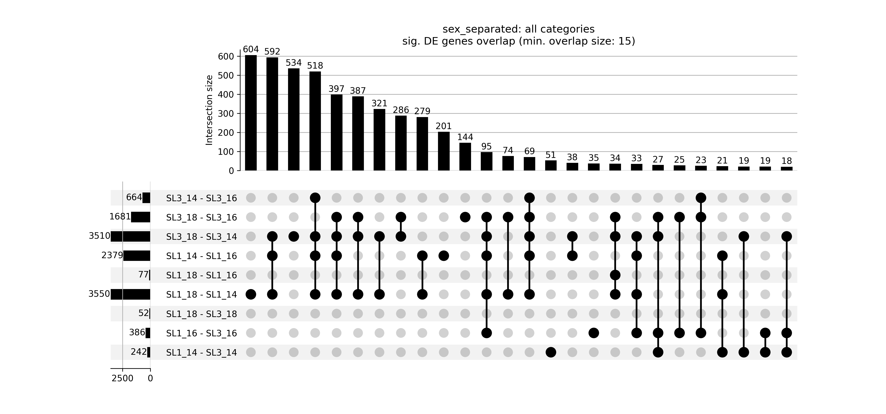
</p>

</div>

<div id="Females_upset" class="tabcontent">

<p float="left">
  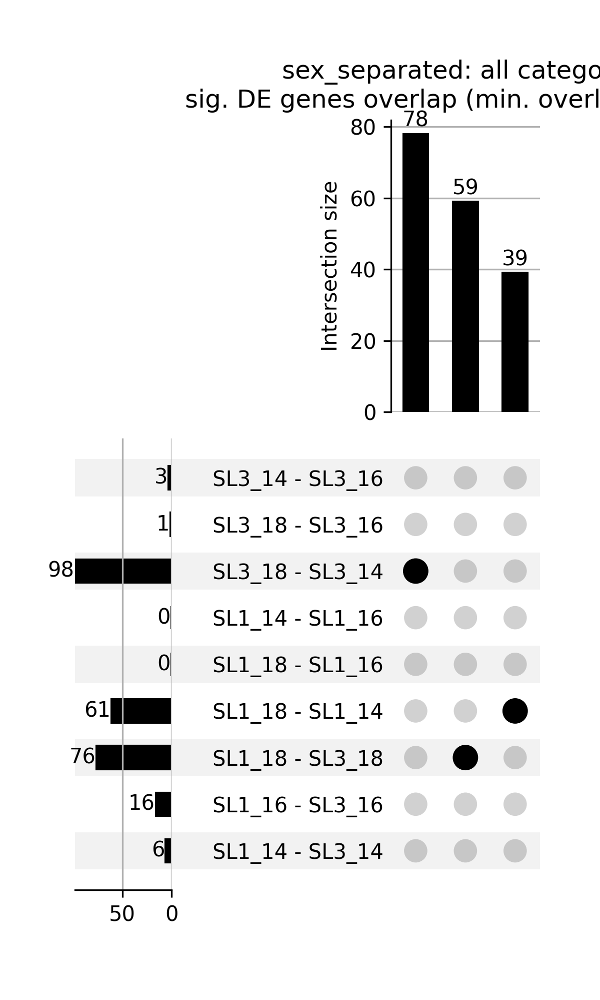
</p>

</div>

<div id="sexes_upset" class="tabcontent">

<p float="left">
  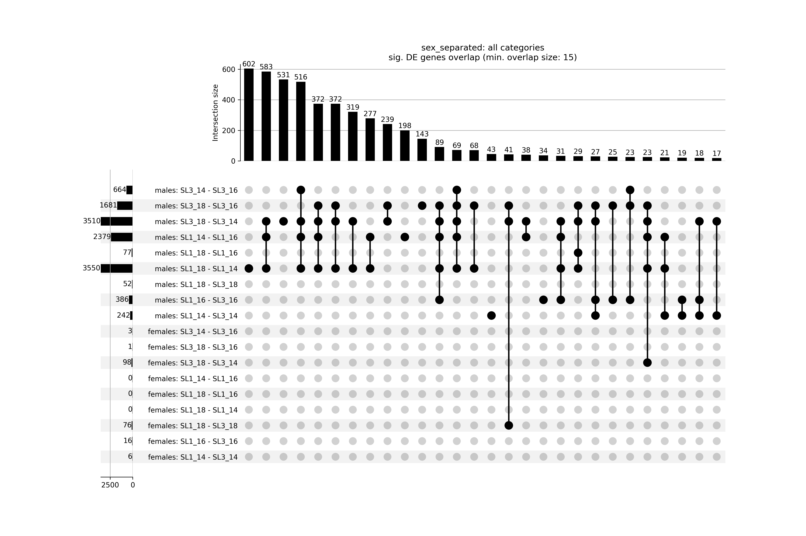
</p>

</div>


#### Upsetplots of sig enriched GO-terms overlap within males and females

See which enriched GO terms are shared between contrasts. Includes a list of the overlapping or exclusive ones for selected contrasts with functional information.

<div class="tab">
  <button class="tablinks" onclick="openTab(event, 'Males_GO')">Males</button>
  <button class="tablinks" onclick="openTab(event, 'Females_GO')">Females</button>
  <button class="tablinks" onclick="openTab(event, 'sexes_GO')">Both sexes</button>
</div>

<div id="Males_GO" class="tabcontent">

<p float="left">
  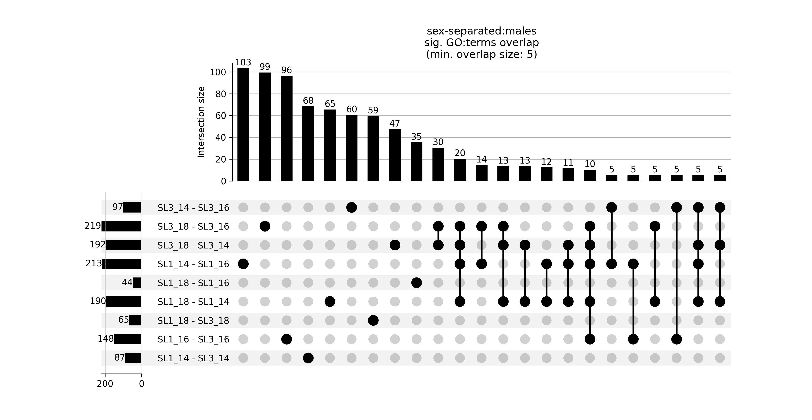
</p>

**GO-terms of relevant contrast comparisons**

GO-terms that are exclusive to individual contrasts and don't overlap with anything

<div class="tab">
  <button class="tablinks" onclick="openTab(event, 'males_SL1_day14-16_GO')">SL1 day14-16</button>
  <button class="tablinks" onclick="openTab(event, 'males_SL1_day18-14_GO')">SL1 day18-14</button>
  <button class="tablinks" onclick="openTab(event, 'males_SL1_day18-16_GO')">SL1 day18-16</button>
  <button class="tablinks" onclick="openTab(event, 'males_SL3_day14-16_GO')">SL3 day14-16</button>
  <button class="tablinks" onclick="openTab(event, 'males_SL3_day18-14_GO')">SL3 day18-14</button>
  <button class="tablinks" onclick="openTab(event, 'males_SL3_day18-16_GO')">SL3 day18-16</button>
  <button class="tablinks" onclick="openTab(event, 'males_day14_GO')">SL1-3 day14</button>
  <button class="tablinks" onclick="openTab(event, 'males_day16_GO')">SL1-3 day16</button>
  <button class="tablinks" onclick="openTab(event, 'males_day18_GO')">SL1-3 day18</button>
</div>

<div id="males_SL1_day14-16_GO" class="tabcontent">

`upsetplot_GO_terms_sex_separated_males_SL1_day14-16.txt`: All sorts of stuff, I can see no theme

<iframe
    src="data/DE_figures_python/GO_enrichment/upsetplot_GO_terms_sex_separated_males_SL1_day14-16.txt"
    frameBorder="0"
    class=""
    scrolling="auto"
    style="width:100%; height:30vh;">
</iframe>

</div>

<div id="males_SL1_day18-14_GO" class="tabcontent">

`upsetplot_GO_terms_sex_separated_males_SL1_day18-14.txt`: Mostly molecular and biochemical stuff I don't know, some DNA/chromatin organization, as well as <span style="color: #BD351E"> meiosis, insemination and sperm competition? </span>


<iframe
    src="data/DE_figures_python/GO_enrichment/upsetplot_GO_terms_sex_separated_males_SL1_day18-14.txt"
    frameBorder="0"
    class=""
    scrolling="auto"
    style="width:100%; height:30vh;">
</iframe>

</div>

<div id="males_SL1_day18-16_GO" class="tabcontent">

`upsetplot_GO_terms_sex_separated_males_SL1_day18-16.txt`: Lots of development and organ morphogenesis. Very few DE genes compared to other day-comparisons (see smear plots above), but more genes are upregulated in day 18 compared to 16, which kind of makes sense for organ development stuff.

<iframe
    src="data/DE_figures_python/GO_enrichment/upsetplot_GO_terms_sex_separated_males_SL1_day18-16.txt"
    frameBorder="0"
    class=""
    scrolling="auto"
    style="width:100%; height:30vh;">
</iframe>

</div>

<div id="males_SL3_day14-16_GO" class="tabcontent">

`upsetplot_GO_terms_sex_separated_males_SL3_day14-16.txt`: Same as SL1, don't really understand these.

<iframe
    src="data/DE_figures_python/GO_enrichment/upsetplot_GO_terms_sex_separated_males_SL3_day14-16.txt"
    frameBorder="0"
    class=""
    scrolling="auto"
    style="width:100%; height:30vh;">
</iframe>

</div>

<div id="males_SL3_day18-14_GO" class="tabcontent">

`upsetplot_GO_terms_sex_separated_males_SL3_day18-14.txt`: some development and a bit of detoxification

<iframe
    src="data/DE_figures_python/GO_enrichment/upsetplot_GO_terms_sex_separated_males_SL3_day18-14.txt"
    frameBorder="0"
    class=""
    scrolling="auto"
    style="width:100%; height:30vh;">
</iframe>

</div>

<div id="males_SL3_day18-16_GO" class="tabcontent">

`upsetplot_GO_terms_sex_separated_males_SL3_day18-16.txt`: some stuff related to molting, cuticle and muscle development

<iframe
    src="data/DE_figures_python/GO_enrichment/upsetplot_GO_terms_sex_separated_males_SL3_day18-16.txt"
    frameBorder="0"
    class=""
    scrolling="auto"
    style="width:100%; height:30vh;">
</iframe>

</div>

<div id="males_day14_GO" class="tabcontent">

`upsetplot_GO_terms_sex_separated_males_day14.txt`: I don't understand these

<iframe
    src="data/DE_figures_python/GO_enrichment/upsetplot_GO_terms_sex_separated_males_day14.txt"
    frameBorder="0"
    class=""
    scrolling="auto"
    style="width:100%; height:30vh;">
</iframe>

</div>

<div id="males_day16_GO" class="tabcontent">

`upsetplot_GO_terms_sex_separated_males_day16.txt`: I don't understand these

<iframe
    src="data/DE_figures_python/GO_enrichment/upsetplot_GO_terms_sex_separated_males_day16.txt"
    frameBorder="0"
    class=""
    scrolling="auto"
    style="width:100%; height:30vh;">
</iframe>

</div>

<div id="males_day18_GO" class="tabcontent">

`upsetplot_GO_terms_sex_separated_males_day18.txt`: a bit of cell/organ growth and differentiation, but mostly stuff I don't understand. 

<iframe
    src="data/DE_figures_python/GO_enrichment/upsetplot_GO_terms_sex_separated_males_day18.txt"
    frameBorder="0"
    class=""
    scrolling="auto"
    style="width:100%; height:30vh;">
</iframe>

</div>


</div>

<div id="Females_GO" class="tabcontent">

<p float="left">
  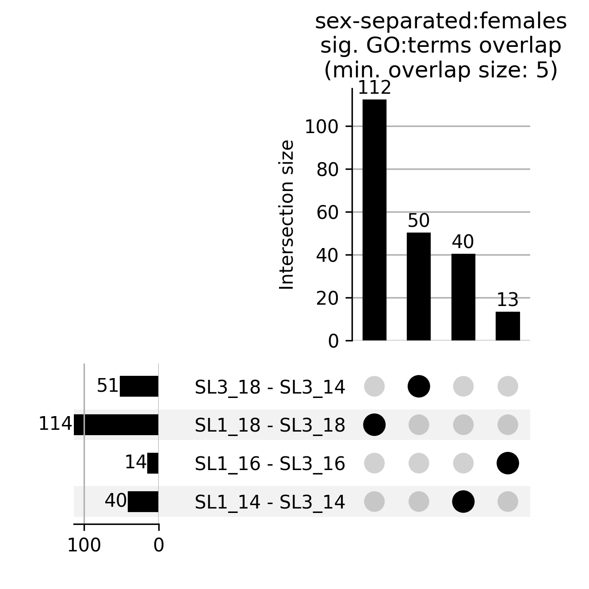
</p>

**GO-terms of relevant contrast comparisons** 

GO-terms that are exclusive to individual contrasts and don't overlap with anything. <span style="color: #BD351E"> Females should show no differences but there is clearly some stuff going on? </span>

<div class="tab">
  <button class="tablinks" onclick="openTab(event, 'females_SL3_day18-14_GO')">SL3 day18-14</button>
  <button class="tablinks" onclick="openTab(event, 'females_day14_GO')">day14</button>
  <button class="tablinks" onclick="openTab(event, 'females_day16_GO')">day16</button>
  <button class="tablinks" onclick="openTab(event, 'females_day18_GO')">day18</button>
</div>

<div id="females_SL3_day18-14_GO" class="tabcontent">

`upsetplot_GO_terms_sex_separated_females_SL3_day18-14.txt`: Different kinds of transmembrane transport

<iframe
    src="data/DE_figures_python/GO_enrichment/upsetplot_GO_terms_sex_separated_females_SL3_day18-14.txt"
    frameBorder="0"
    class=""
    scrolling="auto"
    style="width:100%; height:30vh;">
</iframe>

</div>

<div id="females_day14_GO" class="tabcontent">

`upsetplot_GO_terms_sex_separated_females_day14.txt`: Growth and development of all sorts of organs. negative regulation of some metabolic stuff. According to smear plot above genes are up- and downregulated in equal  measure, so it's not like that all these are upregulated in one line over the other

<span style="color: #BD351E"><b>QUESTION:</b> Lots of development stuff that they differ in </span>

<iframe
    src="data/DE_figures_python/GO_enrichment/upsetplot_GO_terms_sex_separated_females_day14.txt"
    frameBorder="0"
    class=""
    scrolling="auto"
    style="width:100%; height:30vh;">
</iframe>

</div>

<div id="females_day16_GO" class="tabcontent">
upsetplot_GO_terms_sex_separated_females_day16.txt

<iframe
    src="data/DE_figures_python/GO_enrichment/upsetplot_GO_terms_sex_separated_females_day16.txt"
    frameBorder="0"
    class=""
    scrolling="auto"
    style="width:100%; height:30vh;">
</iframe>

</div>

<div id="females_day18_GO" class="tabcontent">
upsetplot_GO_terms_sex_separated_females_day18.txt

<iframe
    src="data/DE_figures_python/GO_enrichment/upsetplot_GO_terms_sex_separated_females_day18.txt"
    frameBorder="0"
    class=""
    scrolling="auto"
    style="width:100%; height:30vh;">
</iframe>

</div>


</div>

<div id="sexes_GO" class="tabcontent">

<p float="left">
  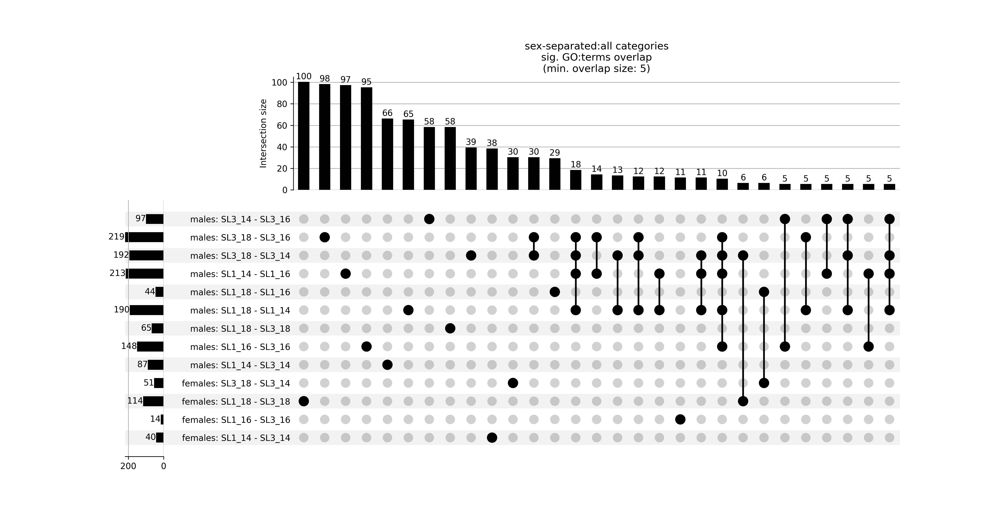
</p>

These are all still nonoverlapping, see the sex-separated GO-terms lists for functional information.

</div>


### 3.4 Line-separated samples

I will now split the data by line to see sex differences in expression during the development stages. 

<details>
<summary>MDS plots for SL1 and SL3</summary>

<p float="left">
  
  
</p>

</details>


#### Differential expression between males and females

Almost all DE is because of upregulation in males (in all lines and time points).

<div class="tab">
  <button class="tablinks" onclick="openTab(event, 'SL1_smear')">SL1 (Smear plot)</button>
  <button class="tablinks" onclick="openTab(event, 'SL3_smear')">SL3 (Smear plot)</button>
  <button class="tablinks" onclick="openTab(event, 'SL1_volcano')">SL1 (Volcano plot)</button>
  <button class="tablinks" onclick="openTab(event, 'SL3_volcano')">SL3 (Volcano plot)</button>
</div>

<div id="SL1_smear" class="tabcontent">

<p float="left">
  
  
  
</p>

| `glmQLFTest`  | Day 14        | Day 16        | Day 18        |
| ------------- | ------------- | ------------- | ------------- |
| Downregulated | 265           | 767           | 1039          |
| no difference | 10724         | 10155         | 9889          |
| Upregulated   | 4             | 71            | 65            |

<p float="left">
  
</p>

Day 14 has the least sex differences, which is when they are for sure still in larval development. Above, I speculate that SL1 starts pupation (preparation) at day 16, which is when sex differences can first be introduced, so it makes sense that the sex-bias (mostly only male-bias) increases during those days. The venn-diagramm shows that day 16 and 18 mostly have the same DE genes.

</div>

<div id="SL3_smear" class="tabcontent">

<p float="left">
  
  
  
</p>

| `glmQLFTest`  | Day 14        | Day 16        | Day 18        |
| ------------- | ------------- | ------------- | ------------- |
| Downregulated | 569           | 875           | 861           |
| no difference | 10015         | 9676          | 9721          |
| Upregulated   | 3             | 36            | 5             |

<p float="left">
  
</p>

A similar trend as SL1 but not as strong, more genes are already sex-biased on day 14. The male-bias is more severe. This supports the speculation that the larger SL3 individuals start preparation for pupation even earlier (above shows that in SL1, day 16/18 is clearly very similar, while 14/16 and 16/18 differ a lot, maybe indicating a major developmental milestone before day 16. In SL3 all pairwise day comparisons are very different, and we do not see the same milestone. So this means it either happens earlier or later, and these results indicate earlier). 

</div>


<div id="SL1_volcano" class="tabcontent">

<p float="left">
  
  
  
</p>


</div>

<div id="SL3_volcano" class="tabcontent">

<p float="left">
  
  
  
</p>

</div>


#### Scatterplots of pairwise comparisons

Since we are explicitly checking for sex-bias, it makes no sense to highlight genes with shared sex-bias in SL1 and SL3 for example, so I exclude the highlight here.

<div class="tab">
  <button class="tablinks" onclick="openTab(event, 'SL1_overlap')">SL1</button>
  <button class="tablinks" onclick="openTab(event, 'SL3_overlap')">SL3</button>
</div>

<div id="SL1_overlap" class="tabcontent">


<p float="left">
  
  
  
</p>


|               | Day 14 - Day 16 | Day 14 - Day 18 | Day 16 - Day 18 |
| ------------- | --------------- | --------------- | --------------- |
| shared        | 257             | 259             | 746             |
| younger only  | 12              | 10              | 92              |
| older only    | 581             | 845             | 358             |


</div>

<div id="SL3_overlap" class="tabcontent">

<p float="left">
  
  
  
</p>


|               | Day 14 - Day 16 | Day 14 - Day 18 | Day 16 - Day 18 |
| ------------- | --------------- | --------------- | --------------- |
| shared        | 535             | 516             | 769             |
| younger only  | 37              | 56              | 142             |
| older only    | 376             | 350             | 97              |

</div>

#### interaction of sex by day effects


<div class="tab">
  <button class="tablinks" onclick="openTab(event, 'SL1_interaction_smear')">SL1 (Smear plot)</button>
  <button class="tablinks" onclick="openTab(event, 'SL3_interaction_smear')">SL3 (Smear plot)</button>
  <button class="tablinks" onclick="openTab(event, 'SL1_interaction_volcano')">SL1 (Volcano plot)</button>
  <button class="tablinks" onclick="openTab(event, 'SL3_interaction_volcano')">SL3 (Volcano plot)</button>
</div>

<div id="SL1_interaction_smear" class="tabcontent">

<p float="left">
  
  
  
</p>

`(F_14-M_14)-(F_16-M_16), (F_18-M_18)-(F_14-M_14), (F_18-M_18)-(F_16-M_16)`

| `glmQLFTest`  | Day 14-16     | Day 18-14     | Day 18-16     |
| ------------- | ------------- | ------------- | ------------- |
| Downregulated | 0             | 66            | 0             |
| no difference | 10993         | 10926         | 10993         |
| Upregulated   | 0             | 1             | 0             |

</div>


<div id="SL3_interaction_smear" class="tabcontent">

<p float="left">
  
  
  
</p>

`(F_14-M_14)-(F_16-M_16), (F_18-M_18)-(F_14-M_14), (F_18-M_18)-(F_16-M_16)`

| `glmQLFTest`  | Day 14-16     | Day 18-14     | Day 18-16     |
| ------------- | ------------- | ------------- | ------------- |
| Downregulated | 0             | 28            | 0             |
| no difference | 10587         | 10553         | 10587         |
| Upregulated   | 0             | 6             | 0             |

</div>


<div id="SL1_interaction_volcano" class="tabcontent">

<p float="left">
  
  
  
</p>

`(F_14-M_14)-(F_16-M_16), (F_18-M_18)-(F_14-M_14), (F_18-M_18)-(F_16-M_16)`

| `glmQLFTest`  | Day 14-16     | Day 18-14     | Day 18-16     |
| ------------- | ------------- | ------------- | ------------- |
| Downregulated | 0             | 66            | 0             |
| no difference | 10993         | 10926         | 10993         |
| Upregulated   | 0             | 1             | 0             |

</div>


<div id="SL3_interaction_volcano" class="tabcontent">

<p float="left">
  
  
  
</p>

`(F_14-M_14)-(F_16-M_16), (F_18-M_18)-(F_14-M_14), (F_18-M_18)-(F_16-M_16)`

| `glmQLFTest`  | Day 14-16     | Day 18-14     | Day 18-16     |
| ------------- | ------------- | ------------- | ------------- |
| Downregulated | 0             | 28            | 0             |
| no difference | 10587         | 10553         | 10587         |
| Upregulated   | 0             | 6             | 0             |

</div>


#### Upsetplots of sig DE genes overlap within SL1 and SL3

Most sex-biased genes are sex-biased at all times in both lines! 

<div class="tab">
  <button class="tablinks" onclick="openTab(event, 'SL1_upset')">SL1</button>
  <button class="tablinks" onclick="openTab(event, 'SL3_upset')">SL3</button>
  <button class="tablinks" onclick="openTab(event, 'lines_upset')">Both lines</button>
</div>

<div id="SL1_upset" class="tabcontent">

<p float="left">
  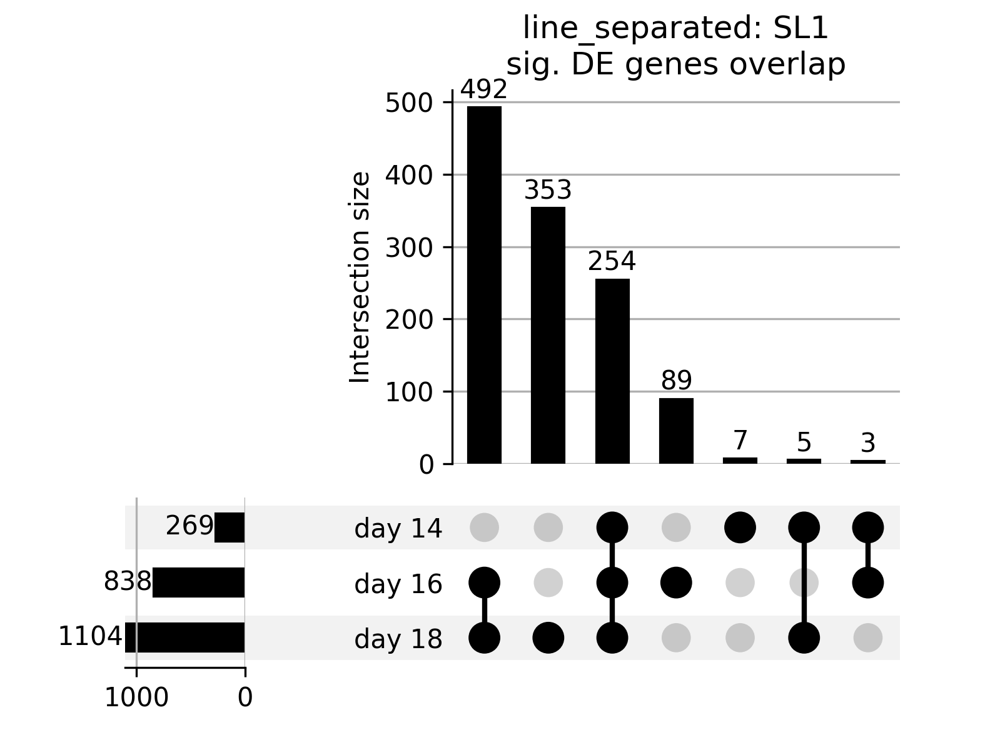
</p>

Lots of stuff happening mostly shared between later time points. smaller intersection between all time points, mostly because not so many genes are sex-biased yet in day 14

</div>

<div id="SL3_upset" class="tabcontent">

<p float="left">
  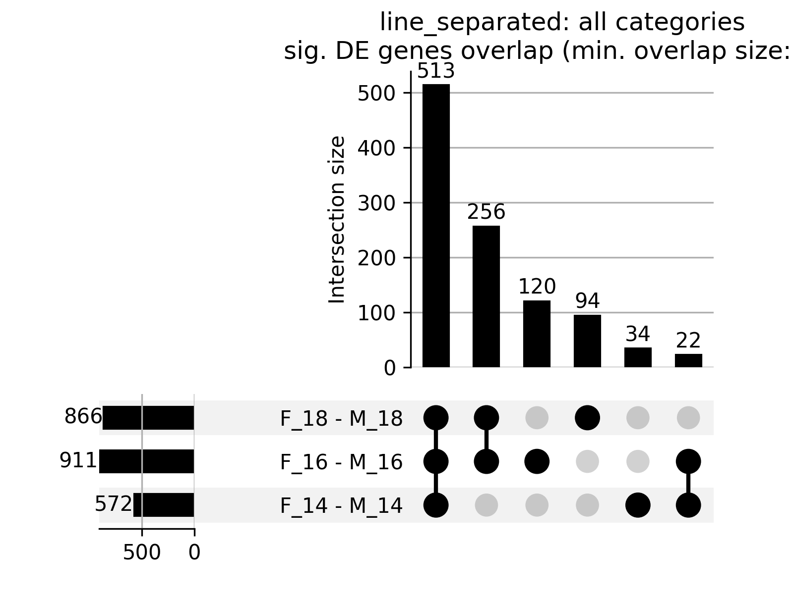
</p>

Most genes are sex biased (male-biased, see smear plots) at all times.

</div>

<div id="lines_upset" class="tabcontent">

<p float="left">
  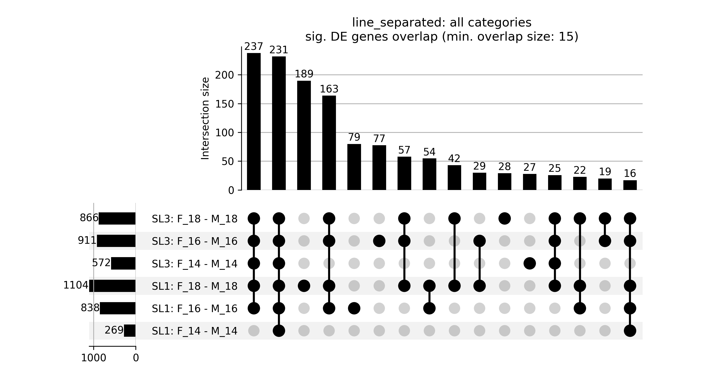
</p>

Same genes are sex-biased even between the lines. (again outlier SL1 day14, not a lot of sex bias happening here yet)

</div>


#### Upsetplots of sig enriched GO-terms overlap within SL1 and SL3

Even though the genes that are sex biased overlap, the GO-term enrichment finds mostly different GO-terms in the enrichment?

<div class="tab">
  <button class="tablinks" onclick="openTab(event, 'SL1_GO')">SL1</button>
  <button class="tablinks" onclick="openTab(event, 'SL3_GO')">SL3</button>
  <button class="tablinks" onclick="openTab(event, 'lines_GO')">Both lines</button>
</div>

<div id="SL1_GO" class="tabcontent">

<p float="left">
  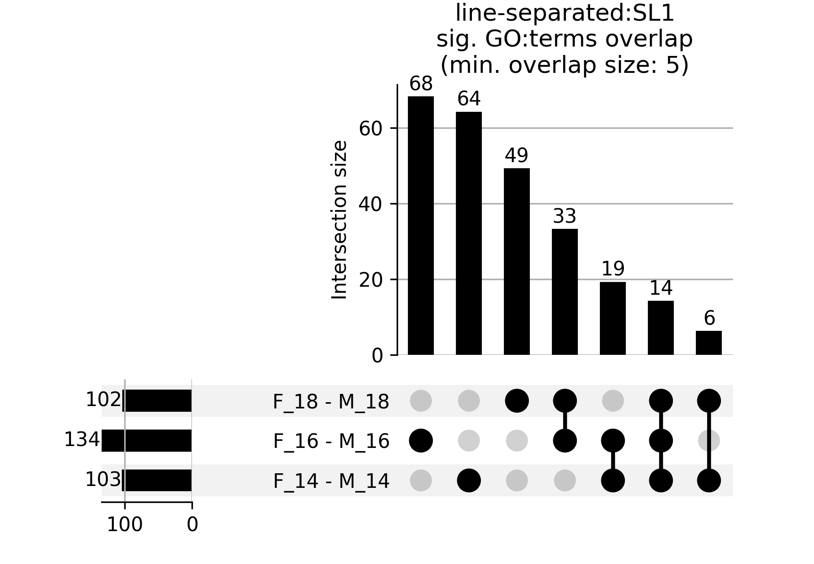
</p>

**GO-terms of relevant contrast comparison**

Shared enriched GO-terms ('all') are mostly related to spermatogenesis (same in SL3). The GO-terms that are unique to the development days are difficult to interpret, lots of biochemical stuff.

<div class="tab">
  <button class="tablinks" onclick="openTab(event, 'SL1_day14_GO')">day14</button>
  <button class="tablinks" onclick="openTab(event, 'SL1_day16_GO')">day16</button>
  <button class="tablinks" onclick="openTab(event, 'SL1_day18_GO')">day18</button>
  <button class="tablinks" onclick="openTab(event, 'SL1_all_GO')">all</button>
  <button class="tablinks" onclick="openTab(event, 'SL1_early_GO')">early</button>
  <button class="tablinks" onclick="openTab(event, 'SL1_late_GO')">late</button>
</div>

<div id="SL1_day14_GO" class="tabcontent">

`upsetplot_GO_terms_line_separated_SL1_day14.txt`: no clue (mostly molecular/biochemistry stuff I know nothing about)

<iframe
    src="data/DE_figures_python/GO_enrichment/upsetplot_GO_terms_line_separated_SL1_day14.txt"
    frameBorder="0"
    class=""
    scrolling="auto"
    style="width:100%; height:30vh;">
</iframe>

</div>

<div id="SL1_day16_GO" class="tabcontent">

`upsetplot_GO_terms_line_separated_SL1_day16.txt`: no clue (mostly molecular/biochemistry stuff I know nothing about)

<iframe
    src="data/DE_figures_python/GO_enrichment/upsetplot_GO_terms_line_separated_SL1_day16.txt"
    frameBorder="0"
    class=""
    scrolling="auto"
    style="width:100%; height:30vh;">
</iframe>

</div>

<div id="SL1_day18_GO" class="tabcontent">

`upsetplot_GO_terms_line_separated_SL1_day18.txt`: no clue (mostly molecular/biochemistry stuff I know nothing about)

<iframe
    src="data/DE_figures_python/GO_enrichment/upsetplot_GO_terms_line_separated_SL1_day18.txt"
    frameBorder="0"
    class=""
    scrolling="auto"
    style="width:100%; height:30vh;">
</iframe>

</div>

<div id="SL1_all_GO" class="tabcontent">

upsetplot_GO_terms_line_separated_SL1_all.txt: `F_14 - M_14 AND F_16 - M_16 AND F_18 - M_18`

Makes sense mostly, spermatogenesis and cilium-stuff would be male-biased when it happens during development.

<iframe
    src="data/DE_figures_python/GO_enrichment/upsetplot_GO_terms_line_separated_SL1_all.txt"
    frameBorder="0"
    class=""
    scrolling="auto"
    style="width:100%; height:30vh;">
</iframe>

</div>

<div id="SL1_early_GO" class="tabcontent">

upsetplot_GO_terms_line_separated_SL1_early.txt: `F_14 - M_14 AND F_16 - M_16`: less moolecular than the individual days but I still don't understand

<iframe
    src="data/DE_figures_python/GO_enrichment/upsetplot_GO_terms_line_separated_SL1_early.txt"
    frameBorder="0"
    class=""
    scrolling="auto"
    style="width:100%; height:30vh;">
</iframe>

</div>

<div id="SL1_late_GO" class="tabcontent">

upsetplot_GO_terms_line_separated_SL1_late.txt: `F_16 - M_16 AND F_18 - M_18`: less moolecular than the individual days but I still don't understand

<iframe
    src="data/DE_figures_python/GO_enrichment/upsetplot_GO_terms_line_separated_SL1_late.txt"
    frameBorder="0"
    class=""
    scrolling="auto"
    style="width:100%; height:30vh;">
</iframe>

</div>


</div>

<div id="SL3_GO" class="tabcontent">

<p float="left">
  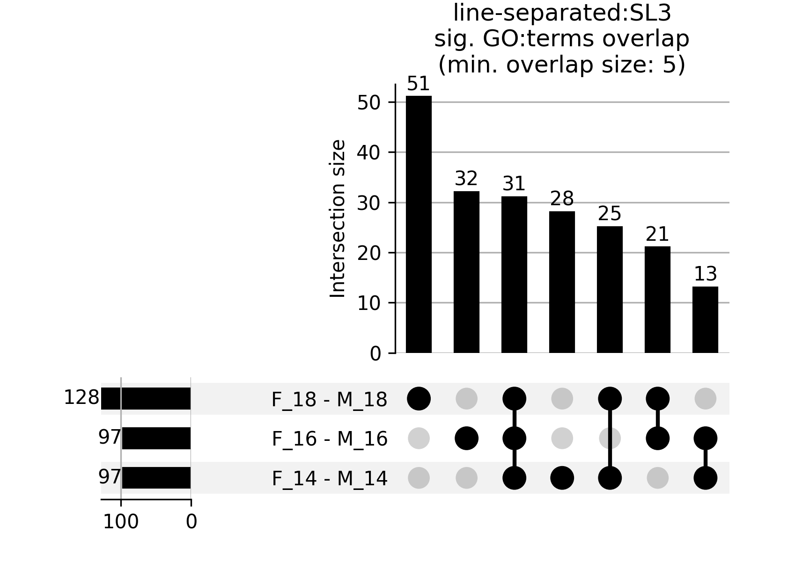
</p>

**GO-terms of relevant contrast comparison**

Shared enriched GO-terms ('all') are mostly related to spermatogenesis (same in SL1). Day14 shows some male-bias in genes related to feeding and digestion, and day14+day16 share a strange set of male courtship behaviour GO-terms.

<div class="tab">
  <button class="tablinks" onclick="openTab(event, 'SL3_day14_GO')">day14</button>
  <button class="tablinks" onclick="openTab(event, 'SL3_day16_GO')">day16</button>
  <button class="tablinks" onclick="openTab(event, 'SL3_day18_GO')">day18</button>
  <button class="tablinks" onclick="openTab(event, 'SL3_all_GO')">all</button>
  <button class="tablinks" onclick="openTab(event, 'SL3_early_GO')">early</button>
  <button class="tablinks" onclick="openTab(event, 'SL3_late_GO')">late</button>
</div>


<div id="SL3_day14_GO" class="tabcontent">

`upsetplot_GO_terms_line_separated_SL3_day14.txt`: some sensory reception and stimulus detection, as well as response to fructose and regulation of appetite?  <span style="color: #BD351E"> Do the larger SL3 males eat more at this time? </span>

<iframe
    src="data/DE_figures_python/GO_enrichment/upsetplot_GO_terms_line_separated_SL3_day14.txt"
    frameBorder="0"
    class=""
    scrolling="auto"
    style="width:100%; height:30vh;">
</iframe>

</div>

<div id="SL3_day16_GO" class="tabcontent">

`upsetplot_GO_terms_line_separated_SL3_day16.txt`: Some stuff related to spermatogenesis.

<iframe
    src="data/DE_figures_python/GO_enrichment/upsetplot_GO_terms_line_separated_SL3_day16.txt"
    frameBorder="0"
    class=""
    scrolling="auto"
    style="width:100%; height:30vh;">
</iframe>

</div>

<div id="SL3_day18_GO" class="tabcontent">

`upsetplot_GO_terms_line_separated_SL3_day18.txt`: Biochemical stuff I don't understand. maybe related to feeding/nutrient processing?

<iframe
    src="data/DE_figures_python/GO_enrichment/upsetplot_GO_terms_line_separated_SL3_day18.txt"
    frameBorder="0"
    class=""
    scrolling="auto"
    style="width:100%; height:30vh;">
</iframe>

</div>

<div id="SL3_all_GO" class="tabcontent">

upsetplot_GO_terms_line_separated_SL3_all.txt: `F_14 - M_14 AND F_16 - M_16 AND F_18 - M_18`: Again spermatogenesis like SL1, but also some mitochondria stuff.

<iframe
    src="data/DE_figures_python/GO_enrichment/upsetplot_GO_terms_line_separated_SL3_all.txt"
    frameBorder="0"
    class=""
    scrolling="auto"
    style="width:100%; height:30vh;">
</iframe>

</div>

<div id="SL3_early_GO" class="tabcontent">

upsetplot_GO_terms_line_separated_SL3_early.txt: `F_14 - M_14 AND F_16 - M_16`: Apparently lots of the same genes are involved in male courtship as well as wing development? <span style="color: #BD351E"> Do beetles have veined wings? Otherwise how is male courtship male-biased early in larval development?</span>

<iframe
    src="data/DE_figures_python/GO_enrichment/upsetplot_GO_terms_line_separated_SL3_early.txt"
    frameBorder="0"
    class=""
    scrolling="auto"
    style="width:100%; height:30vh;">
</iframe>

</div>

<div id="SL3_late_GO" class="tabcontent">

upsetplot_GO_terms_line_separated_SL3_late.txt: `F_16 - M_16 AND F_18 - M_18`: one spermatogenesis, but mostly biochemical stuff I don't understand.

<iframe
    src="data/DE_figures_python/GO_enrichment/upsetplot_GO_terms_line_separated_SL3_late.txt"
    frameBorder="0"
    class=""
    scrolling="auto"
    style="width:100%; height:30vh;">
</iframe>

</div>


</div>

<div id="lines_GO" class="tabcontent">

<p float="left">
  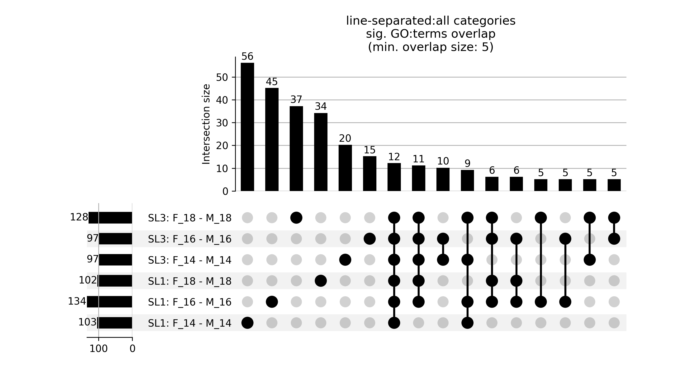
</p>

</div>


### 3.5 Day-separated samples

Analyze line and sex differences in each time point.


#### Differential expression between SL1 and SL3

In Females, there should be no line bias, so all genes that show line-bias in females (see lists in tabs) are excluded for the day contrasts.

<div class="tab">
  <button class="tablinks" onclick="openTab(event, 'day14_SL1-3_smear')">Day 14 (Smear plot)</button>
  <button class="tablinks" onclick="openTab(event, 'day14_SL1-3_volcano')">Day 14 (Volcano plot)</button>
  <button class="tablinks" onclick="openTab(event, 'day16_SL1-3_smear')">Day 16 (Smear plot)</button>
  <button class="tablinks" onclick="openTab(event, 'day16_SL1-3_volcano')">Day 16 (Volcano plot)</button>
  <button class="tablinks" onclick="openTab(event, 'day18_SL1-3_smear')">Day 18 (Smear plot)</button>
  <button class="tablinks" onclick="openTab(event, 'day18_SL1-3_volcano')">Day 18 (Volcano plot)</button>
</div>

<div id="day14_SL1-3_smear" class="tabcontent">

<p float="left">
  
  
  
</p>

| `glmQLFTest`  | F1-F3         | M1-M3         |
| ------------- | ------------- | ------------- |
| Downregulated | 11            | 160           |
| no difference | 10370         | 10097         |
| Upregulated   | 17            | 141           |

<details>
<summary>130 DE genes shared between males and females (excluded from plots, toggle down to see list)</summary>

```
['gene-327441', 'gene-241001', 'gene-403652', 'gene-403851', 'gene-224860', 'gene-218086', 'gene-390956', 'gene-224682', 'gene-240910', 'gene-81551', 'gene-392224', 'gene-240983', 'gene-326825', 'gene-222519', 'gene-237881', 'gene-224968', 'gene-220544', 'gene-226245', 'gene-391198', 'gene-403818', 'gene-239553', 'gene-90157', 'gene-84970', 'gene-219019', 'gene-407253', 'gene-224845', 'gene-81640', 'gene-222383', 'gene-220249', 'gene-430080', 'gene-430044', 'gene-391222', 'gene-222365', 'gene-240833', 'gene-428765', 'gene-240691', 'gene-80359', 'gene-392248', 'gene-390678', 'gene-225629', 'gene-120952', 'gene-428756', 'gene-224956', 'gene-403809', 'gene-224227', 'gene-240935', 'gene-225720', 'gene-225140', 'gene-224614', 'gene-224357', 'gene-392159', 'gene-222531', 'gene-225325', 'gene-117712', 'gene-84949', 'gene-222344', 'gene-406796', 'gene-240929', 'gene-392290', 'gene-81599', 'gene-225107', 'gene-231925', 'gene-214979', 'gene-220028', 'gene-260693', 'gene-224277', 'gene-224250', 'gene-224782', 'gene-390616', 'gene-224593', 'gene-322912', 'gene-431701', 'gene-80466', 'gene-403706', 'gene-323148', 'gene-323803', 'gene-283443', 'gene-326909', 'gene-225173', 'gene-243308', 'gene-430068', 'gene-222430', 'gene-240871', 'gene-237318', 'gene-224697', 'gene-222332', 'gene-241126', 'gene-89234', 'gene-406468', 'gene-328764', 'gene-326810', 'gene-88715', 'gene-222486', 'gene-224743', 'gene-221953', 'gene-225635', 'gene-222501', 'gene-428738', 'gene-430032', 'gene-241108', 'gene-81572', 'gene-392186', 'gene-222555', 'gene-81427', 'gene-225738', 'gene-403700', 'gene-234575', 'gene-240623', 'gene-222350', 'gene-395080', 'gene-225236', 'gene-224201', 'gene-241055', 'gene-225709', 'gene-326873', 'gene-326849', 'gene-322927', 'gene-80484', 'gene-395143', 'gene-225030', 'gene-222600', 'gene-224875', 'gene-390637', 'gene-224307', 'gene-403583', 'gene-224896', 'gene-430263', 'gene-428747', 'gene-430314', 'gene-403902']
```

</details>

</div>

<div id="day14_SL1-3_volcano" class="tabcontent">

<p float="left">
  
  
  
</p>

| `glmQLFTest`  | F1-F3         | M1-M3         |
| ------------- | ------------- | ------------- |
| Downregulated | 11            | 160           |
| no difference | 10370         | 10097         |
| Upregulated   | 17            | 141           |

<details>
<summary>130 DE genes shared between males and females (excluded from plots, toggle down to see list)</summary>

```
['gene-327441', 'gene-241001', 'gene-403652', 'gene-403851', 'gene-224860', 'gene-218086', 'gene-390956', 'gene-224682', 'gene-240910', 'gene-81551', 'gene-392224', 'gene-240983', 'gene-326825', 'gene-222519', 'gene-237881', 'gene-224968', 'gene-220544', 'gene-226245', 'gene-391198', 'gene-403818', 'gene-239553', 'gene-90157', 'gene-84970', 'gene-219019', 'gene-407253', 'gene-224845', 'gene-81640', 'gene-222383', 'gene-220249', 'gene-430080', 'gene-430044', 'gene-391222', 'gene-222365', 'gene-240833', 'gene-428765', 'gene-240691', 'gene-80359', 'gene-392248', 'gene-390678', 'gene-225629', 'gene-120952', 'gene-428756', 'gene-224956', 'gene-403809', 'gene-224227', 'gene-240935', 'gene-225720', 'gene-225140', 'gene-224614', 'gene-224357', 'gene-392159', 'gene-222531', 'gene-225325', 'gene-117712', 'gene-84949', 'gene-222344', 'gene-406796', 'gene-240929', 'gene-392290', 'gene-81599', 'gene-225107', 'gene-231925', 'gene-214979', 'gene-220028', 'gene-260693', 'gene-224277', 'gene-224250', 'gene-224782', 'gene-390616', 'gene-224593', 'gene-322912', 'gene-431701', 'gene-80466', 'gene-403706', 'gene-323148', 'gene-323803', 'gene-283443', 'gene-326909', 'gene-225173', 'gene-243308', 'gene-430068', 'gene-222430', 'gene-240871', 'gene-237318', 'gene-224697', 'gene-222332', 'gene-241126', 'gene-89234', 'gene-406468', 'gene-328764', 'gene-326810', 'gene-88715', 'gene-222486', 'gene-224743', 'gene-221953', 'gene-225635', 'gene-222501', 'gene-428738', 'gene-430032', 'gene-241108', 'gene-81572', 'gene-392186', 'gene-222555', 'gene-81427', 'gene-225738', 'gene-403700', 'gene-234575', 'gene-240623', 'gene-222350', 'gene-395080', 'gene-225236', 'gene-224201', 'gene-241055', 'gene-225709', 'gene-326873', 'gene-326849', 'gene-322927', 'gene-80484', 'gene-395143', 'gene-225030', 'gene-222600', 'gene-224875', 'gene-390637', 'gene-224307', 'gene-403583', 'gene-224896', 'gene-430263', 'gene-428747', 'gene-430314', 'gene-403902']
```

</details>

</div>

<div id="day16_SL1-3_smear" class="tabcontent">

<p float="left">
  
  
  
  
</p>

| `glmQLFTest`  | F1-F3         | M1-M3         |
| ------------- | ------------- | ------------- |
| Downregulated | 6             | 173           |
| no difference | 10415         | 10161         |
| Upregulated   | 21            | 108           |

<details>
<summary>142 DE genes shared between males and females (excluded from plots, toggle down to see list)</summary>

```
['gene-241001', 'gene-282746', 'gene-224860', 'gene-227308', 'gene-390956', 'gene-224682', 'gene-240910', 'gene-399475', 'gene-240983', 'gene-222519', 'gene-282458', 'gene-237881', 'gene-224968', 'gene-220544', 'gene-226245', 'gene-240860', 'gene-391198', 'gene-282524', 'gene-403818', 'gene-90157', 'gene-84970', 'gene-224845', 'gene-81640', 'gene-222383', 'gene-220249', 'gene-430080', 'gene-430044', 'gene-391222', 'gene-222365', 'gene-240833', 'gene-428765', 'gene-240691', 'gene-80359', 'gene-390678', 'gene-225629', 'gene-238849', 'gene-282620', 'gene-120952', 'gene-428756', 'gene-224956', 'gene-403809', 'gene-282853', 'gene-224227', 'gene-225720', 'gene-225140', 'gene-238407', 'gene-239506', 'gene-224357', 'gene-222531', 'gene-241682', 'gene-225325', 'gene-84949', 'gene-222344', 'gene-406796', 'gene-240929', 'gene-282551', 'gene-240638', 'gene-392290', 'gene-225158', 'gene-225107', 'gene-220028', 'gene-260693', 'gene-224277', 'gene-224782', 'gene-390616', 'gene-224593', 'gene-322912', 'gene-431701', 'gene-428113', 'gene-380466', 'gene-323148', 'gene-323803', 'gene-282665', 'gene-326909', 'gene-428104', 'gene-225173', 'gene-227370', 'gene-399317', 'gene-224890', 'gene-282347', 'gene-282784', 'gene-430068', 'gene-282491', 'gene-400393', 'gene-222430', 'gene-399484', 'gene-240871', 'gene-224697', 'gene-222332', 'gene-241126', 'gene-89234', 'gene-399424', 'gene-282362', 'g14784', 'gene-223491', 'gene-400384', 'gene-222486', 'gene-224743', 'gene-243299', 'gene-221953', 'gene-225635', 'gene-222501', 'gene-428738', 'gene-400402', 'gene-430032', 'gene-241108', 'gene-282398', 'gene-81572', 'gene-392186', 'gene-222555', 'gene-81427', 'gene-225738', 'gene-282701', 'gene-282886', 'gene-240623', 'gene-222159', 'gene-222350', 'gene-395080', 'gene-225236', 'gene-224201', 'gene-241055', 'gene-286545', 'gene-225709', 'gene-431030', 'gene-326849', 'gene-322927', 'gene-395143', 'gene-225030', 'gene-222600', 'gene-224875', 'gene-223773', 'gene-390637', 'gene-224307', 'gene-231854', 'gene-224896', 'gene-430263', 'gene-428747', 'gene-399270', 'gene-241262', 'gene-430314', 'gene-242512', 'gene-282590']
```

</details>

</div>

<div id="day16_SL1-3_volcano" class="tabcontent">

<p float="left">
  
  
  
  
</p>

| `glmQLFTest`  | F1-F3         | M1-M3         |
| ------------- | ------------- | ------------- |
| Downregulated | 6             | 173           |
| no difference | 10415         | 10161         |
| Upregulated   | 21            | 108           |

<details>
<summary>142 DE genes shared between males and females (excluded from plots, toggle down to see list)</summary>

```
['gene-241001', 'gene-282746', 'gene-224860', 'gene-227308', 'gene-390956', 'gene-224682', 'gene-240910', 'gene-399475', 'gene-240983', 'gene-222519', 'gene-282458', 'gene-237881', 'gene-224968', 'gene-220544', 'gene-226245', 'gene-240860', 'gene-391198', 'gene-282524', 'gene-403818', 'gene-90157', 'gene-84970', 'gene-224845', 'gene-81640', 'gene-222383', 'gene-220249', 'gene-430080', 'gene-430044', 'gene-391222', 'gene-222365', 'gene-240833', 'gene-428765', 'gene-240691', 'gene-80359', 'gene-390678', 'gene-225629', 'gene-238849', 'gene-282620', 'gene-120952', 'gene-428756', 'gene-224956', 'gene-403809', 'gene-282853', 'gene-224227', 'gene-225720', 'gene-225140', 'gene-238407', 'gene-239506', 'gene-224357', 'gene-222531', 'gene-241682', 'gene-225325', 'gene-84949', 'gene-222344', 'gene-406796', 'gene-240929', 'gene-282551', 'gene-240638', 'gene-392290', 'gene-225158', 'gene-225107', 'gene-220028', 'gene-260693', 'gene-224277', 'gene-224782', 'gene-390616', 'gene-224593', 'gene-322912', 'gene-431701', 'gene-428113', 'gene-380466', 'gene-323148', 'gene-323803', 'gene-282665', 'gene-326909', 'gene-428104', 'gene-225173', 'gene-227370', 'gene-399317', 'gene-224890', 'gene-282347', 'gene-282784', 'gene-430068', 'gene-282491', 'gene-400393', 'gene-222430', 'gene-399484', 'gene-240871', 'gene-224697', 'gene-222332', 'gene-241126', 'gene-89234', 'gene-399424', 'gene-282362', 'g14784', 'gene-223491', 'gene-400384', 'gene-222486', 'gene-224743', 'gene-243299', 'gene-221953', 'gene-225635', 'gene-222501', 'gene-428738', 'gene-400402', 'gene-430032', 'gene-241108', 'gene-282398', 'gene-81572', 'gene-392186', 'gene-222555', 'gene-81427', 'gene-225738', 'gene-282701', 'gene-282886', 'gene-240623', 'gene-222159', 'gene-222350', 'gene-395080', 'gene-225236', 'gene-224201', 'gene-241055', 'gene-286545', 'gene-225709', 'gene-431030', 'gene-326849', 'gene-322927', 'gene-395143', 'gene-225030', 'gene-222600', 'gene-224875', 'gene-223773', 'gene-390637', 'gene-224307', 'gene-231854', 'gene-224896', 'gene-430263', 'gene-428747', 'gene-399270', 'gene-241262', 'gene-430314', 'gene-242512', 'gene-282590']
```

</details>

</div>

<div id="day18_SL1-3_smear" class="tabcontent">

<p float="left">
  
  
  
  
</p>

| `glmQLFTest`  | F1-F3         | M1-M3         |
| ------------- | ------------- | ------------- |
| Downregulated | 6             | 3             |
| no difference | 11193         | 11190         |
| Upregulated   | 5             | 11            |

</div>

<div id="day18_SL1-3_volcano" class="tabcontent">

<p float="left">
  
  
  
  
</p>

| `glmQLFTest`  | F1-F3         | M1-M3         |
| ------------- | ------------- | ------------- |
| Downregulated | 6             | 3             |
| no difference | 11193         | 11190         |
| Upregulated   | 5             | 11            |

</div>


#### Differential expression between males and females

This agrees very nicely with the line-separated analysis, most genes are male-biased, with SL1 on day 14 showing much less male-bias compared to all other tested contrasts.

<div class="tab">
  <button class="tablinks" onclick="openTab(event, 'day14_FM_smear')">Day 14 (Smear plot)</button>
  <button class="tablinks" onclick="openTab(event, 'day14_FM_volcano')">Day 14 (Volcano plot)</button>
  <button class="tablinks" onclick="openTab(event, 'day16_FM_smear')">Day 16 (Smear plot)</button>
  <button class="tablinks" onclick="openTab(event, 'day16_FM_volcano')">Day 16 (Volcano plot)</button>
  <button class="tablinks" onclick="openTab(event, 'day18_FM_smear')">Day 18 (Smear plot)</button>
  <button class="tablinks" onclick="openTab(event, 'day18_FM_volcano')">Day 18 (Volcano plot)</button>
</div>

<div id="day14_FM_smear" class="tabcontent">

<p float="left">
  
  
  
</p>

| `glmQLFTest`  | F1-M1         | F3-M3         |
| ------------- | ------------- | ------------- |
| Downregulated | 154           | 510           |
| no difference | 10236         | 9884          |
| Upregulated   | 8             | 4             |


</div>

<div id="day14_FM_volcano" class="tabcontent">

<p float="left">
  
  
  
</p>

| `glmQLFTest`  | F1-M1         | F3-M3         |
| ------------- | ------------- | ------------- |
| Downregulated | 154           | 510           |
| no difference | 10236         | 9884          |
| Upregulated   | 8             | 4             |


</div>

<div id="day16_FM_smear" class="tabcontent">

<p float="left">
  
  
  
</p>

| `glmQLFTest`  | F1-M1         | F3-M3         |
| ------------- | ------------- | ------------- |
| Downregulated | 692           | 781           |
| no difference | 9713          | 9625          |
| Upregulated   | 37            | 36            |

</div>

<div id="day16_FM_volcano" class="tabcontent">

<p float="left">
  
  
  
</p>

| `glmQLFTest`  | F1-M1         | F3-M3         |
| ------------- | ------------- | ------------- |
| Downregulated | 692           | 781           |
| no difference | 9713          | 9625          |
| Upregulated   | 37            | 36            |

</div>

<div id="day18_FM_smear" class="tabcontent">

<p float="left">
  
  
  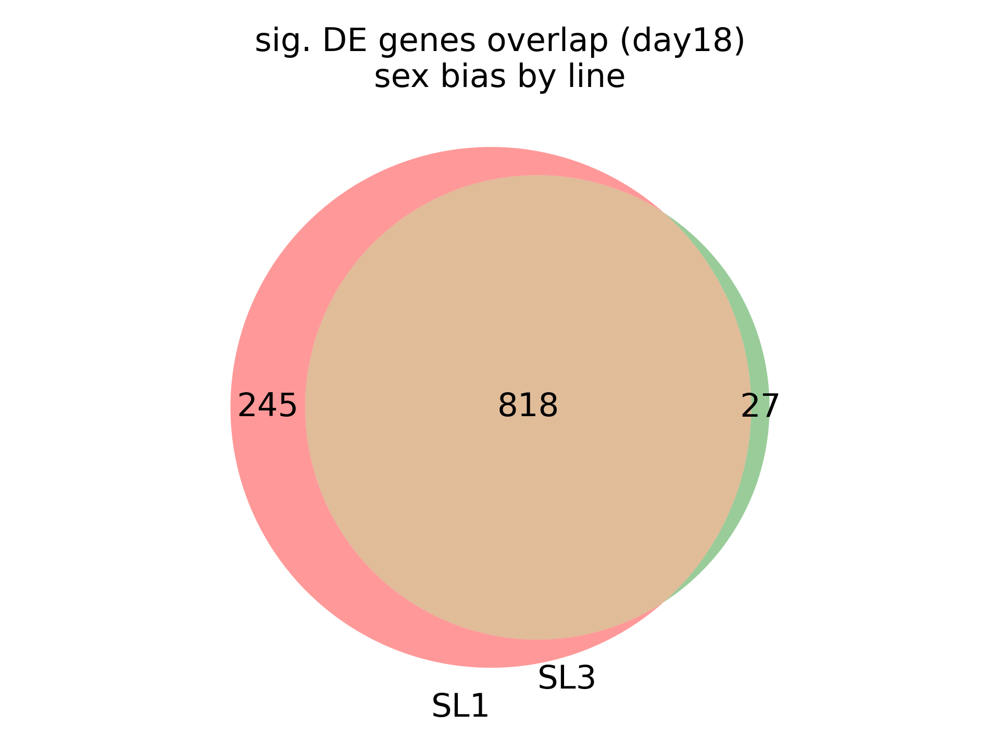
</p>

| `glmQLFTest`  | F1-M1         | F3-M3         |
| ------------- | ------------- | ------------- |
| Downregulated | 1044          | 843           |
| no difference | 10141         | 10359         |
| Upregulated   | 19            | 2             |

</div>

<div id="day18_FM_volcano" class="tabcontent">

<p float="left">
  
  
  
</p>

| `glmQLFTest`  | F1-M1         | F3-M3         |
| ------------- | ------------- | ------------- |
| Downregulated | 1044          | 843           |
| no difference | 10141         | 10359         |
| Upregulated   | 19            | 2             |

</div>


#### Interaction sex-bias by line-bias

`(F_1 - M_1) - (F_3 - M_3)`: Female-biased in one line and male-biased in the other. Also plot a scatter of the genes significant in the interaction in the same scatter plot as above if they are significant.

<div class="tab">
  <button class="tablinks" onclick="openTab(event, 'day14_interaction_smear')">Day 14 (Smear plot)</button>
  <button class="tablinks" onclick="openTab(event, 'day14_interaction_volcano')">Day 14 (Volcano plot)</button>
  <button class="tablinks" onclick="openTab(event, 'day16_interaction_smear')">Day 16 (Smear plot)</button>
  <button class="tablinks" onclick="openTab(event, 'day16_interaction_volcano')">Day 16 (Volcano plot)</button>
  <button class="tablinks" onclick="openTab(event, 'day18_interaction_smear')">Day 18 (Smear plot)</button>
  <button class="tablinks" onclick="openTab(event, 'day18_interaction_volcano')">Day 18 (Volcano plot)</button>
</div>

<div id="day14_interaction_smear" class="tabcontent">
<p float="left">
  
  
    
</p>

| `glmQLFTest`  | (F_1 - M_1) - (F_3 - M_3) |
| ------------- | ------------------------- |
| Downregulated | 160                       |
| no difference | 10097                     |
| Upregulated   | 141                       |


</div>

<div id="day14_interaction_volcano" class="tabcontent">
<p float="left">
  
  
  
</p>

| `glmQLFTest`  | (F_1 - M_1) - (F_3 - M_3) |
| ------------- | ------------------------- |
| Downregulated | 160                       |
| no difference | 10097                     |
| Upregulated   | 141                       |

</div>

<div id="day16_interaction_smear" class="tabcontent">
<p float="left">
  
  
    
</p>

| `glmQLFTest`  | (F_1 - M_1) - (F_3 - M_3) |
| ------------- | ------------------------- |
| Downregulated | 173                       |
| no difference | 10161                     |
| Upregulated   | 108                       |

</div>

<div id="day16_interaction_volcano" class="tabcontent">
<p float="left">
  
  
  
</p>

| `glmQLFTest`  | (F_1 - M_1) - (F_3 - M_3) |
| ------------- | ------------------------- |
| Downregulated | 173                       |
| no difference | 10161                     |
| Upregulated   | 108                       |

</div>

<div id="day18_interaction_smear" class="tabcontent">
<p float="left">
  
  
    
</p>

| `glmQLFTest`  | (F_1 - M_1) - (F_3 - M_3) |
| ------------- | ------------------------- |
| Downregulated | 3                         |
| no difference | 11190                     |
| Upregulated   | 11                        |

</div>

<div id="day18_interaction_volcano" class="tabcontent">
<p float="left">
  
  
  
</p>

| `glmQLFTest`  | (F_1 - M_1) - (F_3 - M_3) |
| ------------- | ------------------------- |
| Downregulated | 3                         |
| no difference | 11190                     |
| Upregulated   | 11                        |

</div>


#### Overlap of DE scatterplots


<div class="tab">
  <button class="tablinks" onclick="openTab(event, 'day14_scatter')">Day 14</button>
  <button class="tablinks" onclick="openTab(event, 'day16_scatter')">Day 16</button>
  <button class="tablinks" onclick="openTab(event, 'day18_scatter')">Day 18</button>
</div>

<div id="day14_scatter" class="tabcontent">
<p float="left">
  
  
</p>
</div>

<div id="day16_scatter" class="tabcontent">
<p float="left">
  
  
</p>
</div>

<div id="day18_scatter" class="tabcontent">
<p float="left">
  
  
</p>
</div>

#### Upsetplot of sig DE genes between lines and sexes

Same as in the line-separated analysis, the sex-biased genes are the same between all days and lines, and if there are differences it is that genes are missing from day 14 where they are not sex-biased yet.

<div class="tab">
  <button class="tablinks" onclick="openTab(event, 'day14_upset')">Day 14</button>
  <button class="tablinks" onclick="openTab(event, 'day16_upset')">Day 16</button>
  <button class="tablinks" onclick="openTab(event, 'day18_upset')">Day 18</button>
  <button class="tablinks" onclick="openTab(event, 'all_upset')">All days</button>
</div>

<div id="day14_upset" class="tabcontent">
<p float="left">
  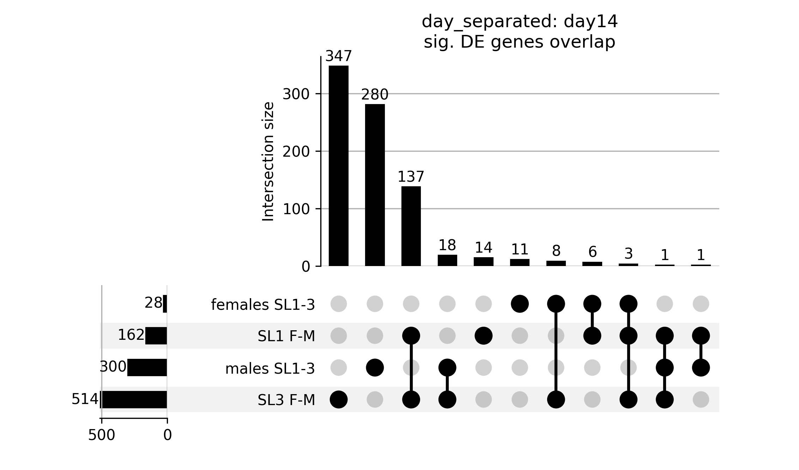
</p>


</div>

<div id="day16_upset" class="tabcontent">
<p float="left">
  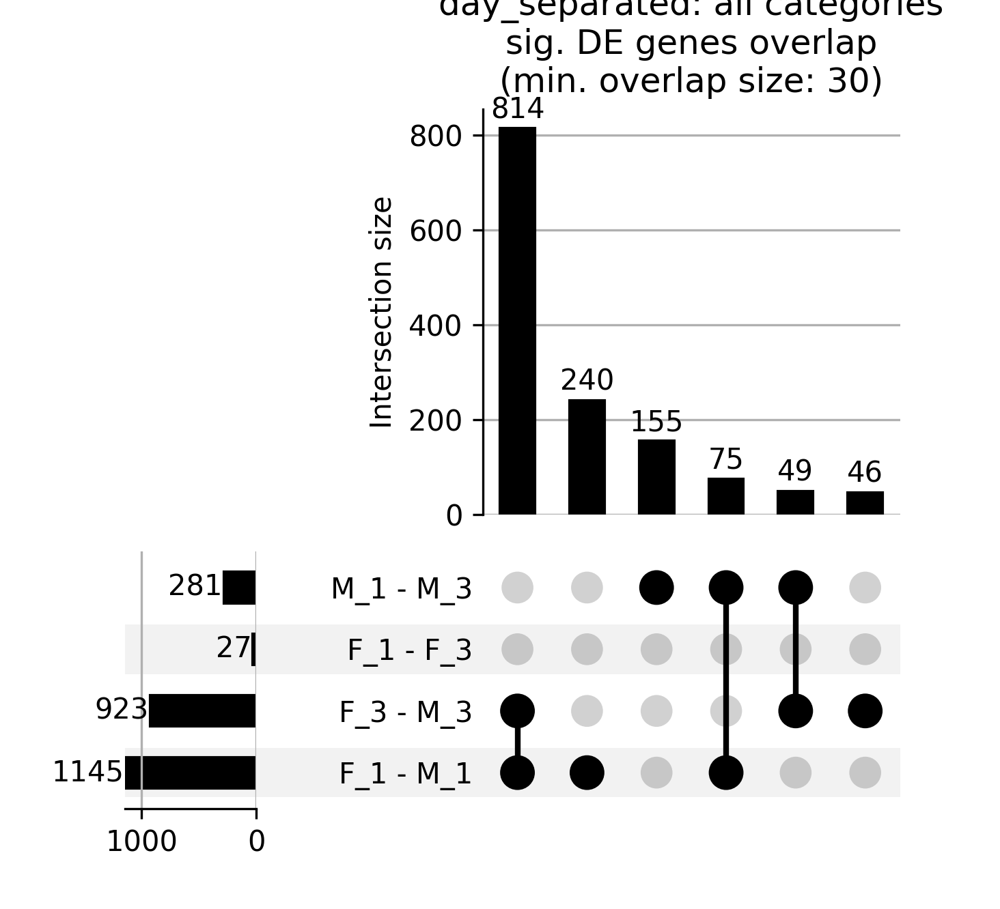
</p>

</div>

<div id="day18_upset" class="tabcontent">
<p float="left">
  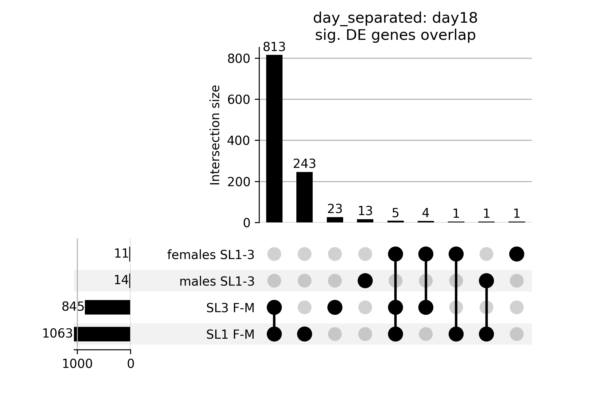
</p>


</div>

<div id="all_upset" class="tabcontent">
<p float="left">
  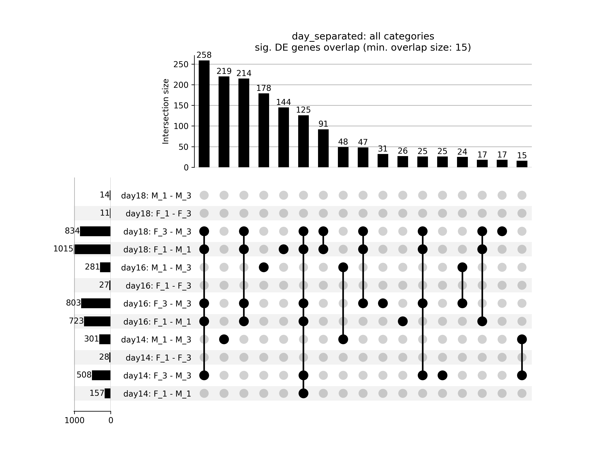
</p>
</div>


#### Upsetplot of sig enriched GO-terms between lines and sexes


<div class="tab">
  <button class="tablinks" onclick="openTab(event, 'day14_GO')">Day 14</button>
  <button class="tablinks" onclick="openTab(event, 'day16_GO')">Day 16</button>
  <button class="tablinks" onclick="openTab(event, 'day18_GO')">Day 18</button>
  <button class="tablinks" onclick="openTab(event, 'all_GO')">All days</button>
</div>

<div id="day14_GO" class="tabcontent">
<p float="left">
  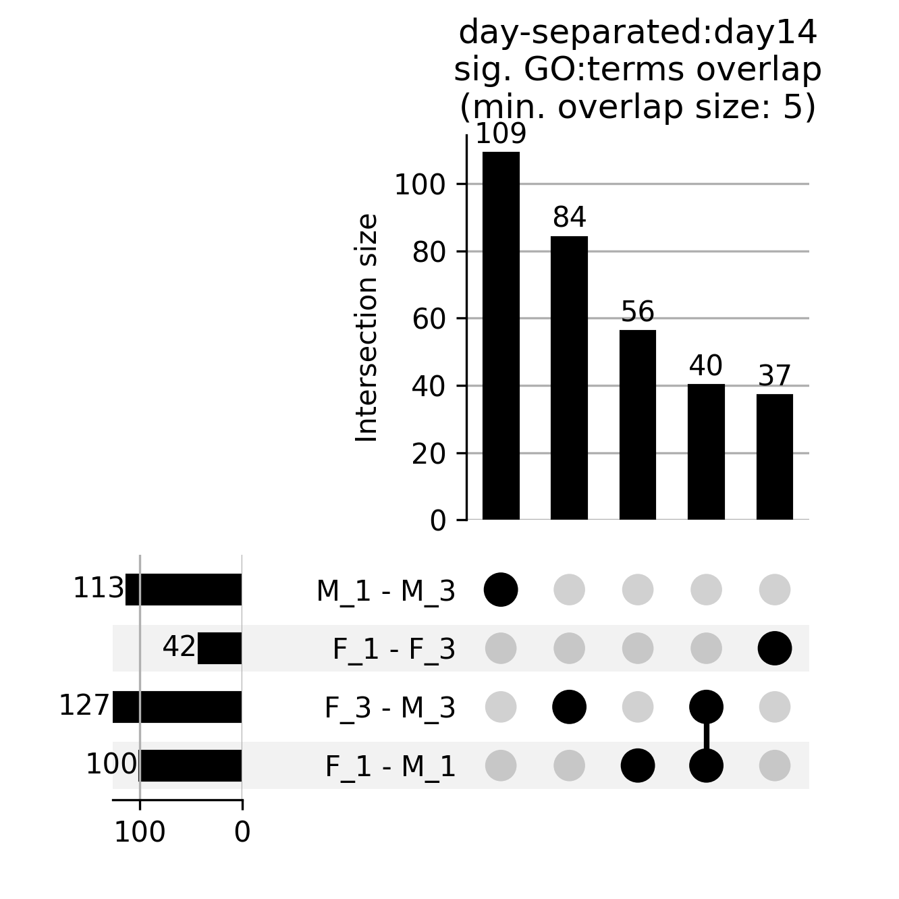
</p>

**GO-terms of relevant contrast comparison**

Some spermatogenesis stuff is male-biased only in SL3 (`SL3 F-M`) and not yet in SL1.

<div class="tab">
  <button class="tablinks" onclick="openTab(event, 'day14_SL1_GO')">SL1 F-M</button>
  <button class="tablinks" onclick="openTab(event, 'day14_SL3_GO')">SL3 F-M</button>
  <button class="tablinks" onclick="openTab(event, 'day14_both_GO')">both F-M</button>
  <button class="tablinks" onclick="openTab(event, 'day14_males_GO')">males SL1-3</button>
  <button class="tablinks" onclick="openTab(event, 'day14_females_GO')">females SL1-3</button>
</div>

<div id="day14_SL1_GO" class="tabcontent">

`upsetplot_GO_terms_day_separated_day14_SL1.txt`: A little bit of spermatogenesis, but mostly Biochemical stuff I don't understand.

<iframe
    src="data/DE_figures_python/GO_enrichment/upsetplot_GO_terms_day_separated_day14_SL1.txt"
    frameBorder="0"
    class=""
    scrolling="auto"
    style="width:100%; height:30vh;">
</iframe>

</div>

<div id="day14_SL3_GO" class="tabcontent">

`upsetplot_GO_terms_day_separated_day14_SL3.txt`: Spermatogenesis and mating behaviour

<iframe
    src="data/DE_figures_python/GO_enrichment/upsetplot_GO_terms_day_separated_day14_SL3.txt"
    frameBorder="0"
    class=""
    scrolling="auto"
    style="width:100%; height:30vh;">
</iframe>

</div>

<div id="day14_both_GO" class="tabcontent">

upsetplot_GO_terms_day_separated_day14_both.txt: `F_1 - M_1 AND F_3 - M_3`: Some spermatogenesis (cilium) but mostly biochemical stuff

<iframe
    src="data/DE_figures_python/GO_enrichment/upsetplot_GO_terms_day_separated_day14_both.txt"
    frameBorder="0"
    class=""
    scrolling="auto"
    style="width:100%; height:30vh;">
</iframe>

</div>

<div id="day14_males_GO" class="tabcontent">

`upsetplot_GO_terms_day_separated_day14_males.txt` some locomotion but mostly unsure how to interpret. <span style="color: #BD351E"> Nothing related to feeding/digestion (which is male-biased in the line-separated data for day14 in SL3).</span>

<iframe
    src="data/DE_figures_python/GO_enrichment/upsetplot_GO_terms_day_separated_day14_males.txt"
    frameBorder="0"
    class=""
    scrolling="auto"
    style="width:100%; height:30vh;">
</iframe>

</div>

<div id="day14_females_GO" class="tabcontent">

`upsetplot_GO_terms_day_separated_day14_females.txt`: <span style="color: #BD351E"> Females should have no line difference!</span> Unclear how to interpret these anyways.

<iframe
    src="data/DE_figures_python/GO_enrichment/upsetplot_GO_terms_day_separated_day14_females.txt"
    frameBorder="0"
    class=""
    scrolling="auto"
    style="width:100%; height:30vh;">
</iframe>

</div>


</div>

<div id="day16_GO" class="tabcontent">
<p float="left">
  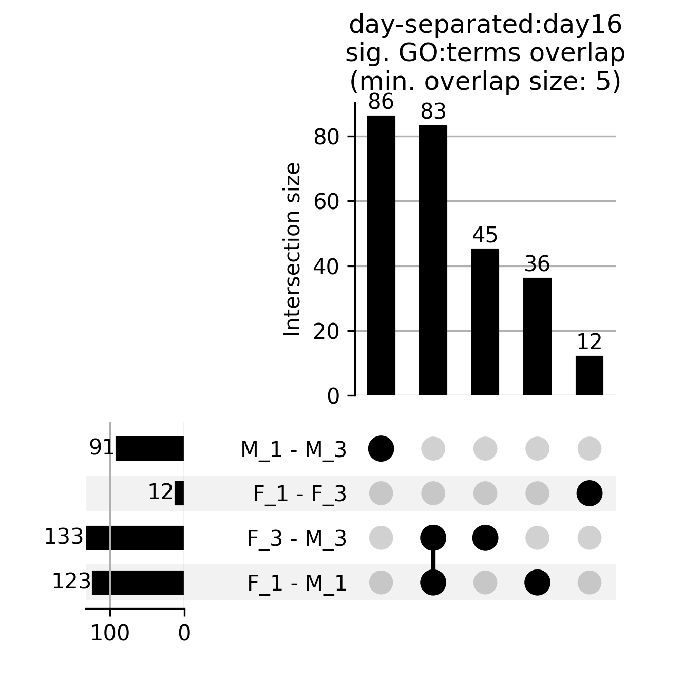
</p>

**GO-terms of relevant contrast comparison**

<div class="tab">
  <button class="tablinks" onclick="openTab(event, 'day16_SL1_GO')">SL1 F-M</button>
  <button class="tablinks" onclick="openTab(event, 'day16_SL3_GO')">SL3 F-M</button>
  <button class="tablinks" onclick="openTab(event, 'day16_both_GO')">both F-M</button>
  <button class="tablinks" onclick="openTab(event, 'day16_males_GO')">males SL1-3</button>
  <button class="tablinks" onclick="openTab(event, 'day16_females_GO')">females SL1-3</button>
</div>

<div id="day16_SL1_GO" class="tabcontent">

`upsetplot_GO_terms_day_separated_day16_SL1.txt`: some digestion/glucose-related stuff. a litte bit of spermatogenesis/mating behaviour.

<iframe
    src="data/DE_figures_python/GO_enrichment/upsetplot_GO_terms_day_separated_day16_SL1.txt"
    frameBorder="0"
    class=""
    scrolling="auto"
    style="width:100%; height:30vh;">
</iframe>

</div>

<div id="day16_SL3_GO" class="tabcontent">

`upsetplot_GO_terms_day_separated_day16_SL3.txt`: again male courtship behaviour/veined wing development!  <span style="color: #BD351E"> also male-biased in early SL3 (day 14 and 16) in the line-separated data</span> 

<iframe
    src="data/DE_figures_python/GO_enrichment/upsetplot_GO_terms_day_separated_day16_SL3.txt"
    frameBorder="0"
    class=""
    scrolling="auto"
    style="width:100%; height:30vh;">
</iframe>

</div>

<div id="day16_both_GO" class="tabcontent">

upsetplot_GO_terms_day_separated_day16_both.txt: `F_1 - M_1 AND F_3 - M_3`: spermatogenesis, and a bit of feeding/digestion related stuff. 

<iframe
    src="data/DE_figures_python/GO_enrichment/upsetplot_GO_terms_day_separated_day16_both.txt"
    frameBorder="0"
    class=""
    scrolling="auto"
    style="width:100%; height:30vh;">
</iframe>

</div>

<div id="day16_males_GO" class="tabcontent">

`upsetplot_GO_terms_day_separated_day16_males.txt` Lots of metabolic process. Maybe also related to differences in feeding behaviour at this time in the SL3 males

<iframe
    src="data/DE_figures_python/GO_enrichment/upsetplot_GO_terms_day_separated_day16_males.txt"
    frameBorder="0"
    class=""
    scrolling="auto"
    style="width:100%; height:30vh;">
</iframe>

</div>

<div id="day16_females_GO" class="tabcontent">

`upsetplot_GO_terms_day_separated_day16_females.txt`: <span style="color: #BD351E"> Females should have no line difference!</span> These are difficult to interpret anyways.

<iframe
    src="data/DE_figures_python/GO_enrichment/upsetplot_GO_terms_day_separated_day16_females.txt"
    frameBorder="0"
    class=""
    scrolling="auto"
    style="width:100%; height:30vh;">
</iframe>

</div>


</div>

<div id="day18_GO" class="tabcontent">
<p float="left">
  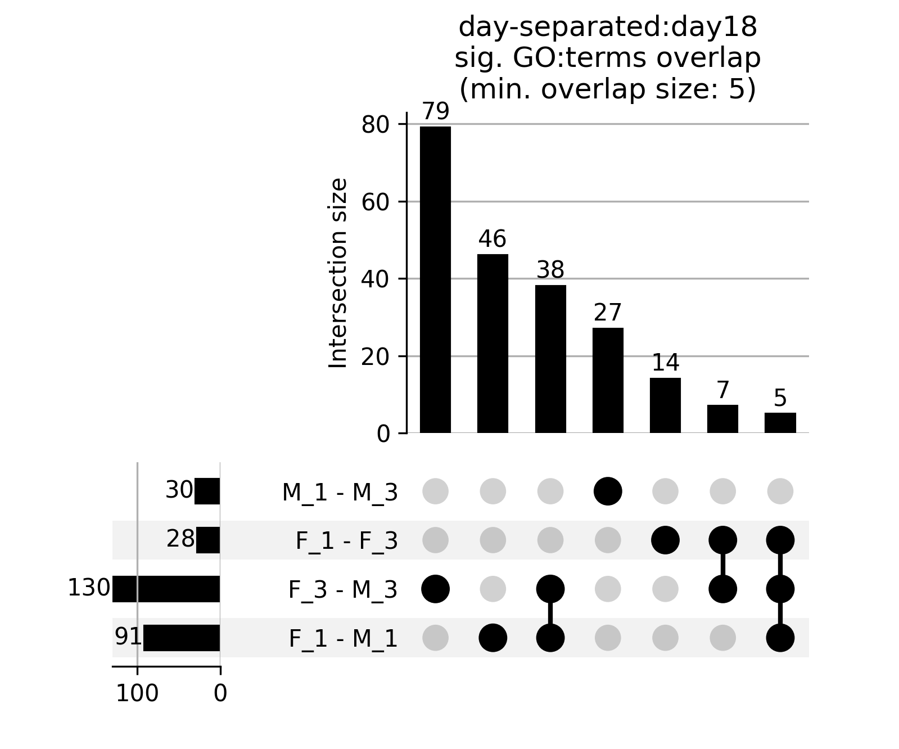
</p>


**GO-terms of relevant contrast comparison**

<div class="tab">
  <button class="tablinks" onclick="openTab(event, 'day18_SL1_GO')">SL1 F-M</button>
  <button class="tablinks" onclick="openTab(event, 'day18_SL3_GO')">SL3 F-M</button>
  <button class="tablinks" onclick="openTab(event, 'day18_both_GO')">both F-M</button>
  <button class="tablinks" onclick="openTab(event, 'day18_males_GO')">males SL1-3</button>
  <button class="tablinks" onclick="openTab(event, 'day18_females_GO')">females SL1-3</button>
</div>

<div id="day18_SL1_GO" class="tabcontent">

`upsetplot_GO_terms_day_separated_day18_SL1.txt`: a bit of (retina?) development, mostly unclear biochemistry.

<iframe
    src="data/DE_figures_python/GO_enrichment/upsetplot_GO_terms_day_separated_day18_SL1.txt"
    frameBorder="0"
    class=""
    scrolling="auto"
    style="width:100%; height:30vh;">
</iframe>

</div>

<div id="day18_SL3_GO" class="tabcontent">

`upsetplot_GO_terms_day_separated_day18_SL3.txt`: a bit of spermatogenesis but mostly unclear biochemistry.

<iframe
    src="data/DE_figures_python/GO_enrichment/upsetplot_GO_terms_day_separated_day18_SL3.txt"
    frameBorder="0"
    class=""
    scrolling="auto"
    style="width:100%; height:30vh;">
</iframe>

</div>

<div id="day18_both_GO" class="tabcontent">

upsetplot_GO_terms_day_separated_day18_both.txt: `F_1 - M_1 AND F_3 - M_3`: Also a bit of spermatogenesis but I think less than day 14 and 16?. Also transmembrane and metabolism biochemistry.

<iframe
    src="data/DE_figures_python/GO_enrichment/upsetplot_GO_terms_day_separated_day18_both.txt"
    frameBorder="0"
    class=""
    scrolling="auto"
    style="width:100%; height:30vh;">
</iframe>

</div>

<div id="day18_males_GO" class="tabcontent">

`upsetplot_GO_terms_day_separated_day18_males.txt` no spermatogenesis any more? stuff related to calcium ions.

<iframe
    src="data/DE_figures_python/GO_enrichment/upsetplot_GO_terms_day_separated_day18_males.txt"
    frameBorder="0"
    class=""
    scrolling="auto"
    style="width:100%; height:30vh;">
</iframe>

</div>

<div id="day18_females_GO" class="tabcontent">

`upsetplot_GO_terms_day_separated_day18_females.txt` <span style="color: #BD351E"> Females should have no line difference!</span>

<iframe
    src="data/DE_figures_python/GO_enrichment/upsetplot_GO_terms_day_separated_day18_females.txt"
    frameBorder="0"
    class=""
    scrolling="auto"
    style="width:100%; height:30vh;">
</iframe>

</div>

</div>

<div id="all_GO" class="tabcontent">
<p float="left">
  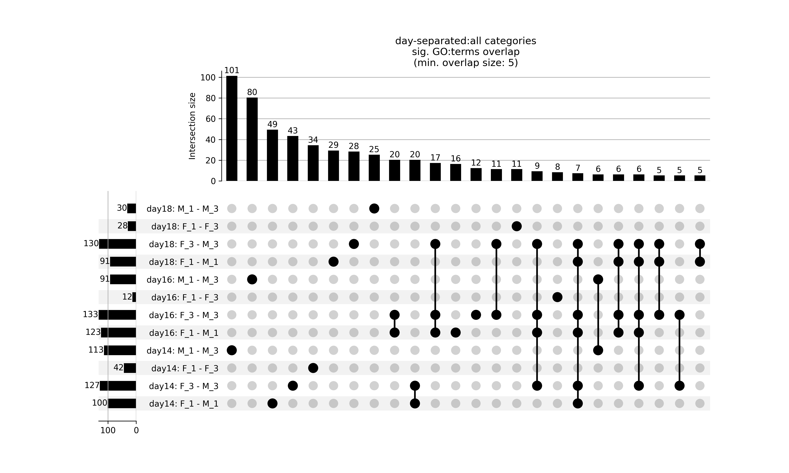
</p>
</div>


## 4. Y expression quantification

### 4.1 median expression in all samples

The median expression of X and Y linked genes in all samples with 95% standard error

<div class="tab">
  <button class="tablinks" onclick="openTab(event, 'y_median')">only Y</button>
  <button class="tablinks" onclick="openTab(event, 'x_and_y_median')">Y and X</button>
</div>

<div id="y_median" class="tabcontent">
<p float="left">
  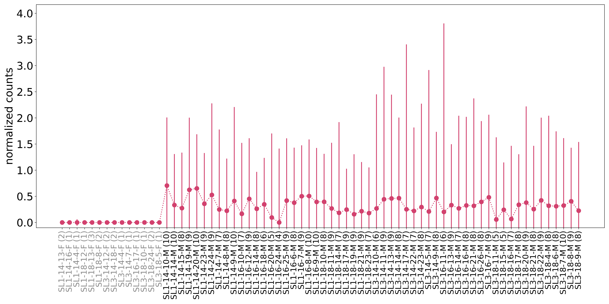
</p>
</div>

<div id="x_and_y_median" class="tabcontent">
<p float="left">
  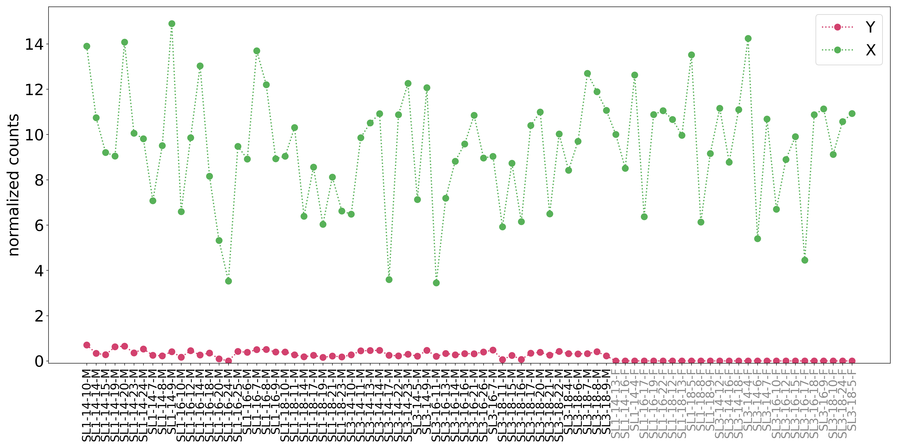
</p>
</div>

### 4.2 DE of only genes on the Y chromosome

I filtered the raw counts file `PhD_chapter4/data/gene_counts_standard.txt` to only have genes that are on the Y according to the annotation, which is 63. 

<div class="tab">
  <button class="tablinks" onclick="openTab(event, 'all_Y')">11 expressed y genes</button>
  <button class="tablinks" onclick="openTab(event, 'low_y')">9 lowly expressed y genes</button>
</div>

<div id="all_Y" class="tabcontent">
<p float="left">
  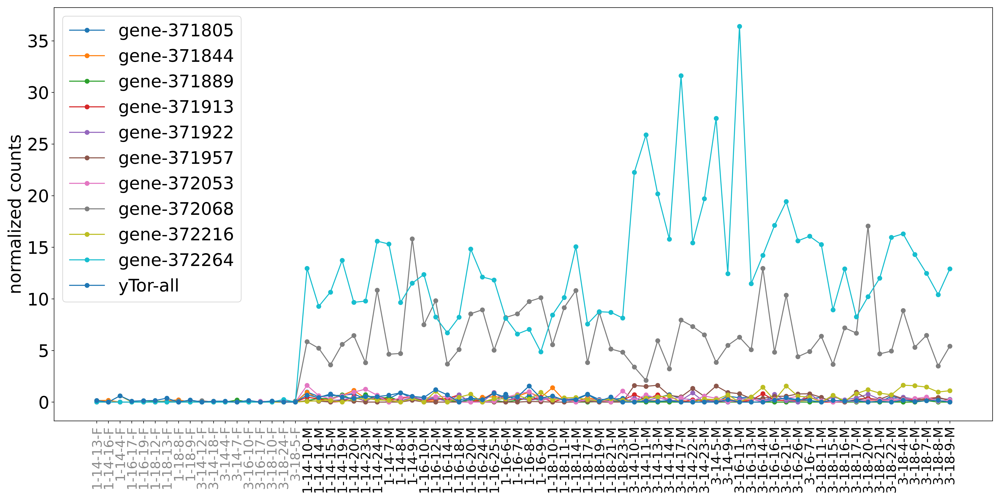
</p>

`gene-372264` is annotated as nucleic acid binding, the other one has no functional annotation.

</div>

<div id="low_y" class="tabcontent">
<p float="left">
  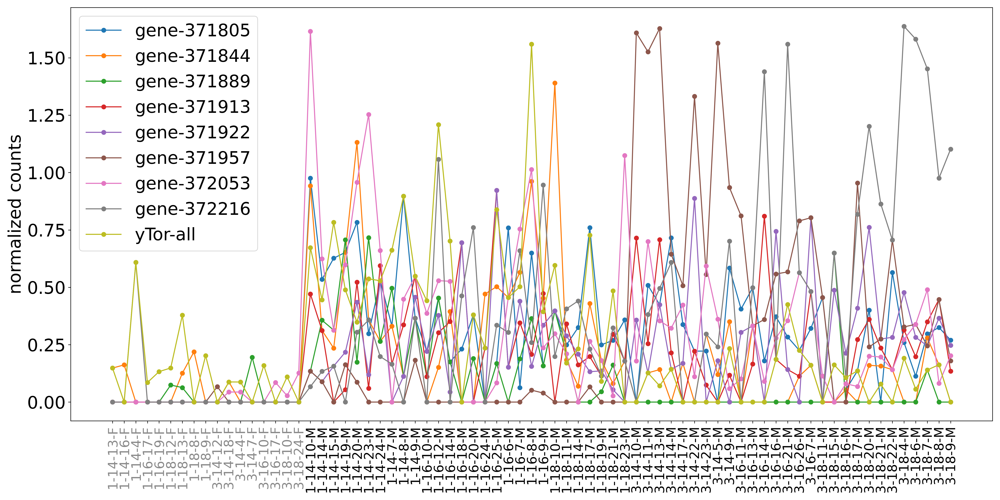
</p>
</div>

Thoughts about the annotation: unsure how BRAKER handles multimapping internally? this is all unuqiely mapped reads. maybe high multimapping makes gene prediction more difficult, resulting in fewer genes in the first place? 

#### MSL2

MSL2 is a gene that controls dosage compensation in drosophila, there's a copy on `scaffold_26` (y-linked) in Cmac which is expressed at comparable levels to the autosomal one (multimapping?)

<details>
<summary>Toggle down for plot</summary>

<p float="left">
  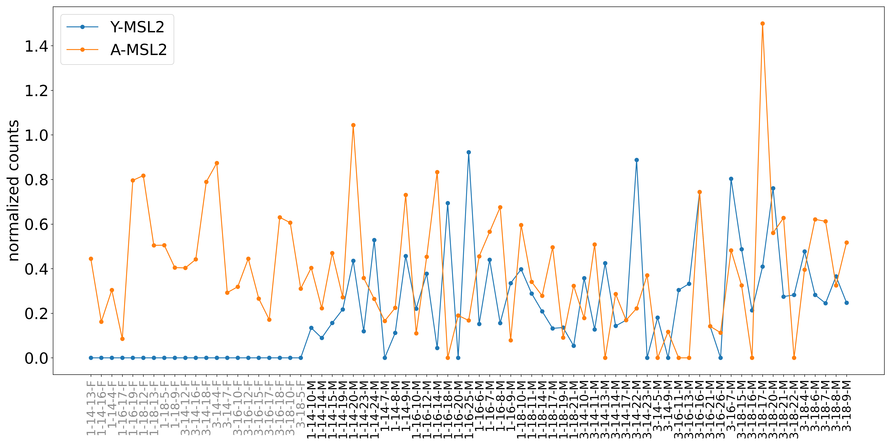
</p>

</details>