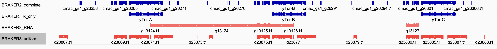

# mTOR annotation

## Old annotation: why am I doing this

There is an older version of the annotation done with BRAKER2 and TSEBRA separately, published in Kaufmann 2023 ([here](https://academic.oup.com/mbe/article/40/8/msad167/7227908)) which has like 35k genes, a lot for beetles. When I re-annotate a superscaffolded version of this assembly with BRAKER3 and the same RNAseq data, I find a much more reasonable 15k genes. I think this is because of the way that TSEBRA sets it's default values when combining evidence from different sources. The TSEBRA internal default weight value for RNAseq is only half of the value that BRAKER3 sets for TSEBRA. I assume this is why the old BRAKER2 annotation (which used TSEBRA-specific defaults) finds about the same number of genes as my annotation with no RNAseq, because the RNA evidence is valued down. When it is weighted higher like in BRAKER3, then more false positives are filtered out, reducing the number of genes overall, especially for shorter transcripts. See more detailed explanation in the SI of https://github.com/milena-t/PhD_chapter1.

However, this old annotation contains some manual curation for the copy number variation of TOR on the Y contigs. To be able to use the updated annotation for this project, I need to include the manual curation and also do a functional annotation.

## Manual curation of Y-Tor

This is the workflow that Doug used and thankfully documented really well in `/proj/naiss2023-6-65/douglas/nobackup/Callosobruchus_maculatus/mTor`. This is based on the Kaufmann2023 annotation that already has correct gene structure models and just needed the functional information added. 

### mTor consensus sequence 

They already have candidate proteins from Cmac that they think are the duplicates on the Y, so Doug starts with making an alignment between them, the autosomal one, and several other species (`sequences/mTor_sequences.faa`):
<details>
  <summary>list</summary>
<li>[Homo sapiens]: NP_004949.1 serine/threonine kinas mTOR isoform 1 </li>
<li>[Callosobruchus maculatus]: VEN43112.1 unnamed protein product </li>
<li>[Callosobruchus maculatus]: VEN51984.1 unnamed protein product </li>
<li>[Anoplophora glabripennis]: XP_018572076.1 serine/threonine-protein kinase Tor </li>
<li>[Diabrotica virgifera virgifera]: XP_028145210.1 serine/threonine-protein kinase Tor </li>
<li>[Leptinotarsa decemlineata]: XP_023015005.1 target of rapamycin </li>
<li>[Leptinotarsa decemlineata]: ALE20544.1 mTOR </li>
<li>[Brassicogethes aeneus]: CAH0563318.1 unnamed protein product </li>
<li>[Brassicogethes aeneus]: CAH0563403.1 unnamed protein product </li>
<li>[Rhynchophorus ferrugineus]: KAF7282696.1 hypothetical protein GWI33_002162 </li>
<li>[Aethina tumida]: XP_019880827.1 PREDICTED: LOW QUALITY PROTEIN: target of rapamycin-like </li>
<li>[Tribolium castaneum]: XP_971819.1 PREDICTED: serine/threonine-protein kinase mTOR </li>
<li>[Sitophilus oryzae]: XP_030750054.1 serine/threonine-protein kinase Tor </li>
<li>[Asbolus verrucosus]: RZC37432.1 serine/threonine-protein kinase mTOR </li>
<li>[Tenebrio molitor]: CAH1377105.1 unnamed protein product </li>
<li>[Tenebrio molitor]: AKB11618.1 target of rapamycin </li>
<li>[Ignelater luminosus]: KAF2880605.1 hypothetical protein ILUMI_25569 </li>
<li>[Lamprigera yunnana]: KAF5285925.1 hypothetical protein FQA39_LY04386 </li>
<li>[Nicrophorus vespilloides]: XP_017768823.1 PREDICTED: target of rapamycin </li>
<li>[Photinus pyralis]: XP_031352545.1 serine/threonine-protein kinase Tor </li>
<li>[Onthophagus taurus]: XP_022907797.1 target of rapamycin </li>
<li>[Agrilus planipennis]: XP_025831250.1 serine/threonine-protein kinase Tor </li>
<li>[Coccinella septempunctata]: XP_044759281.1 serine/threonine-protein kinase Tor </li>
<li>[Harmonia axyridis]: XP_045478375.1 serine/threonine-protein kinase Tor </li>
<li>[Abscondita terminalis]: KAF5280820.1 hypothetical protein FQR65_LT14927 </li>
<li>[Propylea japonica]: UIB01653.1 serine/threonine-protein kinase mTOR </li>

</details>

### Identify Tor gene structure models via blast in other annotations

We use the existing Cmac Tor protein sequences to check if there is existing yTor gene structures in the superscaffolded annotations (I will use the ones I made for chapter 1, which use RNA from Lome, Nigeria or South India). I expect yTor to be on contig `utg000322l_1` in the old assembly, and therefore `scaffold_26` or `scaffold_48` in the superscaffolded assembly (that the annotations are based on.)

* **Lome** results: There is only one hit and it is `Cmac_Lome_diverse_g1010.t1_1` for both the queries. the other ones have high e-values but the sequence identity is only 35% or lower. It is on `scafold_1`
* **Nigeria** (Lu 2024) results: Same as above, only `Cmac_Lu2024_simple_g1006.t1_1` has a sequence identity above 35%. It is on `scafold_1`
* **South India** results: Same as the other two, only `Cmac_SI_diverse_g963.t1_1`. It is on `scafold_1`

All of these annotations identify only autosomal Tor, so I am checking the non-RNA based annotation as well just to be sure, but they also don't reproduce the right gene structures. I have also attempted to reproduce the annotations on the non-superscaffolded versions of the assembly, in case the scaffolding changes the Y-chromosome gene structure in a way that negatively impacts gene prediction, but they also don't have the correct gene models.

<details>
<summary>Gene structures in annotations without RNAseq data</summary>

None of the RNA-based annotations detect the y-TOR, so I'm going to try with the uniform annotation that does not use RNAseq. it has much more hits with above 99% sequence identity:

* VEN43112.1 (longer query)
    * C_maculatus_g11558.t1_1 : `scaffold_271`
    * C_maculatus_g23887.t1_1 : `scaffold_6`
    * C_maculatus_g23872.t1_1 : `scaffold_6`
    * C_maculatus_g23878.t1_1 : `scaffold_6`
    * C_maculatus_g23876.t1_1 : `scaffold_6`
    * C_maculatus_g23870.t1_1 : `scaffold_6`
    * C_maculatus_g23885.t1_1 : `scaffold_6`
    * C_maculatus_g11556.t1_1 : `scaffold_271`
  
* VEN51984.1 (shorter query)
    * C_maculatus_g23876.t1_1 : `scaffold_6`
    * C_maculatus_g23870.t1_1 : `scaffold_6`
    * C_maculatus_g23885.t1_1 : `scaffold_6`
    * C_maculatus_g11556.t1_1 : `scaffold_271`
    * other hits with low sequence identity
  
This does also not find the Y-Tor, but a bunch of stuff on Scaffold 6? None of the Y contigs in the old assembly are placed on scaffold 6. 

### blastp hits in non-superscaffolded annotation

### no RNA seq annotation

Since no TOR copy is found on any Y contig in the superscaffolded annotation, I will check the uniform annotation i have for the non-superscaffolded one. These are the blast results for the same two query proteins as above. Two results with 100% sequence identity are highlighted, the rest are above 99%.
* VEN43112.1 (longer query)
  * C_maculatus_g11558.t1_1 (100% seq ident) : `utg000092` (`scaffold_1`)
  * C_maculatus_g23887.t1_1 : **`utg000322` (Y)**
  * C_maculatus_g23872.t1_1 : **`utg000322` (Y)**
  * C_maculatus_g23878.t1_1 : **`utg000322` (Y)**
  * C_maculatus_g23876.t1_1 : **`utg000322` (Y)** (100% seq ident for shorter query)
  * C_maculatus_g23870.t1_1 : **`utg000322` (Y)**
  * C_maculatus_g23885.t1_1 : **`utg000322` (Y)**
  * C_maculatus_g11556.t1_1 : `utg000092` (`scaffold_1`)

* VEN51984.1 (shorter query), all hits are also hits with longer query
  * C_maculatus_g23876.t1_1 (100% seq ident) : **`utg000322` (Y)**
  * C_maculatus_g23870.t1_1 : **`utg000322` (Y)**
  * C_maculatus_g23885.t1_1 : **`utg000322` (Y)**
  * C_maculatus_g11556.t1_1 : `utg000092` (`scaffold_1`)

#### yes RNA seq annotation (BRAKER3)

The old non-superscaffolded annotation was made with BRAKER2, orthoDB v11 Arthropoda and population-specific RNAseq data, and I have re-done this annotation with OrthoDB v12, and BRAKER3 with the same RNAseq data. No hits on the y-contig that were previously identified to contain the yTOR copies

* VEN43112.1 (longer query)
  * g6611.t1	(99.944% seq ident): `utg000092l` (normal autosomal TOR)
* VEN51984.1 (shorter query)
  * g6611.t1	(99.799% seq ident): `utg000092l` (normal autosomal TOR)
  * very low seq ident hits
    * g2534.t1	(34.988% seq ident): `utg000025l`
    * g2335.t1	(30.244% seq ident): `utg000020l`
    * g2518.t1	(25.164% seq ident): `utg000025l`
    * g1915.t1	(25.744% seq ident): `utg000019l`
    * g128.t1	(24.242% seq ident): `utg000002l`
  
Since none of these are on the Y chromosome `utg000322` I will check the region where the three TOR copies are annotated

```
utg000092l_1	exonerate:protein2genome:local	gene	1461991	1523525	.	-	.	ID=mTor;sequence=mTor_Cmac_consensus;score=12235;gene_orientation=+;identity=99.92;similarity=99.92;
utg000322l_1	exonerate:protein2genome:local	gene	5685151	5729229	.	-	.	ID=yTor-A;sequence=mTor_Cmac_consensus;score=9127;gene_orientation=+;identity=99.72;similarity=99.78;
utg000322l_1	exonerate:protein2genome:local	gene	5875248	5919319	.	-	.	ID=yTor-B;sequence=mTor_Cmac_consensus;score=9101;gene_orientation=+;identity=99.72;similarity=99.78;
utg000322l_1	exonerate:protein2genome:local	gene	6073692	6119745	.	-	.	ID=yTor-C;sequence=mTor_Cmac_consensus;score=9114;gene_orientation=+;identity=99.67;similarity=99.72;
```

The surrounding genes in the new annotation are these:

```
utg000322l      AUGUSTUS        gene    5665586 5681426 .       +       .       ID=g13123
utg000322l      AUGUSTUS        gene    5712613 5904154 .       +       .       ID=g13124
utg000322l      AUGUSTUS        gene    5855689 5871524 .       +       .       ID=g13125
utg000322l      AUGUSTUS        gene    5902712 5904154 .       +       .       ID=g13126
utg000322l      AUGUSTUS        gene    6054136 6069970 .       +       .       ID=g13127
utg000322l      AUGUSTUS        gene    6373201 6374370 .       -       .       ID=g13128
```

</details>

### IGV comparison of the annotations of the yTOR region

All annotations are based on the non-superscaffolded version of the assembly. The first two rows are the Kaufmann2023 annotation with BRAKER2 and RNAseq, just the second row removes everything except the yTor genes of interest. The third row is the BRAKER3 annotation with RNAseq, the fourth row is the BRAKER3 annotation without RNAseq (only protein evidence).



### manual curation of gene structures

I will use the agp file from the superscaffolding that associates non-scaffolded contigs with their superscaffolded counterparts to transform the annotation of the yTor gene structures from Kaufmann2023 and insert them into the superscaffolded Lome RNA annotation.

#### convert yTor annotations to superscaffolded coordinates

1. make braker annotation from gtf into gff via AGAT 
<details>
    <summary>using AGAT on pelle</summary>

When using the current version 1.6.1, I get this error when using `agat_convert_sp_gxf2gxf.pl`, which seems to refer to some internal log file, so no clue how to fix that. I think it may be something to do with the braker gtf that does not use the `transcript_id` tag for transcripts because the IDs are sequential with the gene IDs, so e.g. `g1` has transcripts `g1.t1` and `g1.t2`.

```text
File tf provided as input does not exits! Please verify your path and file existence! at /sw/arch/eb/software/AGAT/1.6.1-GCCcore-13.3.0/lib/perl5/site_perl/5.38.2/AGAT/AGAT.pm line 687.
```

Therefore I will install an older version that has worked before with mamba and then do the conversion myself. v1.3.2 has worked for filtering isoforms, 

```bash
module load Mamba/23.11.0-0
mamba create -n mamba_agat
mamba activate mamba_agat
mamba install -c bioconda agat=1.3.2

mamba deactivate
```


</details>

1. convert old yTOR annotations to new coordinates using `mTOR_annotation/data/SALSA_superscaffolding_contig_coordinates.agp`
2. remove genes in this location in superscaffolded gff
3. insert yTor annotations in the right place, (cat at the bottom and then sort with `agat_convert_sp_gxf2gxf.pl`)


## Functional annotation

I will use a simplified version of Ingo's approach of using eggnogmapper and InterProScan and combining the functional annotation information with `agat_sp_manage_functional_annotation.pl`.