<!-- Tab links -->
<script>
function openTab(evt, cityName) {
  // Declare all variables
  var i, tabcontent, tablinks;

  // Get all elements with class="tabcontent" and hide them
  tabcontent = document.getElementsByClassName("tabcontent");
  for (i = 0; i < tabcontent.length; i++) {
    tabcontent[i].style.display = "none";
  }

  // Get all elements with class="tablinks" and remove the class "active"
  tablinks = document.getElementsByClassName("tablinks");
  for (i = 0; i < tablinks.length; i++) {
    tablinks[i].className = tablinks[i].className.replace(" active", "");
  }

  // Show the current tab, and add an "active" class to the button that opened the tab
  document.getElementById(cityName).style.display = "block";
  evt.currentTarget.className += " active";
}

</script>

<style>

/* Style the tab */
.tab {
  overflow: hidden;
  border: 1px solid #ccc;
  background-color: #f1f1f1;
}

/* Style the buttons that are used to open the tab content */
.tab button {
  background-color: inherit;
  float: left;
  border: none;
  outline: none;
  cursor: pointer;
  padding: 14px 16px;
  transition: 0.3s;
}

/* Change background color of buttons on hover */
.tab button:hover {
  background-color: #ddd;
}

/* Create an active/current tablink class */
.tab button.active {
  background-color: #ccc;
}

/* Style the tab content */
.tabcontent {
  display: none;
  padding: 6px 12px;
  border: 1px solid #ccc;
  border-top: none;
}

</style>


# Differential expression analysis on Larval RNAseq data

## 1. Preprocessing and testing

This analysis is based on a lot of work to properly filter the data and compare mapping pipelines to handle the high rRNA contamination rate and multimapping issues.

### 1.1 rRNA filtering and other reads preprocessing

This was done by Bianca Sarcani, all data here: `RNA_data_processing`. Basically:

* filter rRNA reads with sortmeRNA and custom rRNA library (see back to Axel's work about generating the reference library)
* collapse lanes
* deduplicate reads (removePCR duplicates and poly-G)

Bianca continued here and assembled a transcriptome but I will not use it here

### 1.2 Evaluation and comparison of mapping pipelines

This was done by Sebastian Ellwe, see repository here: https://github.com/sellwe/Master_thesis_sebastian. He compared:

* STAR
* Salmon
  * salmon-mapping (map RNA to proteinfasta with decoy dataset)
  * salmon-align (refine existing mapped bam file)

From his results I made the choice to use STAR, see `mapping_and_transcriptome`. In short, with the new annotation the mapping rate is good enough with just STAR and not the complicated optimization algorithm that salmon uses.

### 1.3 yTor annotation manual curation

This work is based on the selection lines evaluated by Kaufmann *et al.* ([link](https://doi.org/10.1093/molbev/msad167)), but I am using a different version of the *C. maculatus* annotation that does not have the gene structures of the Y TOR copy number variation. Therefore I lift these gene structures from the original annotation and transform the coordinates to match my superscaffolded version of the assembly/annotation, see `mTOR_annotation`.

The genes are named `yTor-A`, `yTor-B`, and `yTor-C`, and the autosomal Tor is `transcript-30111`, or `gene-30110`.

## 2. STAR mapping

See `RNA_mapping`.

## 3. DE analysis

I will use edgeR. 

### 3.1 yTor expression

After reading the data and filtering for minimum expression thresholds, yTor-A and yTor-C are expressed, but not yTor-B. The autosomal Tor is expressed much higher than any y-linked copy

<details>
<summary>normalized counts plots</summary> 

<p float="left">
  
  
</p>

</details>

### 3.2 PCA plots

PCAs are based on log-transformed normalized counts. Lines are SL1 and SL3 which are the large (1) and small (3) males respectively. The days are day 14, 16, or 18 of larval development. When plotting all samples at once, the line is a clear separator, but not the day. Day 14 seems to be mostly to the left, but 16 and 18 are across the entire range. Separation by sex mostly shows the same results, line is the lagest difference and day 14 kind of separate but otherwise the age does not make a massive difference.


<div class="tab">
  <button class="tablinks" onclick="openTab(event, 'All samples')">All samples</button>
  <button class="tablinks" onclick="openTab(event, 'Only one sex')">Only one sex</button>
</div>

<div id="All samples" class="tabcontent">


<p float="left">
  
  
</p>

</div>

<div id="Only one sex" class="tabcontent">


<p float="left">
  
  
</p>

Since we are interested in the male variation and the females are mostly control, we have much fewer female than male samples.

</div>

I have also generated a MDS plot based on the edgeR data structure using `plotMDS()`, but they mostly show the same results as the PCA plots.

<details>
<summary>Toggle down for MDS plots</summary>

<p float="left">
  
  
</p>

Males and females are kind of but not super clearly separated, but for only male samples, the SL1 and SL3 border is relatively clear.

</details>

### 3.3 DE analysis of sex-separated samples 

I started the differential expression analysis with only samples from one sex at a time. The contrasts are within each day (14, 16, 18), and always `SL1 - SL3`. `SL1` are the small males (three Tor copies), and all genes identified as "upregulated" are higher expressed in `SL1`. I am trying both `glmLRT` and `glmQLFTest` to test for differential expression, both fit negative binomial GLMs with the first one being more simple but having a higher false-positive error, while the second takes more variation in dispersion into account. I show both here and for the lines comparison, but I will only plot the results from `glmQLFTest`.

#### Number of differentially expressed genes between SL1 and SL3

*Males*: Day 14 and 16 have more significantly differentially expressed genes in common than day 18. The DE genes here are identified with `decideTestsDGE`, while the table above is `topTags`, which is why I think the numbers don't match but I'm unsure what the exact difference is.


| `glmLRT`      | Day 14        | Day 16        | Day 18        | `glmQLFTest`  | Day 14        | Day 16        | Day 18        |
| ------------- | ------------- | ------------- | ------------- | ------------- | ------------- | ------------- | ------------- |
| Downregulated | 102           | 175           | 63            | Downregulated | 76            | 139           | 17            |
| no difference | 10318         | 10147         | 10515         | no difference | 10368         | 10253         | 10574         |
| Upregulated   | 216           | 314           | 58            | Upregulated   | 192           | 244           | 45            |


*Females*: fewer DE genes than males which is good since they are not supposed to have any

| `glmLRT`      | Day 14        | Day 16        | Day 18        | `glmQLFTest`  | Day 14        | Day 16        | Day 18        |
| ------------- | ------------- | ------------- | ------------- | ------------- | ------------- | ------------- | ------------- |
| Downregulated | 20            | 53            | 88            | Downregulated | 6             | 19            | 32            |
| no difference | 9546          | 9488          | 9467          | no difference | 9581          | 9553          | 9559          |
| Upregulated   | 90            | 115           | 101           | Upregulated   | 69            | 115           | 65            |


<details>
<summary>Toggle down for venn diagramm</summary>

Male samples (left) and female samples (right). 

<p float="left">
  
  
</p>

</details>

Additionally, in day 14 and day 16, there is a larger number of upregulated (higher in `SL1`) genes, while day 18 about the same number as up- and downregulated genes. This looks like there is a stronger line-difference in day 14 and 16, which becomes reduced in day 18.

<div class="tab">
  <button class="tablinks" onclick="openTab(event, 'males_lines_DE')">males</button>
  <button class="tablinks" onclick="openTab(event, 'females_lines_DE')">females</button>
</div>

<div id="males_lines_DE" class="tabcontent">

<p float="left">
  
  
  
</p>

</div>

<div id="females_lines_DE" class="tabcontent">

<p float="left">
  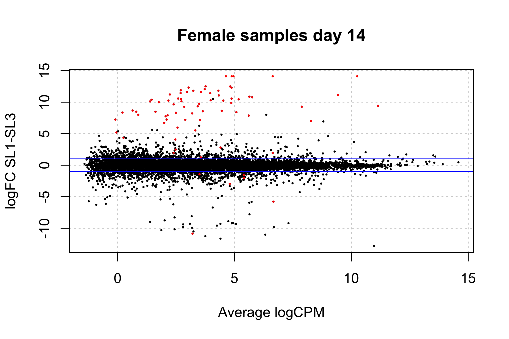
  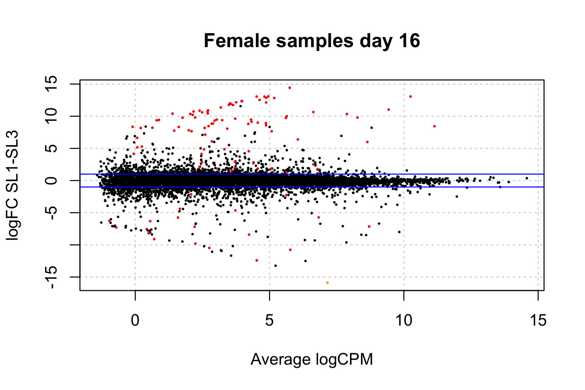
  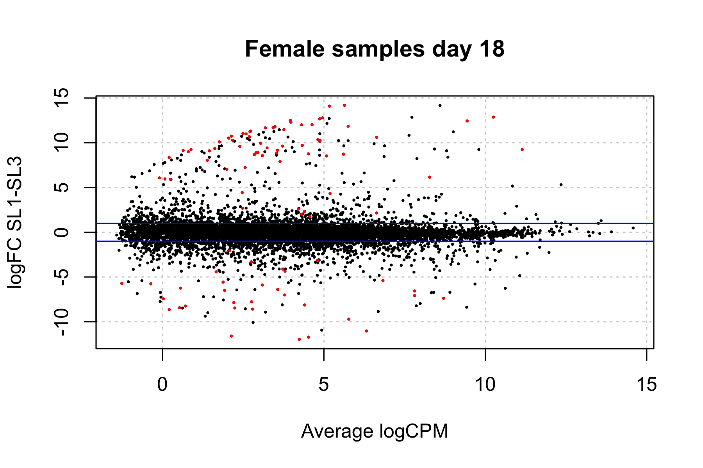
</p>

</div>

I also check which genes are DE in only one or both lines for the day contrast. A lot of them are shared but there is a even more difference, most DE genes are exclusive to the large males, wich is about four times as many genes as are exclusive to the small males. 

<details>
<summary>Toggle down for plot and numbers</summary>

<p float="left">
  
</p>

| category      | num DE genes  |
| ------------- | ------------- |
| both          | 1984          |
| SL1 exclusive | 502           |
| SL3 exclusive | 1999          |

</details>


#### Number of differentially expressed genes between day18 and mean(day14+day16)

In males, most of the DE genes are shared between line 1 (small males) and line 3 (large males), supporting the hypothesis that the difference between the lines is mostly in day 14 and 16, and that the larvae start a common preparation for pupation around day 18.

<div class="tab">
  <button class="tablinks" onclick="openTab(event, 'males_lines_DE_tables')">males</button>
  <button class="tablinks" onclick="openTab(event, 'females_lines_DE_tables')">females</button>
</div>

<div id="males_lines_DE_tables" class="tabcontent">

| `glmLRT`      | Line 1        | Line 3        | `glmQLFTest`  | Line 1        | Line 3        |
| ------------- | ------------- | ------------- | ------------- | ------------- | ------------- |
| Downregulated | 388           | 488           | Downregulated | 311           | 438           |
| no difference | 9010          | 8174          | no difference | 9172          | 8309          |
| Upregulated   | 1238          | 1974          | Upregulated   | 1153          | 1889          |

<p float="left">
  
</p>

</div>

<div id="females_lines_DE_tables" class="tabcontent">

| `glmLRT`      | Line 1        | Line 3        | `glmQLFTest`  | Line 1        | Line 3        |
| ------------- | ------------- | ------------- | ------------- | ------------- | ------------- |
| Downregulated | 84            | 43            | Downregulated | 0             | 10            |
| no difference | 9536          | 9439          | no difference | 9656          | 9571          |
| Upregulated   | 36            | 174           | Upregulated   | 0             | 75            |

<p float="left">
  
</p>

</div>


Lots of genes are upregulated in day 18 compared to 14 and 16 as well.

<div class="tab">
  <button class="tablinks" onclick="openTab(event, 'males_lines_DE_smear')">males</button>
  <button class="tablinks" onclick="openTab(event, 'females_lines_DE_smear')">females</button>
</div>

<div id="males_lines_DE_smear" class="tabcontent">

<p float="left">
  
  
</p>

</div>

<div id="females_lines_DE_smear" class="tabcontent">

<p float="left">
  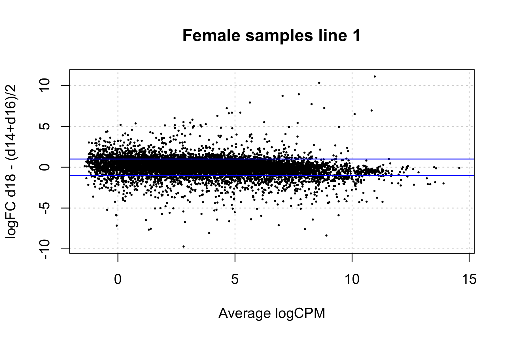
  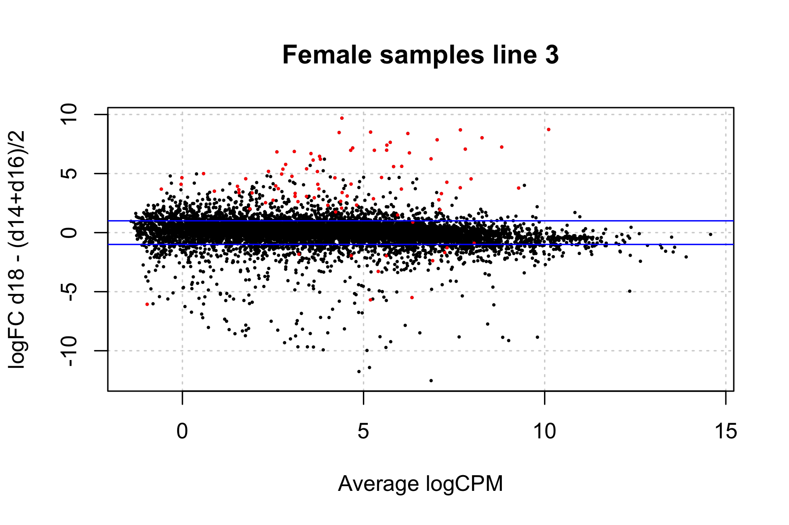
</p>

</div>


I will also look at DE genes in time points that are the same or different in the small and large males. The line-DE genes are mostly different between day 18 and day 14/16, which agrees with previous results. Between day 14 and day 16, most genes are exclusively DE in day 16.

<div class="tab">
  <button class="tablinks" onclick="openTab(event, 'males_day_DE')">males</button>
  <button class="tablinks" onclick="openTab(event, 'females_day_DE')">females</button>
</div>

<!-- Tab content -->
<div id="males_day_DE" class="tabcontent">


<p float="left">


  
</p>

<table>
<tr><th>Day 14 and day 16 </th><th>Day 14 and day 18</th><th>Day 16 and day 18</th></tr>
<tr><td>

| category      | num DE genes  |
| ------------- | ------------- |
| both          | 176           |
| d14 exclusive | 134           |
| d16 exclusive | 296           |

</td><td>

| category      | num DE genes  |
| ------------- | ------------- |
| both          | 47            |
| d14 exclusive | 263           |
| d18 exclusive | 26            |

</td><td>

| category      | num DE genes  |
| ------------- | ------------- |
| both          | 48            |
| d16 exclusive | 424           |
| d18 exclusive | 25            |

</td></tr> </table>

</div>

<div id="females_day_DE" class="tabcontent">


<p float="left">
  
  
  
</p>

<table>
<tr><th>Day 14 and day 16 </th><th>Day 14 and day 18</th><th>Day 16 and day 18</th></tr>
<tr><td>

| category      | num DE genes  |
| ------------- | ------------- |
| both          | 67            |
| d14 exclusive | 36            |
| d16 exclusive | 8             |

</td><td>

| category      | num DE genes  |
| ------------- | ------------- |
| both          | 60            |
| d14 exclusive | 37            |
| d18 exclusive | 15            |

</td><td>

| category      | num DE genes  |
| ------------- | ------------- |
| both          | 75            |
| d16 exclusive | 22            |
| d18 exclusive | 28            |

</td></tr> </table>

</div>

### 3.4 DE analysis sex differences during development

I will now split the data by line to see sex differences in expression during the development stages. 

<details>
<summary>MDS plots for SL1 and SL3</summary>

<p float="left">
  
  
</p>

</details>


The smear plots show greatly male-biased expression in all developmental stages for both lines.

<div class="tab">
  <button class="tablinks" onclick="openTab(event, 'SL1_smear')">SL1</button>
  <button class="tablinks" onclick="openTab(event, 'SL3_smear')">SL3</button>
</div>

<div id="SL1_smear" class="tabcontent">

<p float="left">
  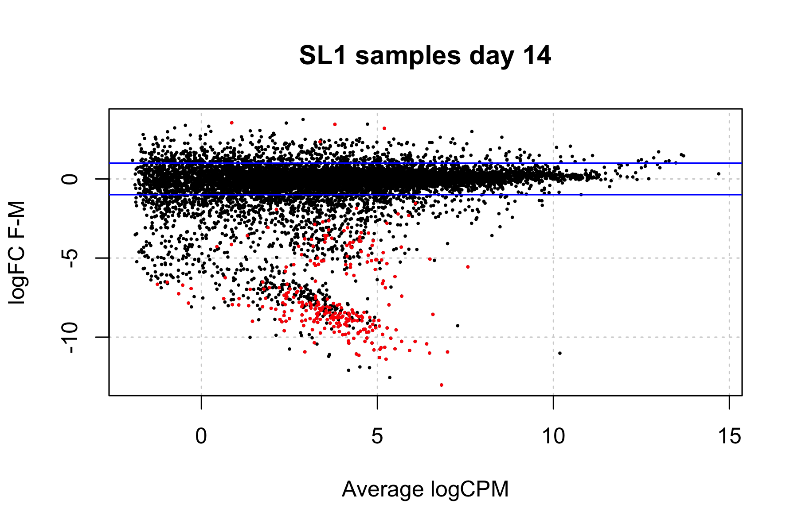
  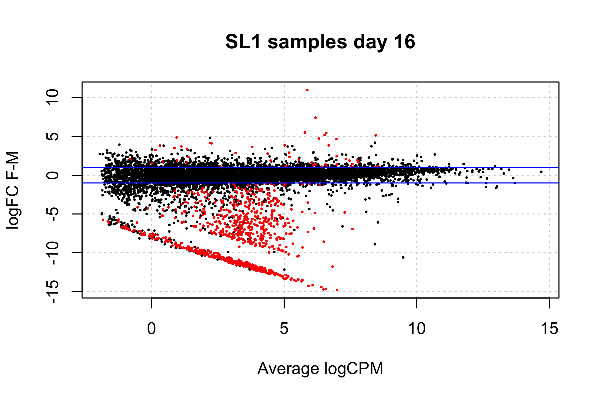
  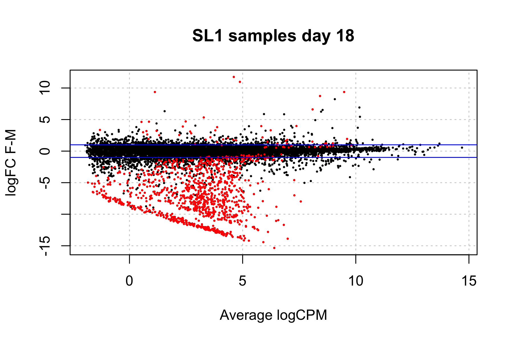
</p>

| `glmLRT`      | Day 14        | Day 16        | Day 18        | `glmQLFTest`  | Day 14        | Day 16        | Day 18        |
| ------------- | ------------- | ------------- | ------------- | ------------- | ------------- | ------------- | ------------- |
| Downregulated | 465           | 872           | 1056          | Downregulated | 264           | 760           | 1008          |
| no difference | 10523         | 10041         | 9870          | no difference | 10725         | 10183         | 9938          |
| Upregulated   | 5             | 80            | 67            | Upregulated   | 4             | 50            | 47            |

<p float="left">
  
</p>

</div>

<div id="SL3_smear" class="tabcontent">

<p float="left">
  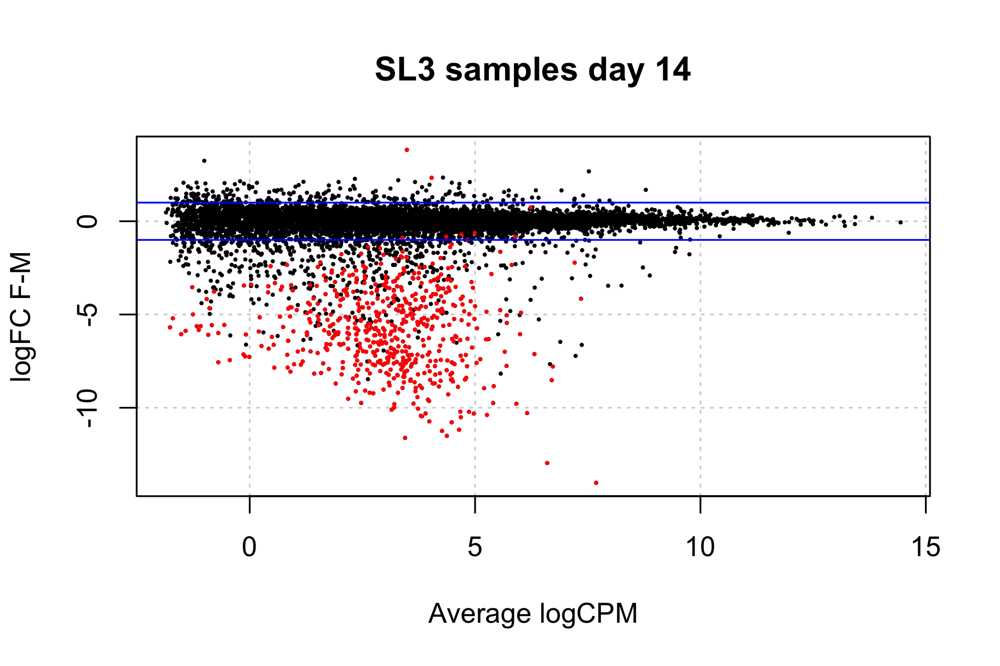
  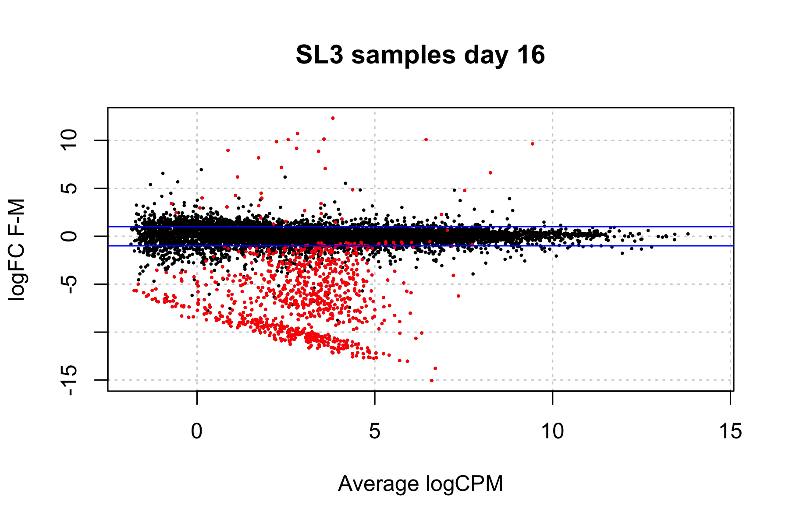
  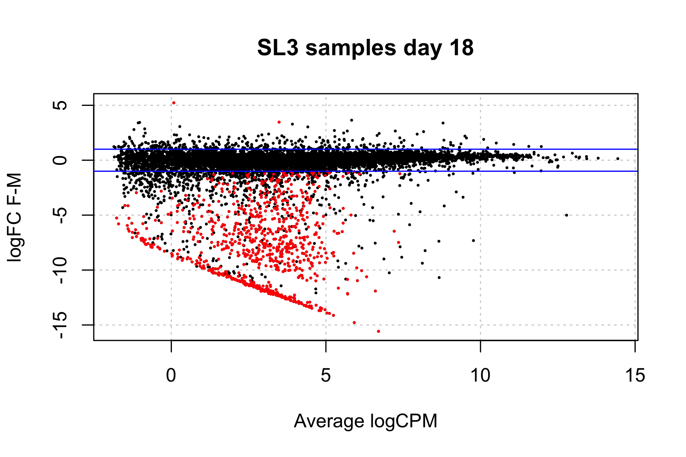
</p>

| `glmLRT`      | Day 14        | Day 16        | Day 18        | `glmQLFTest`  | Day 14        | Day 16        | Day 18        |
| ------------- | ------------- | ------------- | ------------- | ------------- | ------------- | ------------- | ------------- |
| Downregulated | 658           | 878           | 903           | Downregulated | 563           | 842           | 841           |
| no difference | 9927          | 9646          | 9681          | no difference | 10022         | 9710          | 9744          |
| Upregulated   | 2             | 63            | 3             | Upregulated   | 2             | 35            | 2             |

<p float="left">
  
</p>

</div>

For SL1 it seems that these DE genes are mostly the same ones in day 14 and 16, and shift slightly in day 18, and that for SL3 they have about the same overlap in all three developmental stages.


Mostly the same genes are upregulated in males between all comparisons

<div class="tab">
  <button class="tablinks" onclick="openTab(event, 'SL1_overlap')">SL1</button>
  <button class="tablinks" onclick="openTab(event, 'SL3_overlap')">SL3</button>
</div>

<div id="SL1_overlap" class="tabcontent">


<p float="left">
  
  
  
</p>

```
"Both"   "day 14"   "day 16"
 257      581        12

"Both"   "day 14"   "day 18"
 259      845        10

"Both"   "day 16"   "day 18"
 746      358        92
```

</div>

<div id="SL3_overlap" class="tabcontent">

<p float="left">
  
  
  
</p>

```
"Both"   "day 14"   "day 16"
 535      376        37

"Both"   "day 14"   "day 18"
 516      350        56

"Both"   "day 16"   "day 18"
 769      97         142
```

</div>


