<!-- Tab links -->
<script>
function openTab(evt, cityName) {
  // Declare all variables
  var i, tabcontent, tablinks;

  // Get all elements with class="tabcontent" and hide them
  tabcontent = document.getElementsByClassName("tabcontent");
  for (i = 0; i < tabcontent.length; i++) {
    tabcontent[i].style.display = "none";
  }

  // Get all elements with class="tablinks" and remove the class "active"
  tablinks = document.getElementsByClassName("tablinks");
  for (i = 0; i < tablinks.length; i++) {
    tablinks[i].className = tablinks[i].className.replace(" active", "");
  }

  // Show the current tab, and add an "active" class to the button that opened the tab
  document.getElementById(cityName).style.display = "block";
  evt.currentTarget.className += " active";
}

</script>

<style>

/* Style the tab */
.tab {
  overflow: hidden;
  border: 1px solid #ccc;
  background-color: #f1f1f1;
}

/* Style the buttons that are used to open the tab content */
.tab button {
  background-color: inherit;
  float: left;
  border: none;
  outline: none;
  cursor: pointer;
  padding: 14px 16px;
  transition: 0.3s;
}

/* Change background color of buttons on hover */
.tab button:hover {
  background-color: #ddd;
}

/* Create an active/current tablink class */
.tab button.active {
  background-color: #ccc;
}

/* Style the tab content */
.tabcontent {
  display: none;
  padding: 6px 12px;
  border: 1px solid #ccc;
  border-top: none;
}

</style>


# Differential expression analysis on Larval RNAseq data

## 1. Preprocessing and testing

This analysis is based on a lot of work to properly filter the data and compare mapping pipelines to handle the high rRNA contamination rate and multimapping issues.

### 1.1 rRNA filtering and other reads preprocessing

This was done by Bianca Sarcani, all data here: `RNA_data_processing`. Basically:

* filter rRNA reads with sortmeRNA and custom rRNA library (see back to Axel's work about generating the reference library)
* collapse lanes
* deduplicate reads (removePCR duplicates and poly-G)

Bianca continued here and assembled a transcriptome but I will not use it here

### 1.2 Evaluation and comparison of mapping pipelines

This was done by Sebastian Ellwe, see repository here: https://github.com/sellwe/Master_thesis_sebastian. He compared:

* STAR
* Salmon
  * salmon-mapping (map RNA to proteinfasta with decoy dataset)
  * salmon-align (refine existing mapped bam file)

From his results I made the choice to use STAR, see `mapping_and_transcriptome`. In short, with the new annotation the mapping rate is good enough with just STAR and not the complicated optimization algorithm that salmon uses.

### 1.3 yTor annotation manual curation

This work is based on the selection lines evaluated by Kaufmann *et al.* ([link](https://doi.org/10.1093/molbev/msad167)), but I am using a different version of the *C. maculatus* annotation that does not have the gene structures of the Y TOR copy number variation. Therefore I lift these gene structures from the original annotation and transform the coordinates to match my superscaffolded version of the assembly/annotation, see `mTOR_annotation`.

The genes are named `yTor-A`, `yTor-B`, and `yTor-C`, and the autosomal Tor is `transcript-30111`, or `gene-30110`.

## 2. STAR mapping

See the `RNA_mapping` directory in this repository for by-sample mapping rate information. Mean uniquely mapped reads: 83.76% and mean multimapped reads: 9.74%. 

## 3. DE analysis

I will use edgeR. 

### 3.1 yTor expression

After reading the data and filtering for minimum expression thresholds, yTor-A and yTor-C are expressed, but not yTor-B. Since we know that yTor-C (orange) in SL1 is the closest to the SL3 yTor, it makes sense that it shows expression in SL1 and SL3, while yTor-A, which is more diverged from the SL3 yTor, does not map reads from these samples. Furthermore, yTor-C is also the closes to aTor, which likely explains the female samples, which are mismapped reads that only map to yTor-C and not yTor-A.

The autosomal Tor `gene-30110` is expressed much higher than any y-linked copy, which makes sense since it is a highly conserved gene in the insulin signalling pathway. There seems to be no difference between SL1 and SL3.

<details>
<summary>normalized counts plots</summary> 

`(aTor,(yTor-SL3,(yTor-C,(yTor-A,yTor-B))))`

<p float="left">
  
  
</p>

The tick labels are according to this naming scheme: `SL`-`day`-`sample_ID`-`sex`.

</details>

### 3.2 PCA plots

PCAs are based on log-transformed normalized counts. Lines are SL1 and SL3 which are the small (1) and large (3) males respectively. Intuitively, the tor copy number is reversed, with the small males in SL1 having three copies, and the large males in SL3 having only one. The days are day 14, 16, or 18 of larval development. 


<div class="tab">
  <button class="tablinks" onclick="openTab(event, 'All samples')">All samples</button>
  <button class="tablinks" onclick="openTab(event, 'Only one sex')">Only one sex</button>
</div>

<div id="All samples" class="tabcontent">


<p float="left">
  
  
</p>

Line is a clear separator (left), but not day (right). Day 14 seems to be mostly to the left, but 16 and 18 are across the entire range. There is a trend of females being more to the left and males more to the right but it is not as nice of a separation as line.

</div>

<div id="Only one sex" class="tabcontent">

<p float="left">
  
  
</p>

Since we are interested in the male variation and the females are mostly control, we have much fewer female than male samples.

line is the lagest difference, which is the same as when all samples are plotted. The days show a trend where day 18 is more to the left, 16 is intermediate, and 14 is to the right, but it is more of a gradual transition and not a clear separation. This makes sense since age is continuous, and we can only sample with limited precision, so it is likely that there is some age variation present within all the day categories that is represented here. (Except that one outlier in females (right) for SL3 day18 all the way on the right.)

</div>

<details>
<summary>I have also generated a MDS plot based on the edgeR data structure using plotMDS(), but they mostly show the same results as the PCA plots. Toggle down for MDS plots</summary>

<p float="left">
  
  
</p>

Males and females are kind of but not super clearly separated, but for only male samples, the SL1 and SL3 border is relatively clear.

</details>

### 3.3 DE analysis of sex-separated samples 

I started the differential expression analysis with only samples from one sex at a time. The contrasts are within each day (14, 16, 18), and always `SL1 - SL3`. `SL1` are the small males (three Tor copies), and all genes identified as "upregulated" are higher expressed in `SL1`. I am trying both `glmLRT` and `glmQLFTest` to test for differential expression, both fit negative binomial GLMs with the first one being more simple but having a higher false-positive error, while the second takes more variation in dispersion into account. I show both here and for the lines comparison, but I will only plot the results from `glmQLFTest`.

#### Differential expression between SL1 and SL3

Additionally, in day 14 and day 16, there is a larger number of upregulated (higher in `SL1`) genes, while day 18 about the same number as up- and downregulated genes. This looks like there is a stronger line-difference in day 14 and 16, which becomes reduced in day 18.

<div class="tab">
  <button class="tablinks" onclick="openTab(event, 'males_lines_DE')">males</button>
  <button class="tablinks" onclick="openTab(event, 'females_lines_DE')">females</button>
</div>

<div id="males_lines_DE" class="tabcontent">

<table>

| `glmQLFTest`  | Day 14        | Day 16        | Day 18        |
| ------------- | ------------- | ------------- | ------------- |
| Downregulated | 94            | 210           | 19            |
| no difference | 10326         | 10164         | 10563         |
| Upregulated   | 216           | 262           | 54            |

</table>

<p float="left">
  
  
  
</p>

Upregulation here means that genes are expressed higher in SL1 than SL3. Day 14 and 16 have more significantly differentially expressed genes in common than day 18. In day 18, the larvae are close to pupation, which likely means that they are switching from gene expression related to grwoth and digestion to what they need for pupation instead, which is potentially not related to the Y-haplotype difference any more, resulting in less DE between the lines on day 18.

<p float="left">
  
</p>

</div>

<div id="females_lines_DE" class="tabcontent">

<table>

| `glmQLFTest`  | Day 14        | Day 16        | Day 18        |
| ------------- | ------------- | ------------- | ------------- |
| Downregulated | 6             | 19            | 32            |
| no difference | 9581          | 9553          | 9559          |
| Upregulated   | 69            | 115           | 65            |

</table>

<p float="left">
  
  
  
</p>

Fewer DE genes than males which is good since they are not supposed to have any. Also, similar amounts of DE genes on day 14, 16, and 18, which is different from the male samples where day 18 is a clear outlier. This is nice since I hypothesize that that is because the line difference impacts day 14 and 16 more than 18, and therefore the DE genes here are not related to the growth differences between the lines that impact the males.

<p float="left">
  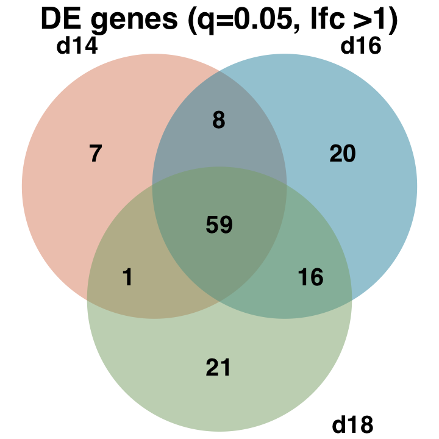
</p>

</div>

#### Differential expression between lines within each day

How do the lines differ for each developmental time point (also difference between day 14 and day 16)?

<div class="tab">
  <button class="tablinks" onclick="openTab(event, 'males_day_DE')">males</button>
  <button class="tablinks" onclick="openTab(event, 'females_day_DE')">females</button>
</div>

<!-- Tab content -->
<div id="males_day_DE" class="tabcontent">


<p float="left">


  
</p>

<table>
<tr><th>Day 14 and day 16 </th><th>Day 14 and day 18</th><th>Day 16 and day 18</th></tr>
<tr><td>

| category      | num DE genes  |
| ------------- | ------------- |
| both          | 176           |
| d14 exclusive | 134           |
| d16 exclusive | 296           |

</td><td>

| category      | num DE genes  |
| ------------- | ------------- |
| both          | 47            |
| d14 exclusive | 263           |
| d18 exclusive | 26            |

</td><td>

| category      | num DE genes  |
| ------------- | ------------- |
| both          | 48            |
| d16 exclusive | 424           |
| d18 exclusive | 25            |

</td></tr> </table>

</div>

<div id="females_day_DE" class="tabcontent">


<p float="left">
  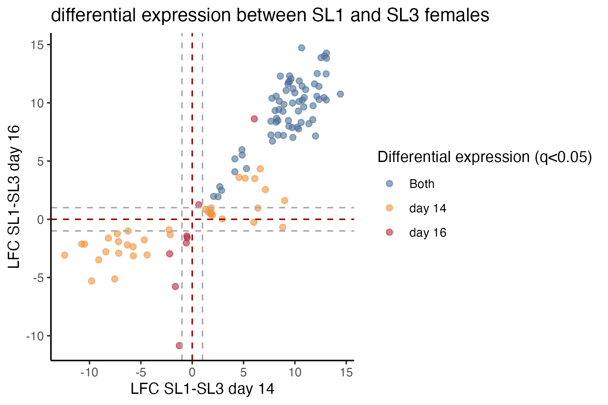
  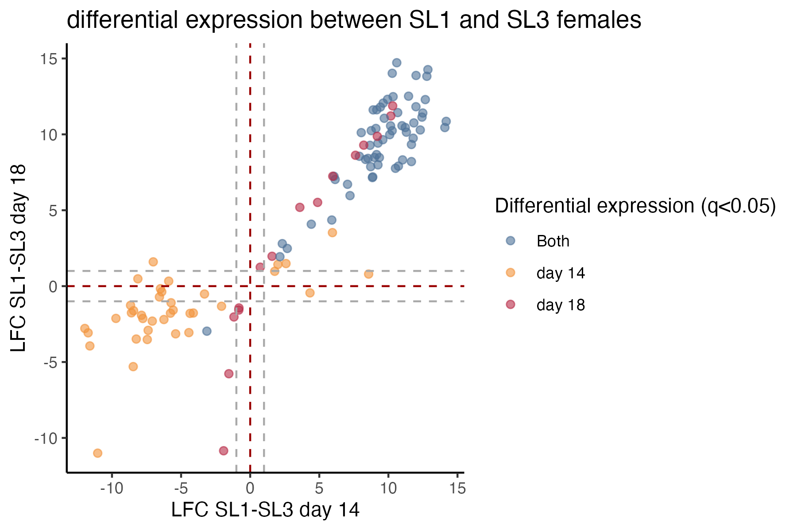
  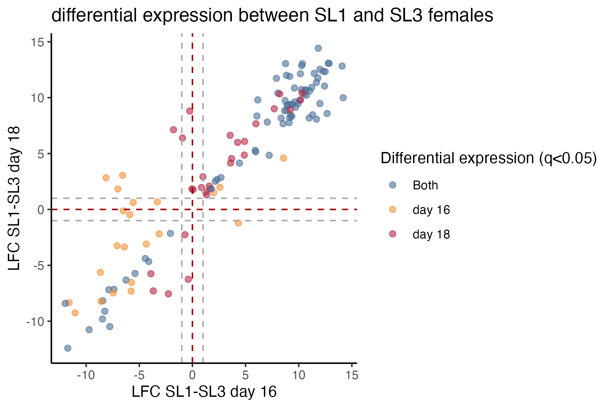
</p>

<table>
<tr><th>Day 14 and day 16 </th><th>Day 14 and day 18</th><th>Day 16 and day 18</th></tr>
<tr><td>

| category      | num DE genes  |
| ------------- | ------------- |
| both          | 67            |
| d14 exclusive | 36            |
| d16 exclusive | 8             |

</td><td>

| category      | num DE genes  |
| ------------- | ------------- |
| both          | 60            |
| d14 exclusive | 37            |
| d18 exclusive | 15            |

</td><td>

| category      | num DE genes  |
| ------------- | ------------- |
| both          | 75            |
| d16 exclusive | 22            |
| d18 exclusive | 28            |

</td></tr> </table>

</div>


#### Differential expression between day18 and mean(day14+day16)

I hypothesize that day 14 and 16 are where a lot of growth happens and SL1 and SL3 differ, while day 18 is the transition to pupation where the line differences become less substantial. I will therefore see what genes are involved in growth specifically by looking at the contrast between day 18 and the mean of day 14 and day 16. 

<div class="tab">
  <button class="tablinks" onclick="openTab(event, 'males_lines_DE_tables')">males</button>
  <button class="tablinks" onclick="openTab(event, 'females_lines_DE_tables')">females</button>
</div>

<div id="males_lines_DE_tables" class="tabcontent">

<table>

| `glmQLFTest`  | Line 1        | Line 3        |
| ------------- | ------------- | ------------- |
| Downregulated | 639           | 1271          |
| no difference | 8150          | 6653          |
| Upregulated   | 1850          | 2766          |

</table>

<p float="left">
  
  
</p>

<p float="left">
  
  
</p>

The fewest genes change in SL1 during this developmental transition, most genes change for both lines or only SL3. The last section shows that for day 14 and day 16, more genes are significantly upregulated in SL1 compared to SL3. 

| category      | num DE genes  |
| ------------- | ------------- |
| both          | 1984          |
| SL1 exclusive | 502           |
| SL3 exclusive | 1999          |

</div>

<div id="females_lines_DE_tables" class="tabcontent">

<table>

| `glmQLFTest`  | Line 1        | Line 3        |
| ------------- | ------------- | ------------- |
| Downregulated | 0             | 11            |
| no difference | 9656          | 9569          |
| Upregulated   | 0             | 76            |

</table>

<p float="left">
  
  
</p>

<p float="left">
  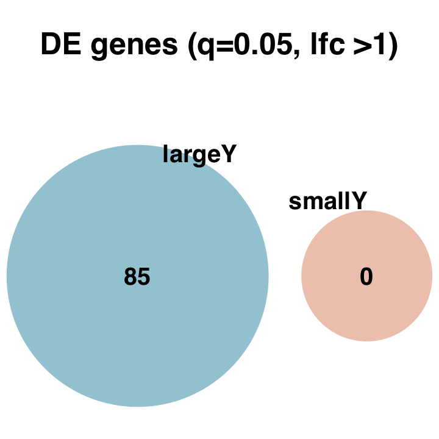
  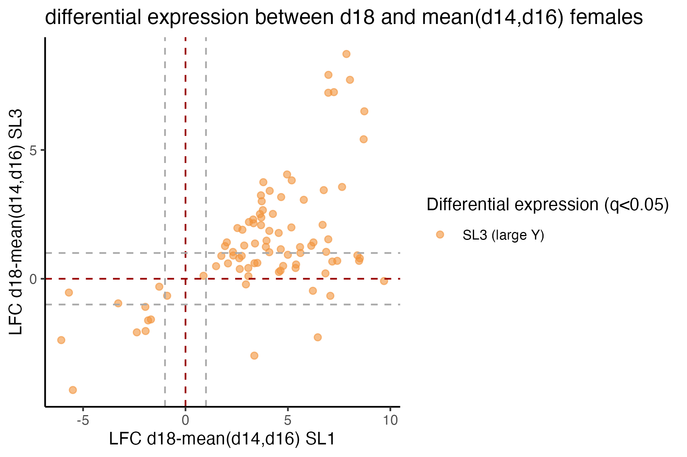
</p>

| category      | num DE genes  |
| ------------- | ------------- |
| both          | 0             |
| SL1 exclusive | 0             |
| SL3 exclusive | 87            |

</div>

### 3.4 DE analysis sex differences during development

I will now split the data by line to see sex differences in expression during the development stages. 

<details>
<summary>MDS plots for SL1 and SL3</summary>

<p float="left">
  
  
</p>

</details>

#### Differential expression between males and females

<div class="tab">
  <button class="tablinks" onclick="openTab(event, 'SL1_smear')">SL1</button>
  <button class="tablinks" onclick="openTab(event, 'SL3_smear')">SL3</button>
</div>

<div id="SL1_smear" class="tabcontent">

<p float="left">
  
  
  
</p>

| `glmQLFTest`  | Day 14        | Day 16        | Day 18        |
| ------------- | ------------- | ------------- | ------------- |
| Downregulated | 265           | 767           | 1039          |
| no difference | 10724         | 10155         | 9889          |
| Upregulated   | 4             | 71            | 65            |

<p float="left">
  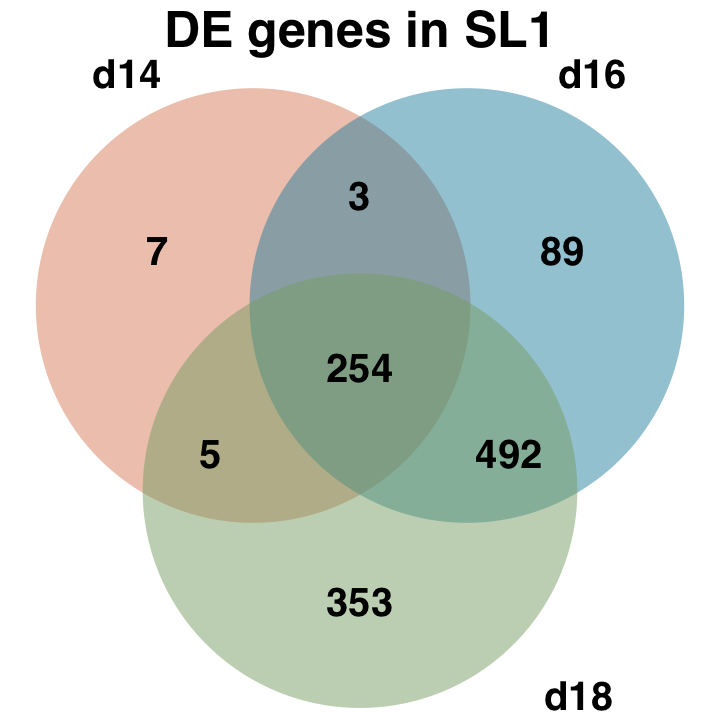
</p>

These DE genes are mostly the same ones in day 14 and 16, and shift slightly in day 18.

</div>

<div id="SL3_smear" class="tabcontent">

<p float="left">
  
  
  
</p>

| `glmQLFTest`  | Day 14        | Day 16        | Day 18        |
| ------------- | ------------- | ------------- | ------------- |
| Downregulated | 569           | 875           | 861           |
| no difference | 10015         | 9676          | 9721          |
| Upregulated   | 3             | 36            | 5             |

<p float="left">
  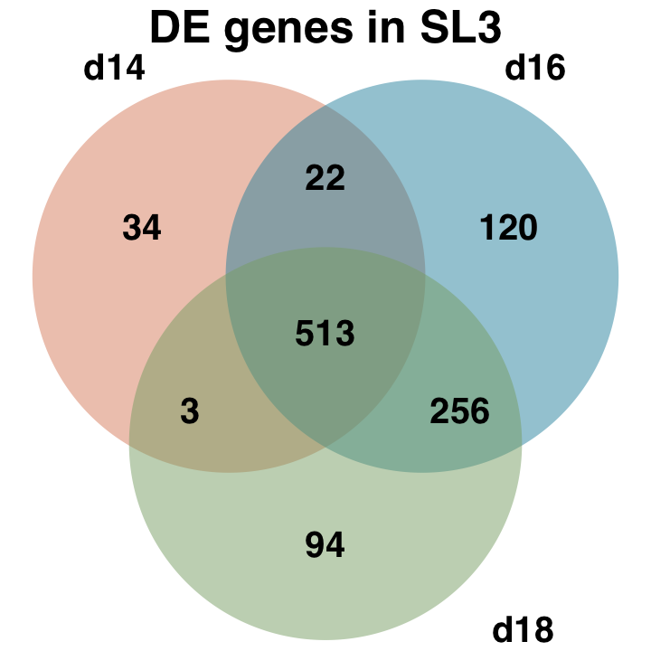
</p>

About the same overlap in all three developmental stages.

</div>

Check for the sex-bias overlap in all pairwise comparisons between the days. TODO this does not match with above. below has more DE in general and also most genes are DE in day 14 and day 16/18 share more which is not the same as above where either 14 and 16 share more (SL1) or it is about equal (SL3). I think i may have the LFC>1 condition inconsistently maybe? It doesn't match above either, but the discrepancy is not as bad. fuck R and its stupid defaults

<div class="tab">
  <button class="tablinks" onclick="openTab(event, 'SL1_overlap')">SL1</button>
  <button class="tablinks" onclick="openTab(event, 'SL3_overlap')">SL3</button>
</div>

<div id="SL1_overlap" class="tabcontent">


<p float="left">
  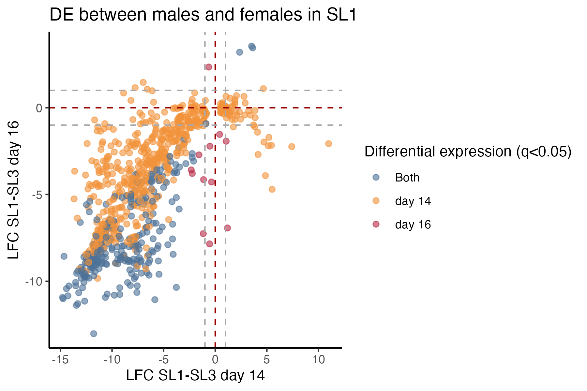
  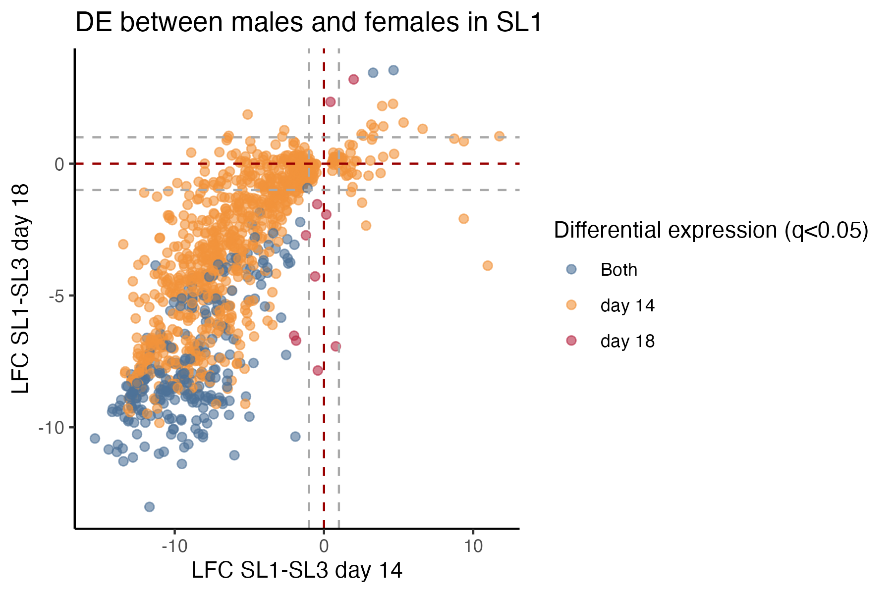
  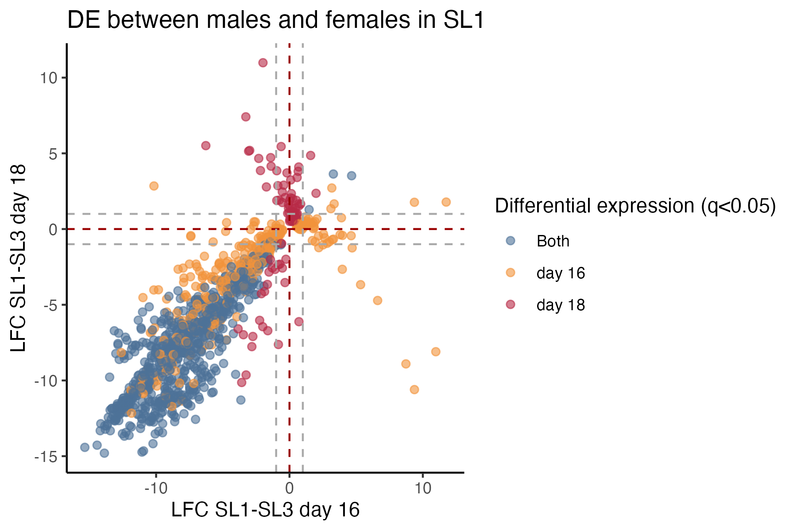
</p>

```
"Both"   "day 14"   "day 16"
 257      581        12

"Both"   "day 14"   "day 18"
 259      845        10

"Both"   "day 16"   "day 18"
 746      358        92
```

</div>

<div id="SL3_overlap" class="tabcontent">

<p float="left">
  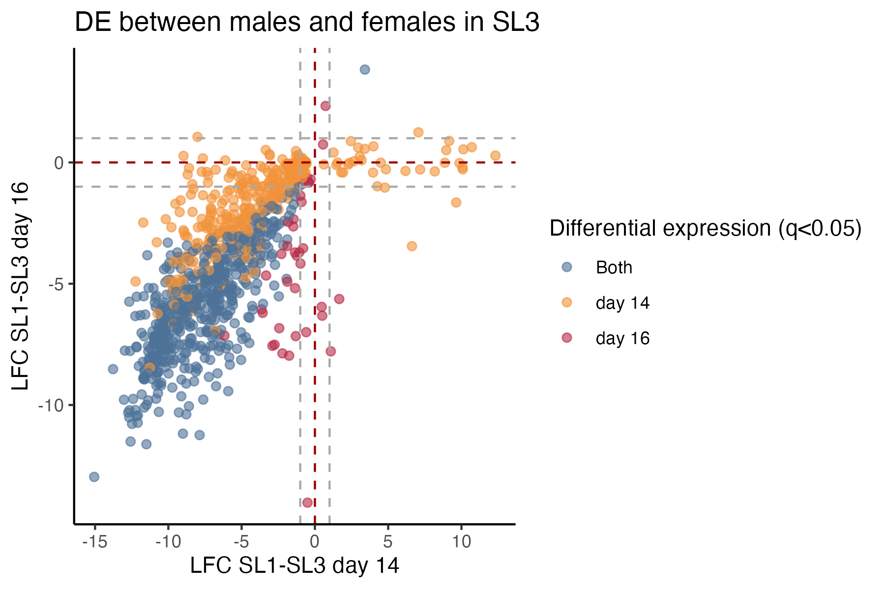
  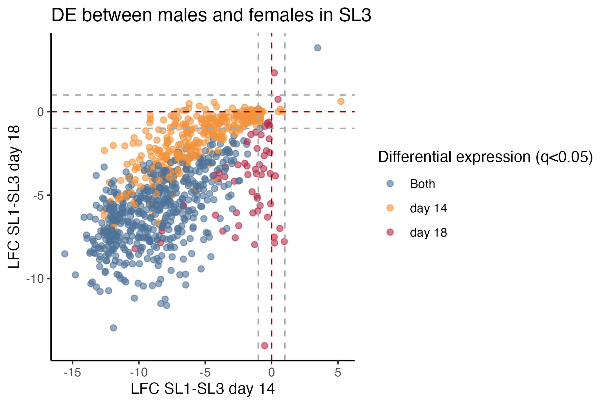
  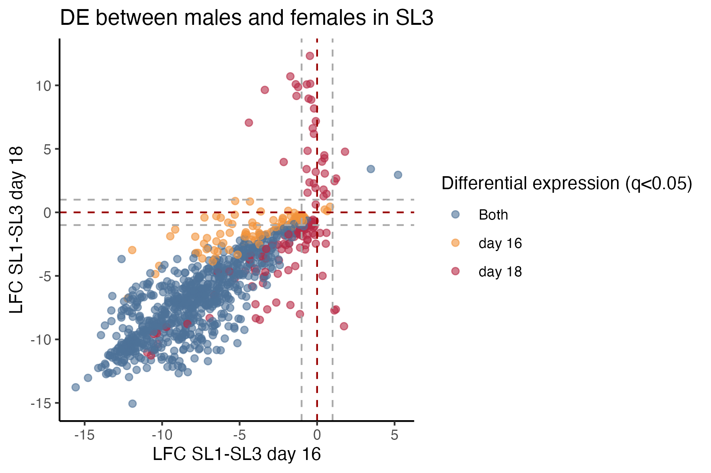
</p>

```
"Both"   "day 14"   "day 16"
 535      376        37

"Both"   "day 14"   "day 18"
 516      350        56

"Both"   "day 16"   "day 18"
 769      97         142
```

</div>


